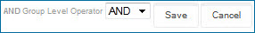

# Data Quality Step wizard

<head>
  <meta name="guidename" content="DataHub"/>
  <meta name="context" content="GUID-8BD0B0F8-ACD3-4119-BC26-BE27456A2A22"/>
</head>

The Data Quality Step wizard is used to add or modify a data quality step.

-   The wizard opens for the purpose of adding a step when a service is clicked in the Available Data Quality Services dialog.

-   The wizard opens for the purpose of modifying a step when that step is clicked in the **Data Quality Steps** tab.

## Data quality service - Configure Fields

This screen is used to configure the inputs and outputs for an ordinary data quality step. The wizard opens to this screen if a service other than Process Call or Business Rule is clicked in the Available Data Quality Services dialog or an ordinary data quality step is clicked in the **Data Quality Steps** tab.

Each ordinary data quality step specifies:

1.  the data quality service to which requests are sent, selected in the Available Data Quality Services dialog.

2.  for each object property supported by that service:

    1. the field, if any, in the source entity whose value will be sent in a request.

    2. the field, if any, in the source entity whose value will be updated to reflect data received in a response.

**Name**
 **Description**

**Match Score Threshold**
 \(Loqate only\) Sets the required similarity between input data and the closest reference data match as a percentage. A value of 100 specifies complete similarity. The default is 85.

**Match Level Threshold**
 \(Loqate only\) Sets the level, expressed as an integer, to which the input data matches reference data after validation and enrichment. The minimum value, 0, specifies no match level. The maximum value, 5, specifies matching at the delivery point \(building or structure\) level. The default is 3.

**Incoming Entity**/**Service Input**
 For each object property supported by the selected service for validation, sets the field whose value in a source entity will be passed as input to the service. Hovering the pointer on the object property name shows a description of the object property. The absence of a field selection means a value will not be passed as input for that particular object property. Clicking  clears a selection.

Deleted fields are shown as “Unknown” in red.

**Service Output**/**Outgoing Entity**
 For each object property supported by the selected service for enrichment, sets the field whose value in a source entity will be enriched with data retrieved from the service. Hovering the pointer on the object property name shows a description of the object property. The absence of a field selection means a value will not be retrieved for that particular object property. Clicking  clears a selection.

Deleted fields are shown as “Unknown” in red.

**Cancel**
 Closes the wizard without adding a data quality step or modifying an existing data quality step.

**Next**
 Advances the wizard to the Set Step Condition - Field Changes screen.

## Integration Process Call

This screen is used to select a listener process for a process call data quality step. The wizard opens to this screen if Process Call is clicked in the Available Data Quality Services dialog or a process call data quality step is clicked in the **Data Quality Steps** tab.

**Name**
 **Description**

**Process**
 Selects the process.

In order to be available for selection a process must have a Listener connector operation as its Start step. In order to be usable the selected process must be deployed to the same repository to which the model is deployed and return results as documents.

**Cancel**
 Closes the wizard without adding a data quality step or modifying an existing data quality step.

**Next**
 Advances the wizard to the Set Step Condition - Field Changes screen.

## Configure Business Rule 

This screen is used to configure the business rule for a business rule data quality step. The wizard opens to this screen if Business Rule is clicked in the Available Data Quality Services dialog or a business rule data quality step is clicked in the **Data Quality Steps** tab.

**Name**
 **Description**

**Inputs**
 This section is used to define the business rule’s inputs and their corresponding outputs.

**Name** **Description**

**Add**
 Selects the type of input to add to the business rule.

-   **Field** — Opens the Add a Field dialog, which is used to add a single field as both an input and output.

    

    **Name**
     **Description**

    Field
     Sets the field to use as the input and output.

    Deleted fields are shown as “Unknown” in red.

    Clicking  clears both **Field** and **Alias**.

    **Alias**
        Sets an output alias for the selected **Field**. Outputs are referenced by alias in the Conditions and Error Message sections. **Alias** is automatically populated with the field name upon selection of a **Field** and cleared upon the clearing of **Field**.

    **OK**
      Adds the input/output and closes the dialog.

    **Cancel**
      Closes the dialog without adding an input/output.

-   **Function** — Opens the Add a Function dialog, the first of a series of two or more dialogs, which are used to add a function input and the corresponding output\(s\).

    

    **Name**
       **Description**

    **Category**
     Selects the function category of which the function to be applied is a member. Follow the links to Integration topics for information about the functions in each category:

    - [String](/docs/Atomsphere/Integration/Process%20building/r-atm-String_functions_efef3d8f-b053-4cfd-aa5f-aa4e30ead17d.md)
    - [Numeric](/docs/Atomsphere/Integration/Process%20building/r-atm-Numeric_functions_9b70e31b-a97d-444e-b638-5a004a66b9ee.md)
    - [Date](/docs/Atomsphere/Integration/Process%20building/r-atm-Date_functions_e35e34c4-45f2-49ac-b1d7-4792114e52dc.md)

    **Functions**
     Selects the function to be applied. The available selections are dependent upon the selected Category.

    **OK**
     Opens a second dialog in which you define the function’s input parameters and/or output(s). The controls in the dialog are dependent upon the selected function in the Functions list. For some functions, a third dialog opens when you click OK in the second.

    **Cancel**
     Closes the dialog without adding an input and output(s).

**Inputs list**
   Lists the inputs defined for the business rule and provides controls for deleting them. In the list:

-   Clicking the name of an input opens the Add A Field dialog or the Add a Function dialog for the purpose of modifying the output\(s\).

-   Clicking  for an input initiates a request to delete it. In the confirmation dialog:

    -   Clicking **OK** executes the request.

    -   Clicking **Cancel** cancels the request.

**Conditions**
 This section is used to define the conditions for the business rule.

**Name**
 **Description**

**Top Level Operator** 
Selects **AND** or **OR** as the Boolean operator defining the relationship between the top-level conditions and condition groups.

**Conditions list**
 Lists the conditions defined for the business rule and provides controls for adding, modifying, deleting and reordering conditions and condition groups. Indentation delineates levels in the hierarchy.

At each level of the hierarchy the following links are available:
 
  - **Add a Condition** — Add a list entry for a new condition at the current level in the hierarchy.
  - **Add a Group** — Add a list entry for a new condition group at the current level in the hierarchy.
  
You must save changes to individual conditions and condition groups to add them.

For each condition and condition group the following links and controls are available:

  -   reorder icon — Used to change the position of the condition or condition group by dragging and dropping.
   
 - **Edit** — Reveals controls used to edit the condition or condition group.
  
 - **Remove** — Removes the condition or condition group. Removing a condition group removes all of its member conditions.
  
The following links and controls are revealed when **Edit** is clicked for either a condition or a condition group:

- **Save** — Saves changes to the condition or condition group and hides the editing controls.
- **Cancel** — Discards unsaved changes to the condition or condition group and hides the editing controls. 
  
The following links and controls are additionally revealed when Edit is clicked for a condition:
- Output selection lists — Select Static or one of the outputs. Outputs are referenced by alias. Multiple outputs for a given input are indented in the list below the input alias. Selecting Static reveals a field to the right for specifying the static value.
- Static value fields
- Operator selection list — Sets the manner in which two specified outputs are compared or a single specified output is evaluated. The operators `contains`, `does not contain`, `starts with`, `is empty`, and `is not empty` perform string comparisons. They should not be used for numeric comparisons.

|  Symbol              | Description |
| ---------------- | ---------------------------------------------------- 
| `=  `                |Output #1 to the left equals output #2 to the right.|
| `!= `              | Output #1 is not equal to output #2.                 |
| `< `               | Output #1 is less than output #2.                    |
| `> `               | Output #1 is greater than output #2.                 |
| `<= `              | Output #1 is less than or equal to output #2.        |
| `>=`               | Output #1 is greater than or equal to output #2.     |
| contains         | Output #1 contains output #2.                        |
| does not contain | Output #1 does not contain output #2.                |
| starts with      | Output #1 starts with output #2.                     |
| is empty         | Output #1 is null.                                   |
| is not empty     | Output #1 is not null.                               |

- The following control is additionally revealed when Edit is clicked for a condition group:
  
    

  - Group Level Operator — Selects AND or OR as the Boolean operator defining the relationship between the condition group’s member conditions and condition groups.

**Error Message**
 This section is used to specify the template for messages logged when incoming entities are quarantined as a result of failing to satisfying the business rule. Messages can contain dynamic output values along with hard-coded text.

**Name**
 **Description**

**Insert Value**
 Selects an output value to append to the template. Outputs are referenced by alias for selection. Multiple outputs for a given input are indented below the input alias.

When you insert a value, the name of the output appears below in the template editor as a numerical reference — for example, \{1\} — and a button appears in the box below.

**Template editor**
 Typing inserts hard-coded message text. Once you insert a value, you can move its numerical reference by cutting and pasting.

**Inserted inputs**
 A button appears below the template for each inserted output value. The label of a given button identifies the output by its alias and shows the number used in the template to reference the value. If the output is one of multiple outputs of an input function, the button label also identifies the input by its alias. Clicking  deletes all references to that value from the template and causes the button to disappear.

**Cancel**
 Closes the wizard without adding a data quality step or modifying an existing data quality step.

**Next**
 Advances the wizard to the Step Name screen.

## Set Step Condition - Contributing Source 

This screen applies only to ordinary and Integration process call data quality steps. It is used to set or lift a condition under which the step is applied based on the source that contributed the entity.

**Name**
 **Description**

**Apply this step for all contributing sources**
 If this option is selected, the step is applied regardless of the contributing source.

**Only apply this step if the record is contributed by selected sources**
 If this option is selected, the step is applied only to entities contributed by selected sources.

When this option is selected, check boxes appear for selecting sources.

**Cancel**
 Closes the wizard without adding a data quality step or modifying an existing data quality step.

**Back**
 Returns the wizard to the Configure Fields or Process Call screen.

**Next**
 Advances the wizard to the Set Step Condition - Field Changes screen.

## Set Step Condition - Field Changes

This screen applies only to ordinary and process call data quality steps. It is used to set or lift a condition under which the step is applied to an incoming source entity based on field values.

**Name**
 **Description**

**Apply this step regardless of field changes**
 If this option is selected, the step is applied even if the entity does not populate or change the values of golden record fields.

**Only apply this step if any Input or Output has changed**
 This option is available only for ordinary steps and is selected by default. If this option is selected, the step is applied only if an entity populates or changes the values of golden record fields selected in the previous screen as **Inputs** or **Outputs**. For collections whose fields are selected as **Inputs** or **Outputs**, qualifying changes include collection items whose input and output fields fail to match any existing item.

**Only apply this step if any fields changed**
 This option is available only for process call steps. If this option is selected, the step is applied only if an entity populates or changes the values of golden record fields. For collections, qualifying changes include items whose fields fail to match any existing item.

**Only apply this step if selected fields changed**
 This option is available only for process call steps. If this option is selected, the step is applied only if a selected entity populates or changes the values of one or more golden record fields. For collections, qualifying changes include items whose fields fail to match any existing item.

When this option is selected, check boxes appear for selecting fields. Field groups are listed in bold. Turning on the check box for a field group selects all of its member fields. Clicking a field group’s **** icon collapses the field group, hiding its member fields. Clicking a field group’s **** icon expands the field group, revealing its member fields.

**Cancel**
 Closes the wizard without adding a data quality step or modifying an existing data quality step.

**Back**
 Returns the wizard to the Set Step Condition - Contributing Source screen.

**Next**
 Advances the wizard to the Set Step Condition - Custom Business Rule \(optional\) screen.

## Set Step Condition - Custom Business Rule \(optional\) 

This screen applies only to ordinary and process call data quality steps. It is used to set a condition under which the step is applied based on satisfaction of a custom business rule by an incoming entity.

**Name**
 **Description**

**Inputs**
 The controls are analogous to those in the Inputs section in the Configure Business Rule screen.

**Conditions**
 The controls are analogous to those in the Conditions section in the Configure Business Rule screen.

**Cancel**
 Closes the wizard without adding a data quality step or modifying an existing data quality step.

**Back**
 Returns the wizard to the Set Step Condition - Field Changes screen.

**Next**
 Advances the wizard to the Step Name or Step Name and Connection Settings screen.

## Step Name \(and Connection Settings\) 

:::note

The suffix “and Connection Settings” appears only for an ordinary data quality step.

:::

**Name**
 **Description**

**Data Quality Step Name**
 Name of the data quality step. The default is the name of the operation — for example, Address Verification — in the case of an ordinary data quality step, Process Call in the case of a process call data quality step, or Business Rule in the case of a business rule data quality step.

**Service Connection Settings**
 Service connection settings are applicable only to an ordinary data quality step and are specific to the selected data quality service.

**Name**
 **Description**

**User Name**
 \(D&B only\) User name for connecting to the service.

**Password**
 \(D&B only\) Password for connecting to the service.

Clicking **Click to Set** or **`<Encrypted>`** reveals a dialog. In that dialog, typing the password in the **Password** field and clicking **Apply** applies the password and returns focus to the wizard.

**Key**
 \(Loqate only\) API key for connecting to the service.

Clicking **Click to Set** or **`<Encrypted>`** reveals a dialog. In that dialog, typing the API key in the **Password** field and clicking **Apply** applies the API key and returns focus to the wizard.

**Cancel**
 Closes the wizard without adding a data quality step or modifying an existing data quality step.

**Back**
 Returns the wizard to the Set Step Condition - Custom Business Rule \(optional\) or Configure Business Rule screen.

**Finish**
 Adds or modifies the data quality step.