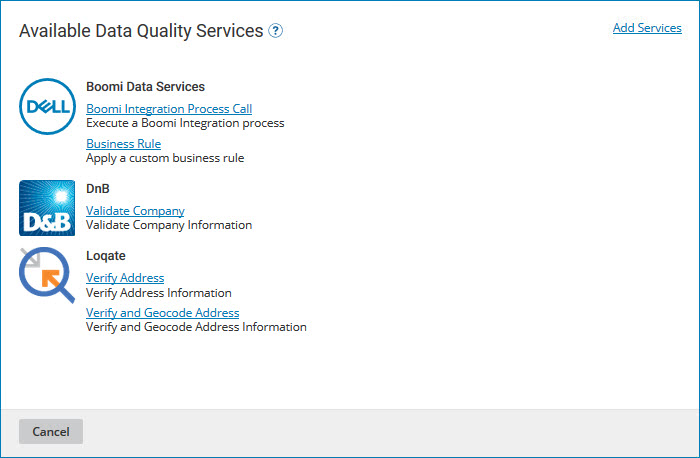

# Data Quality Steps tab

<head>
  <meta name="guidename" content="DataHub"/>
  <meta name="context" content="GUID-60C05EFB-81CD-42AF-A970-C51AA321B4C0"/>
</head>

The **Data Quality Steps** tab in the model page is used to define the model’s data quality steps. Data quality steps specify data validation and enrichment actions to be applied by the repository to incoming source entities. Data validation and enrichment actions resulting from the application of ordinary data quality steps are based on responses to requests sent by the repository to third-party data quality services.

:::note

The controls on this tab for adding and modifying data quality steps are enabled only for administrators and users having roles that include the MDM - View Models and MDM - Edit Models privileges.

:::

## Add a Data Quality Step 

Clicking this button opens the Available Data Quality Services dialog for the purpose of initiating the addition of a data quality step to the model. The dialog contains a list of enabled data quality services:

-   Services are grouped by vendor.

-   Clicking the name of a service opens the Data Quality Step wizard for the purpose of adding a data quality step using that service.

-   The **Add Services** link opens the Data Quality Services dialog for the purpose of viewing the list of supported services and enabling additional services for usage in data quality steps. This link is not present if all supported services are already enabled.

In the Data Quality Services dialog, each list entry shows the name of a vendor and the vendor’s logo.

**Name**
 **Description**

**Install**
 Enables the vendor’s services for usage in data quality steps and restores focus to the Available Data Quality Services dialog.

**Close**
 Enables the vendor’s services for usage in data quality steps and restores focus to the Available Data Quality Services dialog.
Closes the dialog without making a service available for usage in data quality steps. Focus is restored to the Available Data Quality Services dialog.

## Data Quality Steps summary list 

Lists the data quality steps in the model and provides tools for managing them. For each step the following tools and properties are shown:

**Name**
 Enables the vendor’s services for usage in data quality steps and restores focus to the Available Data Quality Services dialog.
**Description**

** reorder icon**
 Enables the vendor’s services for usage in data quality steps and restores focus to the Available Data Quality Services dialog.
Used to change the relative priority of the step by dragging and dropping.

**Name**
 Enables the vendor’s services for usage in data quality steps and restores focus to the Available Data Quality Services dialog.
Name of the step. This is a link to the Data Quality Step wizard for purpose of modifying the step.

**Type**
 Enables the vendor’s services for usage in data quality steps and restores focus to the Available Data Quality Services dialog.
Type \(one of the following\) of the step.

-   For ordinary data quality steps, the name of the third-party data quality service is shown — for example, Loqate - Verify Address.

-   Business Rule

-   Process — process call.

** Delete this data quality step**
 Enables the vendor’s services for usage in data quality steps and restores focus to the Available Data Quality Services dialog.
Clicking this icon deletes the step.

There is no undo. To effectively undo the deletion of a step, you must either re-add it or click **Cancel** or **Close** and discard all unsaved changes to the model.

## Getting Started: Hub Model Data Quality Steps 

Until the first data quality step is added to a definition, this Getting Started box will be visible in the **Data Quality Steps** tab:

**Name**
 **Description**

**Add Your First Data Quality Step**
 Clicking this button has the same effect as clicking **Add a Data Quality Step**.