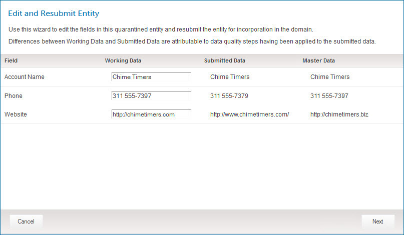

# Edit and Resubmit Entity wizard 

<head>
  <meta name="guidename" content="DataHub"/>
  <meta name="context" content="GUID-6022BC42-6A74-47B9-8724-37416DBD3334"/>
</head>

Selecting **Edit and Resubmit** in the ** Actions** menu in the detail view for a quarantine entry opens the Edit and Resubmit Entity wizard, which is used to edit the fields in the entity and resubmit it for incorporation in the domain.

:::note

Masked values are visible if you have one of the following user permissions:

- **MDM - Privileged Data Steward** role
- **MDM - Administrator** role
- **MDM - Reveal Masked Data** privilege
- **MDM - Data Steward** role (or **MDM - Stewardship** privilege) and the **Reveal Masked Data** Hub entitlement (available with the Advanced Security feature)

:::

## Navigation

The following navigation buttons appear at the bottom of the wizard:

**Cancel**
 Exits the wizard without resubmitting the entity.

**Back**
 Go back to the previous screen. This button is present only in the **Resubmit** screen.

**Next**
 Go to the next screen. This button is present only in the field editor screen.

**Finish**
 Resubmits the entity, with edits, and exits the wizard. This button is present only in the **Resubmit** screen.

## Field editor

The Working Data column fields are pre-populated with the entity field data values. These values reflect the results of data quality steps applied before the entity was quarantined, if any. The other two columns are for reference:

-   The Submitted Data column shows the entity field data as it was originally submitted by the process that routed the batch to the repository.

-   The Master Data column shows the field data in the unambiguously matching golden record, if applicable.

Collections are collapsed by default.

In the reference columns, Long Text field values are represented by the ** View value** icon. Clicking that icon for a represented value opens a dialog in which the value is shown.

In the Working Data column, reference field values are selectable from filtered lists. Clicking a field in that column that corresponds to a reference field reveals a search field. Typing a value in the search field and pressing **Enter** executes the search. If matching values are found, they are listed for selection.

-   If a golden record title format is specified in a referenced domain’s model, title format field values \(in part or in their entirety\), source entity IDs, and actual values \(golden record IDs in their entirety\) are searchable, and values of title format fields are listed for selection.

-   Otherwise, only source entity IDs and actual values \(golden record IDs in their entirety\) are searchable.

For all other field types, text fields are used for editing. Clearing all of the fields in a collection item deletes the item.

:::note

Clicking **Next** has no effect unless fields have been edited.

:::

## Resubmit 

The edited fields are listed with their newly specified values. Clicking **Finish** resubmits the entity with the listed values and closes the wizard.

If the entity was quarantined because it failed a data quality step, the following resubmission options are available:

**Apply all data quality steps**
 When the entity is resubmitted, all data quality steps will be applied to the entity regardless of whether they were previously applied. This option is selected by default.

**Reapply the failed data quality step and apply subsequent steps**
 When the entity is resubmitted, the failed data quality step will be reapplied to the entity and all subsequent steps will be applied.

**Apply data quality steps subsequent to the failed step**
 When the entity is resubmitted, all data quality steps subsequent to the failed step will be applied to the entity.