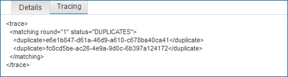

# Entity processing trace

<head>
  <meta name="guidename" content="DataHub"/>
  <meta name="context" content="GUID-b54f46b5-7812-466f-8829-49db265b0619"/>
</head>


Entity processing trace information appears in the Entity Processing Details dialog, which is accessible from the entities list in the Batch detail view. Trace information is presented as XML markup.



The root element is `<trace>` and its structure is as follows:

```
<trace>
   <matching round="" status="">
      <duplicate></duplicate>
      .
      .
      .
      <duplicate></duplicate>
      <unlinkedMatch></unlinkedMatch>
      .
      .
      .
      <unlinkedMatch></unlinkedMatch>
   </matching>
   <tag></tag>
   .
   .
   .
   <tag></tag>
   <dqstep>
      <name></name>
      <connector></connector>
      <operation></operation>
      <success></success>
      <change name="" value=""/>
      .
      .
      .
      <change name="" value=""/>
   </dqstep>
   .
   .
   .
   <dqstep></dqstep>
</trace>
```

Each of the following sections describes one of the direct descendants of `<trace>`.

## `<matching>` 

The `<matching>` element specifies the result of the application of match rules to the entity. If the entity updates a golden record already linked to the source, match rules were not applied, and this element is therefore not present in `<trace>`.

The element has the following attributes:

**Name**
<br />**Description**

`@round`
:   This attribute is populated only if the application of match rules found one or more matching golden records. Its value is the sequential number of the match rule whose application resulted in a match. For example, if a match were to be found as a result of the application of the second match rule, the value would be `2`.

`@status`
:   The outcome of the application of match rules. These are the possible values:

 -   `AMBIGUOUS` — 10 or more matching golden records were found \(1,000 or more in the case of an exact matching expression grouped with a fuzzy matching expression\), and the entity was therefore quarantined.

 -   `DUPLICATES` — One or more matching golden records already linked to the entity’s source were found, and the entity was therefore quarantined. This value is used even if one or more matching golden records not yet linked to the entity’s source were also found.

 -   `MATCH_FOUND` — If the entity’s source is configured to disallow multiple links from individual golden records to entities in the source system, one matching golden record not yet linked to the entity’s source was found. If the entity’s source is configured to allow multiple links, one matching golden record not yet linked to this particular source entity was found. Unless the entity was quarantined, it was eligible for incorporation in the domain as an update to the matching golden record. The update would have included the establishment of a link from the golden record to the source entity.

-   `MULTIMATCH` — Multiple matching golden records not yet linked to the entity’s source were found, and the entity was therefore quarantined.

-   `NO_MATCHES` — There were not any matching golden records. Unless the entity was quarantined, it was eligible for incorporation in the domain as a new golden record.


The element has the following direct descendants:

**Name**
<br />**Description**

`<duplicate>`
:   There is an instance of `<duplicate>` for each matching golden record already linked to the entity’s source. Each instance contains the ID of the matching golden record.

`<unlinkedMatch>`
:   There is an instance of `<unlinkedMatch>` for each matching golden record not yet linked to the entity’s source. Each instance contains the ID of the matching golden record.

## `<tag>` 

Each instance of the repeatable `<tag>` element specifies a tag applicable to the entity data. The tag is specified by name if it exists in the currently deployed version of the domain model. Otherwise, the tag is specified by its system ID. This element is present in `<trace>` only if one or more tags defined in the target domain model are applicable to the entity data.

## `<dqstep>` 

Each instance of the repeatable `<dqstep>` element specifies the outcome of the application of a data quality step. This element is present in `<trace>` only if data quality steps were applied.

The element has the following direct descendants:

**Name**
<br />**Description**

`name`
<br />Name of the step.

`connector`
<br />\(Ordinary steps only\) system name of the data quality service connector for the service used in the step.

`operation`
<br />\(Ordinary steps only\) Name of the data quality service operation used in the step.

`success`
<br />Result of the application of the step. For business rule data quality steps, the value is `true`. For ordinary steps these are the possible values:

   -   `true` — No errors were returned by the data quality service. The entity may have been quarantined for another reason, though.

   -   `false` — The data quality service returned errors, and the entity was therefore quarantined.


`change`
:   \(Ordinary steps only\) An instance of this empty element is present for each field changed as a result of output received from the data quality service operation used in the step. The element has the following attributes:

   **Name**
   <br /> **Description**

   `@name`
   <br />Name of the field whose value changed.

   `@value`
   <br />The field’s new value.