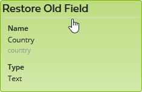
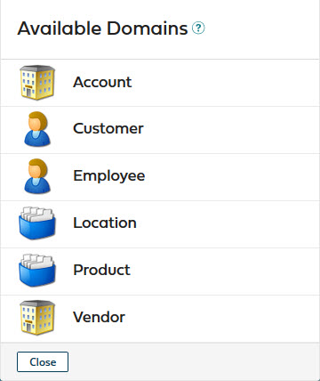
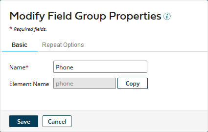
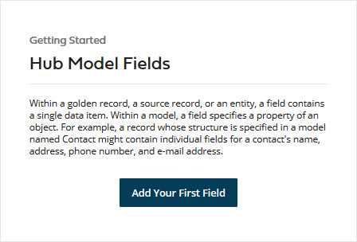
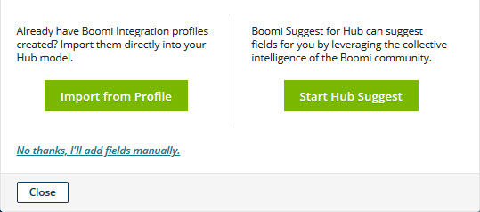

# Fields tab 

<head>
  <meta name="guidename" content="DataHub"/>
  <meta name="context" content="GUID-BC81C4C1-047A-4812-B304-AD5EDC72B3A6"/>
</head>

The **Fields** tab in the model page is used to define the field structure for golden records.

This tab is automatically selected upon loading of the page unless the model name has not been specified, in which case the **Name and Root Element** tab is automatically selected.

For a published model having a newer draft definition, this tab can be used only to view the golden record field structure specified in the published version.

:::note

The controls on this tab for adding and modifying fields are enabled only for administrators and users having roles that include the MDM - View Models and MDM - Edit Models privileges.

:::

## Add a Field or Field Group 

Clicking this button opens the Add a Field or Field Group dialog, which is used to add a field or field group to the golden record field structure.

**Add**
 Selects one of the following to add to the model:

**Field**
  If selected, the dialog appears as follows to enable the addition of a field:

**Field Group**
 If selected, the dialog appears as follows to enable the addition of a field group:

**Save**
 Closes the dialog. In addition:

-   If the specified **Name** is not the same as that of a deleted field, the named field or field group is added below the last existing field or field group.

-   Otherwise, a dialog appears:

    

    -   Clicking **Create New Field** adds the named field or field group below the last existing field or field group and closes the dialog.

        

    -   Clicking **Restore Old Field** restores the deleted field and closes the dialog. The field is restored below the last existing active field or field group regardless of its relative position in the golden record structure at time of deletion.

        

    -   Clicking **Close** closes the dialog, effectively cancelling the request to add a field.

**Cancel**
 Closes the dialog without adding a field or field group.

The following controls are on the **Basic** tab, which is selected when the dialog opens:

**Name**
 Sets the name of the field or field group. The name cannot begin with a number.

:::note

When adding a field, as the field name is typed, the number of characters remaining until the maximum name length is reached is shown. The maximum length of a non-reference field name is 64 characters. The maximum length of a reference field name is 53 characters minus the number of characters in the model’s root element name. For example, a model with the root element name contact \(seven characters\) cannot have a reference field with a name longer than 46 characters.

:::

**Element Name**
 Shows the name of the XML element representing this field or field group in entities propagating to and from repositories. This property is automatically assigned upon creation of a field or field group. Clicking **Copy** copies the element name to the system clipboard.

**Type**
  (Field only)

Selects the data type of the field. The options are as follows:

-   Text \(default\) — maximum length 255 characters. Default is 100. Field values can be partially or fully masked.

    :::note
    
    Setting the Maximum Text Length to a value lower than the previously published value will generate a dialog in which you can opt to truncate existing field data to the new saved value.

    :::

-   Integer — positive or negative whole number. Field values can be partially or fully masked.

-   Float — double-precision binary floating-point. Values exceeding storage capacity are rounded. Field values can be partially or fully masked.

-   Date/Time — format is yyyy-MM-dd'T'HH:mm:ss'Z' — for example, `2013-03-01T15:32:00Z`. Field values can be partially or fully masked.

-   Date — format is yyyy-MM-dd — for example, `2013-03-01`. Field values can be partially or fully masked.

-   Time — format is HH:mm:ss — for example, `15:32:00`. Field values can be partially or fully masked.

-   Boolean — allowable values `true` and `false` \(case-sensitive\). Field values can be fully masked.

-   Reference. Field values cannot be masked. 

-   Enumeration — specified allowable values of maximum length 255 characters. Field values can be partially or fully masked.

-   Long Text — maximum length 5,000 characters. Long Text fields cannot be selected for matching in match rules. Field values can be partially or fully masked.

Once the field is in a published version of the model, its data type cannot be changed.

**Field Details**
  (Field only)

In this section you can set the following field properties:

**Refers To Model**
  (Reference field only)

Selects the model to be referenced by this field.

This cannot be changed once the field is in a published version of the model.

This list is visible only while **Type** is set to Reference.

**Mask**

You can configure model fields with the following options so that field values with sensitive data are masked.
  - **All** - hides entire data. Available for all data types except Reference.
  - **Partial Mask** - hides a portion of the data. Not available for Boolean and Reference type fields.
  - **Partial Show** - reveals a portion of the data. Not available for Boolean and Reference type fields.
  - **None** - reveals entire data

Required

**Yes**
 The field must have a value in golden records.

**No**
 The field need not have a value in golden records.

It is not possible to require an intra-domain reference field. These controls are therefore automatically disabled while the current model is selected in the **Refers To Model** list.

Ensure that a source contributes data to required fields. Boomi DataHub quarantines records until a source contributes data for a required field.

**Allowable Values**
  (Enumeration field only)

Sets the list of allowable values, each of which must be unique and have a maximum of 255 characters:

-   Clicking ** Add allowable value** adds the value typed in the field to the list below.

    Case-sensitivity is enforced. For example, once “red” is added to the list, “Red” cannot be added.

-   Clicking ** Delete this value** adjacent to a value in the list deletes that value.

**Reference Integrity**
  

These check boxes are visible only while **Type** is set to Reference.

**Enforce Incoming**
  (Reference field only)

If selected, referential integrity for entity contributions is enforced with respect to the field as follows:

-   An entity is quarantined if a golden record does not exist for a referenced golden record.

    For example, if an entity is contributed to the Contact domain and its Account field references an account for which a golden record does not exist in the Account domain, the entity is quarantined.

:::note
    
This setting is selected and cannot be cleared for a repeatable reference field \(representing a collection\) because for these fields referential integrity is implicitly enforced.

 In the case of an inter-domain reference, it is not possible to

 -   deploy the model without first deploying the referenced model.

-   attach a source shared by the domain and the referenced domain without first attaching that source to the referenced domain.

-   remove an attachment for a source shared by the domain and the referenced domain without first removing the attachment from the referenced domain.

:::

**Enforce Outgoing**
  (Reference field only)

If selected, referential integrity for source record update requests on channels to sources, as a result of golden record updates, is enforced with respect to the field as follows:

-   Propagation of update requests will occur only to sources already linked to referenced golden records.

    For example, when the golden record for a contact referencing an account is updated, update requests will be propagated only to sources to which the golden record for the referenced account are already linked.

    :::note
    
    It is not possible to enforce outgoing referential integrity for an inter-domain reference field without that field also being required in golden records. Therefore, while Required — **Yes** is selected, Reference Integrity — **Enforce Outgoing** is automatically selected.

    :::

**Validation Options**
  (Text field only, not applicable to Long Text field )

In this section you can set the following field validation options:

**Minimum Text Length**
 Sets the minimum allowed number of characters in the field.

**Maximum Text Length**
 Sets the maximum allowed number of characters in the field.

**Regular Expression**
 Sets the [regular expression](http://docs.oracle.com/javase/6/docs/api/java/util/regex/Pattern.html) specifying the pattern with which the field value in source entities must match.

For example:

-   `\\d\{3\}-\\d\{2\}-\\d\{4\}` — United States social security number \(999-99-9999\)

-   `/^\(https?:\\/\\/\)?\(\[\\da-z\\.-\]+\)\\.\(\[a-z\\.\]\{2,6\}\)\(\[\\/\\w \\.-\]\*\)\*\\/?$/` — web page URL

The following controls are on the **Repeat Options** tab:

**Can Repeat**
 If selected, the field or field group is repeatable. By default this is off.

**Collection Name**
 The name of the collection represented by the field or field group. The name cannot begin with a number.

This control is visible only if **Can Repeat** is on.

:::note

As the collection name is typed, the number of characters remaining until the maximum name length is reached is shown. The maximum length of a collection name is 58 characters minus the number of characters in the model’s root element name. For example, a model with the root element name contact \(seven characters\) cannot have a collection with a name longer than 51 characters.

:::

**Collection Tag**
 Shows the name of the XML element wrapping the collection’s items in entities propagating to and from repositories. This property is automatically assigned upon creation of a repeatable field or field group and is derived from **Collection Name**: Uppercase letters in **Collection Name** are converted to corresponding lowercase letters, and special characters are converted to underscores “\_”. The XPath of the element cannot conflict with that of the element representing another collection, field or field group. Clicking **Copy** copies the collection tag to the system clipboard.

**Identify By**
 Sets the manner in which collection items in incoming entities are identified for matching with collection items in golden records.

**Occurrence**
 Matching is based on order of occurrence. Matching is performed sequentially.

:::note

This radio button is disabled for a reference field.

:::

**Key**
 Matching is based on key field values. Matching is performed only on fields designated as key fields.

These controls are visible only if **Can Repeat** is on.

**Collection Keys**
 Clicking this field reveals a chooser used to select key fields for matching collection items in entities with collection items in golden records.

** Add a key field**
 Adds the selected field to the key field list below.

** Delete this value**
    :   Removes the adjacent field from the key field list.

If the list is empty, all of the field group’s fields are designated as keys.

These controls are enabled only if **Can Repeat** is on for a field group with **Identify By** set to **Key**.

## Import Fields 

Clicking this button opens the Import Fields wizard used to select fields from a profile to import. See the Related reference for the wizard.

## Suggest Fields 

Clicking this button opens the Available Domains dialog used to select the domain from which the Boomi Suggest wizard will derive field suggestions. See the Related reference for the wizard.

**domain list**
 Lists domains supported by Boomi Suggest.

-   **Account**

-   **Customer**

-   **Employee**

-   **Location**

-   **Product**

-   **Vendor**

To select the domain from which the Boomi Suggest wizard will derive field suggestions, click the domain’s name or icon. Selecting a domain closes the dialog and launches the wizard.

**Close**
 Closes the dialog without launching the Boomi Suggest wizard and restores focus to the Fields tab.

## Restore Deleted Fields 

Clicking this button initiates a request to restore the selected deleted fields to the golden record structure. In the confirmation dialog:

-   Clicking **OK** executes the request.

    

    The dialog closes and the selected fields are restored. The fields summary list automatically switches to the Active fields view. The fields are restored below the last existing active field regardless of their relative positions at time of deletion. You can reorder fields in the fields summary list.

-   Clicking **Cancel** cancels the request.

## Fields summary list — active fields 

Lists the active fields and field groups in the model and provides tools for managing them. The id field is required, as it enables maintenance of linkages between golden records and source records. The id field is added automatically as the first field; it cannot be moved, modified or deleted.

Depending on whether a given list entry is a field or field group, the following tools and properties may be shown:

 reorder icon
  Dragging and dropping this icon changes the relative position of the field or field group in the record structure and, if this is a field and the icon is dropped on a field group, moves the field into that field group.

:::note

It is not possible to move a field into a field group that represents a collection.

:::

**expand/collapse icons**
  (Field groups only)

-   Clicking the **+** icon expands the field group, revealing its member fields.

-   Clicking the **–** icon collapses the field group, hiding its member fields.

**Name**
 Name of the field or field group. If this is a field group, the prefix “Field Group” appears. Pausing the pointer on the name displays a tool tip showing the unique field ID or field group ID assigned by . Unique field IDs and field group IDs do not contain lowercase letters.

-   For a field, the name is a link to the Modify Field Properties dialog, which is used to modify the field’s properties. This dialog is much like the Add Field or Field Group dialog \(described above\) with **Add**: **Field** selected. If the link text is green the field is not in a published version of the model.

    

    -   For a field group, the name is a link to the Modify Field Group Properties dialog, which is used to change the field group’s name. This dialog is much like the Add Field or Field Group dialog \(described above\) with **Add**: **Field Group** selected. If the link text is green the field group is not in a published version of the model.

        

**Unique ID**
 The field’s unique ID. Unique IDs are used when editing the model’s golden record title format. The unique ID cannot contain spaces, special characters, or lowercase characters.

**Repeatable**
 If the field or field group is repeatable this is indicated by the text “Yes.”

**Type**
  (Fields only) data type — one of the following:

-   Boolean

-   Date

-   Date/Time

-   Enumeration

-   Float

-   Integer

-   Long Text

-   Reference

-   Text

-   Time

**Required**
  (Fields only) If the field must have a value in golden records this is indicated by the text “Required.”

** Delete this field**
 Initiates a request to delete the field or field group. Deleting a field group also deletes its member fields.

In the confirmation dialog:

-   Clicking **OK** executes the request.

-   Clicking **Cancel** cancels the request.

:::note

To effectively undo the deletion of a field group, you must either restore its member fields and then regroup them or click **Cancel** or **Close** and discard all unsaved changes to the model.

:::

## Fields summary list — deleted fields 

Lists the deleted fields in the model and provides a tool for restoring them.

**check box**
 Turning this on selects the field for restoration.

The field properties displayed here — Name, Type and Required — are the same as in the active fields summary list, but here the field name is not a link.

## Active

Switches the fields summary list to active fields.

-   The **Restore Deleted Fields** button disappears.

-   The **Add a Field**, **Group Field** and **Suggest Fields** buttons appear.

## Deleted 

Switches the fields summary list to deleted fields.

-   The **Add a Field**, **Group Field** and **Suggest Fields** buttons disappear.

-   The **Restore Deleted Fields** button appears.

## Getting Started: Hub Model Fields 

Until the first field is added to a model definition, this Getting Started box will be visible in the **Fields** tab:

**Add Your First Field**
 Opens the dialog used to select the method of initially adding fields and field groups to the model.

-   Clicking **Import from Profile** has the same effect as clicking **Import Fields**.

-   Clicking **Start Hub Suggest** has the same effect as clicking **Suggest Fields**.

-   Clicking **No thanks, I’ll add fields manually** has the same effect as clicking **Add a Field or Field Group**.