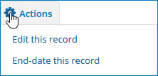
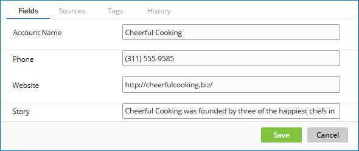

# Golden record detail view

<head>
  <meta name="guidename" content="DataHub"/>
  <meta name="context" content="GUID-326D3A26-9FA9-4883-B3B1-DFA43DBECCC7"/>
</head>


The detail view for a golden record contains detailed information about that golden record.

Doing any of the following opens a golden record’s detail view:

-   In the Golden Records page’s data grid, click the golden record’s Updated Date.

-   In the Golden Records page’s data grid or another golden record’s detail view, click a reference field value. Doing this opens the detail view for the referenced golden record.

-   In the detail view for a quarantine entry, select the **Match Details** tab and under the heading “Potential Duplicates” or “Multiple Matched Unlinked Records”, click the link for the matching golden record.

-   In the Outbound Activity page \(**Reporting** \> **Outbound Activity**\), click the title or ID of an updated golden record.


:::note

Masked values are visible if you have one of the following user permissions:

- **MDM - Privileged Data Steward** role
- **MDM - Administrator** role
- **MDM - Reveal Masked Data** privilege
- **MDM - Data Steward** role (or **MDM - Stewardship** privilege) and the **Reveal Masked Data** Hub entitlement (available with the Advanced Security feature)

:::

Clicking and dragging the **** icon in the view border adjusts the width of the view.

In the view header:

**Name**
<br />**Description**

**View title**
<br /> 
-   If a golden record title format is specified in the domain model, the view title is the golden record title.

-   Otherwise, the view title is the system golden record ID.


**Repository**
<br />Repository on which the domain containing the golden record is hosted.

**Model**
<br />Domain containing the golden record.

**Golden Record ID**
<br />The system golden record ID.

The URL for the view specifies the golden record ID as the value of the parameter `ids` — for example:

```
    https://platform.boomi.com/MdmSphere.html#mdm_data;accountId=account-123456;repository=01234567-89ab-cdef-0123-456789abcdef;universe=abcdef01-2345-6789-abcd-ef0123456789;**ids=c23e3c8c-2840-449e-ba6c-ea90eccd99c3**
```

##  Actions

Clicking this button opens a menu of actions applicable to the golden record: This button is present only in the Golden Records page.




-   **Edit this record** — \(Active records only\) Automatically selects the **Fields** tab and transforms the tab into a dialog, enabling the editing of the golden record. See “Fields tab” below.

    :::note
    
    This action is available only to administrators and users having a role with the Edit Records entitlement.

    :::

-   **End-date this record** — \(End-dated records only\) Initiates a request to end-date the golden record. When a golden record is end-dated, source record update requests specifying Delete operations are propagated to attached sources.

    In the confirmation dialog:

    -   Clicking **End-date** executes the request.

    -   Clicking **Cancel** cancels the request.

    :::note

    It is not possible to end-date a golden record that is referenced by another golden record.

    :::
    
    :::note
    
    This action is available only to administrators and users having a role with the End-date Records entitlement.

    :::

-   **Restore this record** — \(End-dated records only\) Initiates a request to restore the golden record as an active record. In the confirmation dialog:

    -   Clicking **OK** executes the request.

    -   Clicking **Cancel** cancels the request.

    After restoring the golden record, a Restore Record update request propagates on the channel of each source to which the golden record is linked. A single request propagates to an individual source, even if you link the golden record to multiple entities in that source system. Also, it attempts to resolve any pending references in the golden record.

    :::note
    
    This action is available only to administrators and users having a role with the Restore Records entitlement.

    :::

-   **Purge this record** — Initiates a request to purge the golden record.

    :::caution

    Purging a golden record permanently removes it from the domain and cannot be undone. When a golden record is purged, source record update requests specifying Delete operations are *not* propagated to attached sources.

    :::

    :::note

    The quarantine entries counts in the Repositories page and the repository Summary tab can take more than a minute to update to reflect the purge.

    :::

    In the confirmation dialog:

    -   Clicking **Purge** executes the request.

    -   Clicking **Cancel** cancels the request.

    When a golden record is purged from a domain that has a default source, resolved references to that golden record are changed to pending.

    :::note
    
    This action is available only to administrators and users having a role with the Purge Records entitlement.

    :::


## Fields tab

In this tab is a list of the golden record’s fields and their corresponding values. The view opens with this tab selected.

-   Collections are collapsed by default. Clicking a collection’s **** icon expands the collection, revealing its items. Clicking a collection’s **** icon collapses the collection, hiding its items.

-   Source agreement is viewable for fields for which sources are ranked. In the case of an ordinary field, a source is considered to be in agreement if its most recent entity submission specified a value for the field identical to the field value in the golden record. Similarly, in the case of a collection, a source is considered to be in agreement if its most recent entity submission specified a collection identical to the collection in the golden record.

    -   Clicking **View Source Agreement** reveals a list of the domain sources in their ranked order. In the list the  icon and bold type indicate the sources in agreement. For each source in agreement, the timestamp of the relevant entity submission is shown.

    

    -   Clicking **Hide Source Agreement** hides the list of sources.

-   Reference field values are links to details for the referenced golden record. If a golden record title format is specified in a referenced domain’s model, the values of title format fields in referenced golden records are shown as reference field values instead of golden record IDs. If a reference field value is unresolved, the text “Unresolved” appears.

    Source entity IDs contributed as reference field values in entities by individual sources are viewable. The respective states of the references are viewable as well. To view this information in the Source Contributions view, in the field’s list entry click ** View contributed values by source**.

-   Long Text field values are represented by the ** View value** icon. Clicking that icon for a represented value opens a dialog in which the value is shown.

-   Upon the selection of **Edit this record** from the view’s ** Actions** menu \(active records only\), the tab is automatically selected and transforms to a dialog. Changes to the golden record’s field values can be specified by typing new values in the dialog’s fields.

    Reference field values are selectable from filtered lists. Clicking a dialog field corresponding to a reference field reveals a search field. Typing a value in the search field and pressing **Enter** executes the search. If matching values are found, they are listed for selection.

    -   If a golden record title format is specified in a referenced domain’s model, the values of title format fields \(in part or in their entirety\) and actual values \(golden record IDs in their entirety\) are searchable, and title format field values are listed for selection.

    -   Otherwise, only actual values \(golden record IDs in their entirety\) are searchable.

    This dialog cannot be used to add collection items.

    Clearing all of the fields in a collection item deletes the item.

    

    While the tab is a dialog:

    **Name**
    <br />**Description**

    **Save**
    <br />Applies field value changes to the golden record.

    While the golden record is updated, a status message is displayed in the dialog. Upon successful completion of the update, the tab transforms back to its default state, and the status message “The golden record was successfully updated” appears.

    **Cancel**
    <br />Cancels the changes and transforms the tab back to its default state.


## Sources tab

In this tab is a list of the golden record’s links to source entities. Clicking **** refreshes the list.


For each source the following tool is shown:

-   Clicking the gear icon **** opens a menu of actions applicable to the source:

    

    -   **View Pending Updates** — Opens the Outbound Activity page \(**Reporting** \> **Outbound Activity**\) in which you can view details about pending update requests targeting the source.

    -   **Resend Channel Update** — Initiates a request to propagate the current state of the golden record to the source on its channel\(s\). In the confirmation dialog:

    -   Clicking **OK** executes the request.

        -   If the link is established, an update request specifying an update operation is propagated.

        -   If the link is pending, an update request specifying a create operation is propagated.

    -   Clicking **Cancel** cancels the request.

        :::note
        
        This action is available only to administrators and users having a role with the MDM - Source Management privilege.

        :::

    -   **Unlink this Source** — Initiates a request to remove all links to the source’s entities. In the confirmation dialog:

        -   Clicking **OK** executes the request.

            If the source is configured to prevent delivery of update requests specifying create operations on the source’s channel for either all golden records or this golden record given its tags, the links are removed. Otherwise, the state of each link is changed to Pending.

            If the source is designated as the domain’s default source, resolved references to this golden record are changed to Pending.

        -   Clicking **Cancel** cancels the request.

        This action is not available for non-contributing sources, sources for which there are pending links, or the only source to which the golden record is linked.

        :::note
        
        This action is available only to administrators and users having a role with the MDM - Source Management privilege.

        :::


In the case of a source for which the golden record is linked to multiple entities, for each link the following tool is shown:

-   Clicking the gear icon **** opens a menu of actions applicable to the link. There is only one such action:

    -   **Unlink Source Entity** — Initiates a request to remove the link. In the confirmation dialog:

    -   Clicking **OK** executes the request.

        If the source is configured to prevent delivery of update requests specifying create operations on the source’s channel for either all golden records or this golden record given its tags, the link is removed. Otherwise, the state of the link is changed to Pending.

        If the source is designated as the domain’s default source, resolved references to this golden record are changed to Pending.

    -   Clicking **Cancel** cancels the request.

        This action is not available for non-contributing sources, a pending link, or the only source to which the golden record is linked.

   :::note
   
   This action is available only to administrators and users having a role with the MDM - Source Management privilege.

   :::


For each link, the following properties are shown:

-   Source

-   State — The state of the link.

    -   Established — The link is established. The date and time at which establishment of the link occurred is shown.

    -   Pending — The link is pending delivery to the source of a record update request currently on the source’s channel\(s\).

-   Entity ID — ID of the source entity to which the golden record is linked. Clicking the ID, if it is shown as a link, opens the record in the source system in another browser tab or window, provided the source entity URL format is correctly specified in the **Entity ID URL** field for the source attachment in the **Sources** tab, or if not there, for the source definition in the Sources page.


## Tags tab

In this tab is a list of the golden record’s tags.


## History tab 
In this tab is a list of the versions of the golden record in reverse chronological order beginning with the current version and ending with the original version.


For each version the following tool and information are shown:

-   Clicking the gear icon **** opens a menu of actions applicable to the version:
    -   **View Batch Entity** — Opens the Batch Entity dialog which lets you view the entity data for the version:

        **Name**
        <br />**Description**

        **ID**
        <br /> The system entity ID.

        **Fields**
       <br />The entity data — fields and their respective values. The values reflect the results of successfully applied data quality steps, if any. Collections are collapsed by default. This tab is selected by default.

        **Submitted XML**
        <br />The originally submitted entity data in the native XML format of the incoming batch.

        If this version was an Update resulting from an **Edit this record** operation in golden record detail view in , this tab is not available.

        **Close**
        <br />Closes the dialog.

-   Updated Date — Date and time of the operation performed on the golden record. This is a link to the version detail view.

-   Source — Source of the batch that specified the operation performed on the golden record.

-   Summary — Operation performed on the golden record. One of the following:

    -   Created — The golden record was created.

    -   Restored — The golden record was restored as an active record after having been end-dated.

    -   Updated — The golden record was updated. The number of updated fields is also shown.


## Navigation bar

The following navigation controls are in the bar at the bottom of the view:

**Name**
<br />**Description**

** Previous**
<br />Navigates to detail for the previous golden record in the data grid. Keyboard shortcut: **Up arrow**.

**Next **
<br />Navigates to detail for the next golden record in the data grid. Keyboard shortcut: **Down arrow**.

**Close**
<br />Closes the view. If the **Golden Records** page is currently loaded, the data grid updates. Keyboard shortcut: **Esc**.

:::note

You can also close the view by clicking elsewhere in the tab from which you opened the view.

:::

:::note

** Previous** and **Next ** are present only in the Golden Records page.

:::