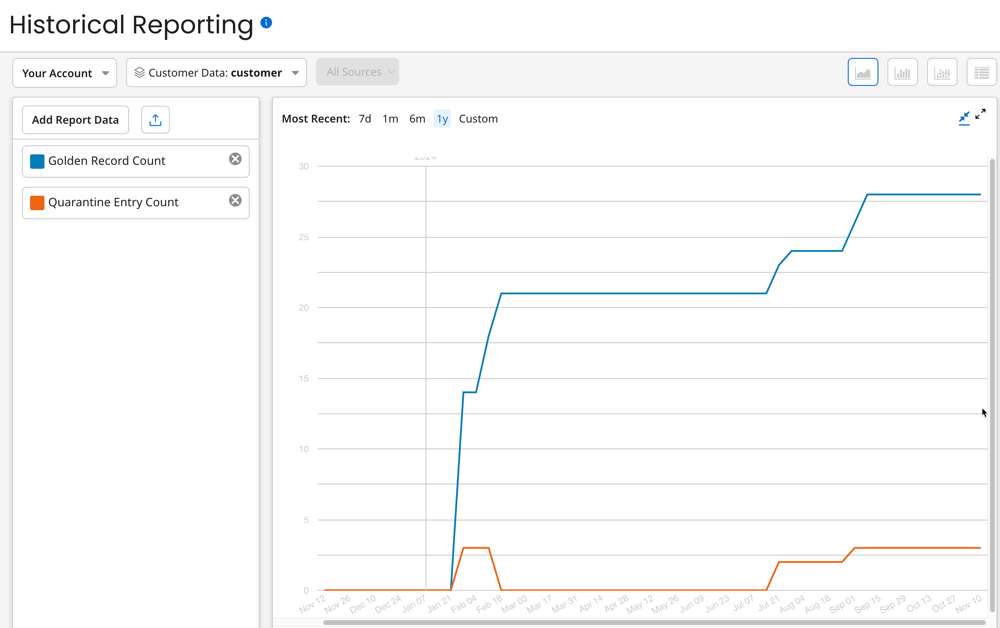
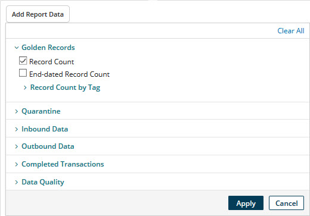
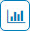

# Historical Reporting page 

<head>
  <meta name="guidename" content="DataHub"/>
  <meta name="context" content="GUID-2CF463DB-52CF-427E-A997-13CCF65E3914"/>
</head>

Selecting **Reporting** \> **Historical** opens the Historical Reporting page, which is used to build and view reports on historical data.

:::note

The page is accessible only by administrators and users having a role with the MDM - Historical Reporting privilege.

:::

## Your Account/Account Groups

The account in use in the current session \(Your Account\) and individual account groups are selectable from this list for inclusion in the scope of the report. By default Your Account is selected. This list is visible only if you are an administrator of a primary account who manages multiple accounts.

## Repositories/models 
Repositories and models \(domains\) are selectable from this list for inclusion in the scope of the report. Individual models are indented in the list below their respective repositories. Selecting just a repository also selects all of its models. The button label shows the current selection; the selected model\(s\) are indicated in bold. By default all repositories and models are selected.

## Source\(s\) 

If an individual model \(domain\) is selected for inclusion in the scope of the report, this list is enabled to allow selection of one or all of the model’s sources. The button label shows the current selection. By default all sources are selected.

## Add Report Data

Reveals a dialog used to add data types to the report.

## Golden Records

Clicking ** reveals controls for selecting golden record data types applicable to the selected scope. Clicking **** hides the controls.

- **Record Count** - Selects counts of active golden records as of the end of reporting intervals. This check box is disabled while the selected scope is limited to a single source.
- **End-dated Record Count** - Selects counts of end-dated golden records as of the end of reporting intervals. This check box is disabled while the selected scope is limited to a single source.
  - **Record Count by Tag** - Clicking **** reveals controls for selecting active golden record counts applicable to the selected scope by tag. Clicking **** hides the controls.

## Quarantine

Clicking **** reveals controls for selecting quarantine data types applicable to the selected scope. Clicking **** hides the controls.

- **Entry Count** - Selects counts of quarantine entries as of the end of reporting intervals.
  - **Entry Count by Tag** - Clicking ** reveals controls for selecting quarantine entry counts applicable to the selected scope by tag. Clicking  hides the controls.

### Entries Created

Selects counts of quarantine entries created during reporting intervals.

#### Entries Created by Cause

This section contains controls for selecting counts of quarantine entries created during reporting intervals by category of reason for quarantining and specific cause of quarantining.

- **Data Incorporation Error** - Selects counts of entities quarantined during reporting intervals while being incorporated in the target domain.
  - **Other Incorporation Error** - Selects counts of entities quarantined during reporting intervals while being incorporated in the target domain due to causes other than unresolvable references.
  - **Unknown Reference Value** - Selects counts of entities quarantined during reporting intervals while being incorporated in the target domain due to unresolvable references, either collection items or fields for which referential integrity for entity contributions is enforced.
  - **Record Already End-dated** - Selects counts of entities quarantined during reporting intervals while being incorporated in the target domain due to the existence of links from end-dated golden records.
- **Data Integration Error** - Selects counts of entities quarantined during reporting intervals due to their failure to structurally conform with the field layout specified in the domain model.
- **Data Quality Error** - Selects counts of entities quarantined during reporting intervals due to data quality step failure.
- **Data Validation Error** - Selects counts of entities quarantined during reporting intervals due to data validation errors.
  - **Required Field Omitted** - Selects counts of entities quarantined during reporting intervals due to their omission of fields specified as required or as key fields for collections in the domain model.
  - **Field Format Error** - Selects counts of entities quarantined during reporting intervals because they contain data not in conformance with either their field type, validation options for that field type specified in the domain model, or with the system 255-character limit for text and Enumeration field values.
  - **Duplicate Collection Key** - Selects counts of entities quarantined during reporting intervals because they contain multiple collection items with the same key values.
- **Matching Error** - If on, selects counts of entities quarantined during reporting intervals due to matching errors.
  - **Multiple Matches** - Selects counts of entities quarantined during reporting intervals due to their matching multiple golden records not yet linked to a record in the source.
  -**Ambiguous Match** - Selects counts of entities quarantined during reporting intervals due to their matching 10 or more golden records, regardless of links to source records \(1,000 or more in the case of an exact matching expression grouped with a fuzzy matching expression\).
  - **Potential Duplicate** - Selects counts of entities quarantined during reporting intervals due to their matching golden records that have already been linked to a record in the source.
  - **Reference Matching Error** - Selects counts of entities quarantined during reporting intervals due to their having a value in a reference field specified for matching in a match rule that does not resolve to a golden record.

- **Requires Approval** - If on, selects counts of entities quarantined during reporting intervals due to source-specific manual approval requirements.
  - **Create Approval Required** - Selects counts of entities quarantined during reporting intervals due to their satisfying conditions configured for their source requiring the manual approval of new entity contributions.
  - **Update Approval Required** - Selects counts of entities quarantined during reporting intervals due to their satisfying conditions configured for their source requiring the manual approval of contributed entities that would update matching golden records.
  - **End-date Approval Required** - Selects counts of entities quarantined due to their source being configured to require manual approval of contributed entities that would end-date matching golden records.

### Entries Resolved

Selects counts of quarantine entries resolved during reporting intervals.

#### Entries Resolved by Resolution Type

This section contains controls for selecting counts of quarantine entries resolved during reporting intervals by method of resolution.

- **Approved for Incorporation** - Selects counts of entries for which a user approved the quarantined entity.
- **Entity Deleted**- Selects counts of entries for which a user requested deletion.
- **Entity Rejected** - Selects counts of entries for which a user rejected the quarantined entity.
- **Fields Selectively Merged** - Selects counts of entries for which a user merged fields from the quarantined entity into a selected matching golden record and also rejected the quarantined entity.
- **Golden Record Deleted** - Selects counts of entries for which a user manually deleted the golden record associated with the quarantined entity.
- **Golden Record Restored** - Selects counts of entries resolved by restoring an end-dated golden record linked to the quarantined entity.
- **Matching Issue Resolved** - Selects counts of entries for which a user resolved the matching issue associated with the quarantined entity.
- **Newer Version Contributed** - Selects counts of entries for which a newer version of the quarantined entity was contributed in a batch, thereby making this quarantine entry obsolete.
- **Newer Version Incorporated** - Selects counts of entries automatically resolved as a result of the successful incorporation in the target domain of a replacement for the quarantined entity.
- **Resubmitted Ignoring Enrichment** - Selects counts of entries for which a user resubmitted the quarantined entity, applying only data quality steps subsequent to the failed step.
- **Resubmitted Retrying Enrichment** - Selects counts of entries for which a user resubmitted the quarantined entity, reapplying the failed data quality step and all subsequent steps.
- **Resubmitted With Edits** - Selects counts of entries for which a user edited and resubmitted the quarantined entity using the Edit and Resubmit Entity wizard.
- **Resubmitted Without Editing** - Selects counts of entries for which a user resubmitted the quarantined entity without editing.

## Inbound Data

Clicking **** reveals controls for selecting inbound data types applicable to the selected scope. Clicking **** hides the controls.

- **Batches Submitted** - Selects counts of incoming batches during reporting intervals.
- **Entities Submitted** - Selects counts of incoming entity contributions during reporting intervals.

## Outbound Data

Clicking **** reveals controls for selecting outbound data types applicable to the selected scope. Clicking **** hides the controls.

- **Delivered Update Requests** - Selects counts of delivered source record update requests. A delivery is recorded only upon acknowledgment by an integration process on behalf of the targeted source.

## Completed Transactions

Clicking **** reveals controls for selecting completed transaction data types applicable to the selected scope. For a given entity a transaction begins with the entity's contribution in a batch, may include quarantining and resolution, and eventually may culminate with incorporation in the target domain. Clicking **** hides the controls.

- **Total Count** - Selects counts of transactions completed during reporting intervals.

#### Count by Result

- **Created Record** - Selects counts of completed transactions during reporting intervals resulting in the creation of golden records.
- **Updated Record** - Selects counts of completed transactions during reporting intervals resulting in the updating of golden records.
- **End-dated Record** - Selects counts of completed transactions during reporting intervals resulting in the end-dating of golden records.
- **Linked to Record** - Selects counts of completed transactions during reporting intervals resulting in the linking of a golden record to the source entity.
- **No Change to Record** - Selects counts of completed transactions during reporting intervals resulting in no change to a record when Hub determines an entity is a duplicate.
- **Early Delta Detection** - Selects counts of completed transactions during reporting intervals resulting in Hub applying early delta detection to the entity and skipped processing it. This occurred because the entity would result in no change to the record.

## Data Quality

Clicking  reveals controls for selecting data that relates to the application of data quality steps to incoming source entities.

- **Process Call Count** - Selects counts of requests to listener processes from process call data quality steps applied to incoming source entities.

##  Download CSV 

Exports report data to comma-separated values \(CSV\) format.

Depending on the browser and its download settings, it may be necessary to specify the destination path and filename to complete the request.

The default CSV filename is mdm-report-timestamp.csv, where timestamp is the date and time of the download request in the format YYYYMMDDHHMMSS.

In the CSV file:

-   The first column always represents the date of a data point in the displayed report. This representation is consistent with the tabular report format option.

-   Breakdowns are represented as follows: Header rows — for example, Date, Account, Repository, etc. — are in row \#2, and breakdown information — for example, Golden Record, Quarantine Entry — are in row \#1.

## Reported data types 

Data types selected for reporting, and, if applicable, data selected for inclusion in data point breakdown, are listed below the **Add Report Data** button. The list is a color-coded legend to data points and breakdown in a report for which a chart format is selected. Clicking **** on a data type’s list entry removes the data type from the report.

If a single data type is selected and **Breakdown by …** is off, the Mean, Min\(imum\)/Max\(imum\) counts, and Median are shown. The total count is shown as well if the selected data type is **Quarantine Entries Created** \(total or by Cause\), **Inbound Data**, or **Completed Transactions** \(total or by Result\).

**Breakdown by account/repository/model/source**
 If on \(switched to the right\), data point breakdown is visible in the report.

-   Data points in an account group-level report are broken down by account.

-   Data points in an account-level report are broken down by repository.

-   Data points in a repository-level report are broken down by model \(domain\).

-   Data points in a model-level report are broken down by source.

Check boxes toggle data visibility in the breakdown. Data is visible in the breakdown only if the check box for the data is on.

This switch is in the off position and is disabled while the selected scope is limited to a single source, multiple data types are selected, or **Golden Record Count** is selected and the scope is limited to a single model.

## Report Options 

These controls are used to select the report format:

- **Most Recent** - These controls are used to select the reporting interval and period. The current selection is highlighted in orange.
- **7d** - Refreshes the displayed report to show data for each day during the seven-day period ending yesterday.
- **1m** - Refreshes the displayed report to show data for each day during the one-month period ending yesterday — for example, June 11-July 10.
- **6m** - Refreshes the displayed report to show data for each week \(Monday-Sunday\) during the six-month period ending last Sunday.
- **1y** - Refreshes the displayed report to show data for each calendar month during the one-year period ending yesterday.
- **Custom** - While selected, these controls for specifying a custom reporting period are revealed. 

**Start Date**
 The start date for the period can be typed or selected using the calendar control.

**End Date**
 The end date for the period can be typed or selected using the calendar control.

Changing **Start Date** or **End Date** refreshes the displayed report to reflect the newly specified period. The reporting interval automatically adjusts to accommodate the length of the specified period.

** View Line Chart**
 Changes the report format to a line chart. This is the default.

** View Bar Chart**
 Changes the report format to a bar chart.

** View Stacked Bar Chart**
 Changes the report format to a stacked bar chart. This format is meaningful only for multiple data type reporting, where relationships exist between data types, and for data point breakdown.

**View Tabular Data**
 Changes the report format to a table. The table is sorted in reverse chronological order.

## Report

In a report for which a chart format is selected:

-   Pausing the pointer on an ordinary data point shows the associated data type, the date or date range and the count.

-   Pausing the pointer on a data item in a breakdown shows the associated model \(domain\) or source, the date or date range, and the count.

-   If the report is restricted to a single data type and **Breakdown by …** is off, dashed horizontal lines represent the mean and median. Pausing the pointer on either of these lines shows the represented metric. If the date range of the report spans multiple years, the start of a year is indicated by an appropriately labeled vertical line.

** Full screen**
 Restores the report to default size.

** Exit full screen**
 Minimizes the report.