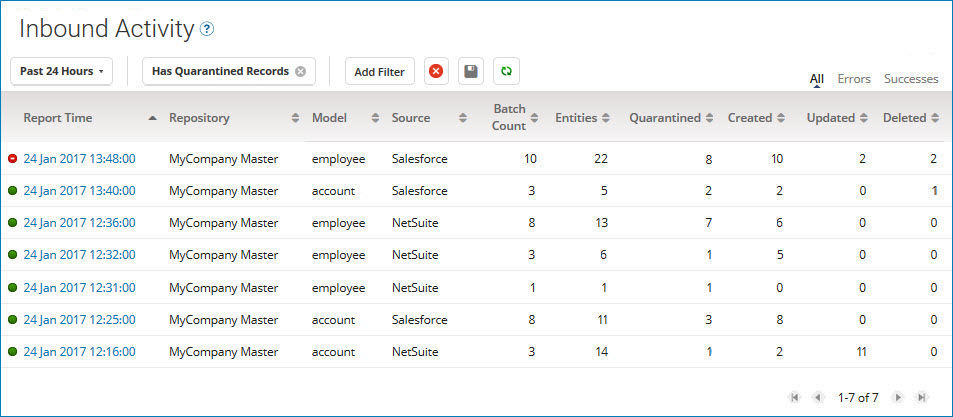
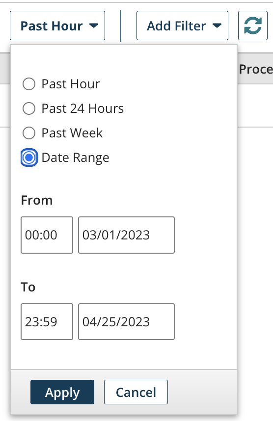
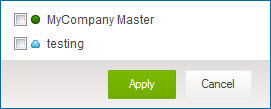
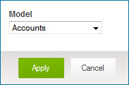
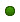

# Inbound Activity page 

<head>
  <meta name="guidename" content="DataHub"/>
  <meta name="context" content="GUID-FA6CDBB4-3489-466F-8C51-BABF4D967D1D"/>
</head>

Selecting **Reporting** \> **Inbound Activity** opens the Inbound Activity page, which is used to view reports on previously processed incoming batches. A report is specific to a repository, domain and source for batches completed or staged during a one-minute span.

After receiving a small entity batch, Boomi DataHub may wait several seconds to receive additional batches. In this scenario, Boomi DataHub combines small batches and applies a single batch ID when processing.

## Time span filter 

The reports list is filtered by a specified time span. The button label indicates the currently applied time span. Clicking the button opens the dialog used to set the time span. The default is **Past Hour** unless another time span has been explicitly saved as the default.

**Name**
 **Description**

**Past Hour**
 Selects the past hour.

**Past 24 Hours**
 Selects the past 24 hours.

**Past Week**
 Selects the past week.

**Date Range**
  Enables the selection of a custom time span. The default is the past month.

-   **From** — Sets the starting time and date:

    -   time — Type a value in the range 00:00–23:59, or select a :00 or :30 value.

    -   date — Type the value or select it from the calendar.

-   **To** — Sets the ending time and date:

    -   time — Type a value in the range 00:00–23:59, or select a :00 or :30 value.

    -   date — Type the value or select it from the calendar.

**Apply**
 Sets the selected time span, closes the dialog and applies the filter.

**Cancel**
 Closes the dialog without setting the time span.

## Filters

The reports list can optionally be filtered using one or more of the following types of criteria:

-   Repositories

-   Model — domain

-   Source

-   Has Quarantined Records

-   Has Created Records

-   Has Deleted Records

While a filter is applied, a button for that filter appears to the left of the **Add Filter** button. The button’s label shows the specified criterion — for example, **Model:** Employees. Clicking  on the button clears the filter. If a dialog is used to apply the filter, clicking elsewhere on the button opens that dialog for the purpose of modifying the criterion.

**Name**
 **Description**

**Add Filter**
 Lists filter types for selection:

-   Repositories — Opens the dialog used to apply filtering by repository. In that dialog clicking the check box for a repository selects that repository.

    

    -   **Apply** — Sets the filter criterion, closes the dialog and applies the filter.

    -   **Cancel** — Closes the dialog without applying a filter.

-   Model — Opens the dialog used to apply filtering by model.

    

    -   **Model** — Selects the model by which to filter.

    -   **Apply** — Sets the filter criterion, closes the dialog and applies the filter.

    -   **Cancel** — Closes the dialog without applying a filter.

-   Source — Opens the dialog used to apply filtering by source.

    

    -   **Source** — Selects the source by which to filter. The selection MDM specifies single-entity batches submitted via **Edit this record** in golden record detail view in .

    -   **Apply** — Sets the filter criterion, closes the dialog and applies the filter.

    -   **Cancel** — Closes the dialog without applying a filter.

-   Has Quarantined Records — Filters by batches from which entities were quarantined.

-   Has Created Records — Filters by batches from which golden records originated.

-   Has Deleted Records — Filters by batches which resulted in the deletion of golden records.

** Clear All Filters**
 Clears all filters.

** Save current filters as default view**
 Saves the currently applied filters as defaults for application to the reports list when Inbound Activity reloads.

## ** Refresh**

Refreshes the reports list.

## Result type filter 
The reports list can optionally be filtered by processing results:

**Name**
  **Description**

**All**
 Filtering by results is not applied. This is the default.

**Errors**
 Show only reports referencing batches that were processed with errors.

**Successes**
 Show only reports referencing batches that were processed successfully.

## Reports list 

Lists batch reports, subject to filtering applied using the controls above the list. The list is sourced from the repository with updates occurring every five minutes.

Each report includes the following:

**Name**
 **Description**

**status**
 Status of the subject batches:

-    All subject batches were processed successfully — this does not mean there were not any quarantined entities. Hovering the pointer on this icon displays the help text “Success”.

-    At least one of the subject batches was processed with errors. Hovering the pointer on this icon displays the help text “Errors”.

**Report Time**
 Starting time of the one-minute span to which the report applies. This is a link to the Batch Report detail view, in which you can view details about the subject batches.

**Repository**
 Repository on which the target domain for the subject batches is hosted.

**Model**
 Target domain for the subject batches.

**Source**
 Source from which the subject batches were contributed.

**Batch Count**
 Count of the subject batches.

**Entities**
 Aggregate count of entities in the subject batches.

:::note

Any difference between this count and the sum of the aggregate counts of quarantined entities plus the sum of the aggregate counts of golden records created, updated, and deleted, is attributable to entities not quarantined but for which there was not an operation on a golden record.

:::

**Quarantined**
 Aggregate count of entities quarantined during the processing of the subject batches.

**Created**
 Aggregate count of golden records originated during the processing of the subject batches.

**Updated**
 Aggregate count of golden records updated as a result of the processing of the subject batches.

**Deleted**
 Aggregate count of golden records end-dated as a result of the processing of the subject batches.

By default the list is sorted by report time from newest to oldest. Clicking a column heading selects the column by which to sort the list. Clicking the selected column reverses the sort order.

In addition to the scroll bars, the following controls are used to navigate the list:

**Name**
 **Description**

****
 Loads the first reports.

****
 Loads reports immediately prior to those currently loaded.

x-y of z
  Indicates the number and relative chronological position of reports currently loaded — for example, “51-75 of 2086”. The total report count shown reflects currently applied filtering.

****
 Loads reports immediately subsequent to those currently loaded.

****
 Loads the last reports.