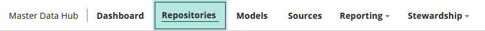

# Menu

<head>
  <meta name="guidename" content="DataHub"/>
  <meta name="context" content="GUID-7e419afa-e20a-4a7f-a36d-3e1e5ee2cb94"/>
</head>

While you are using Boomi DataHub, its menu spans the page beneath the top banner.

The links in the menu open pages of the same names, except in the cases of **Reporting** and **Stewardship**, each of which opens a sub-menu:

-   [Dashboard](/docs/Atomsphere/Master%20Data%20Hub/Menu/r-mdm-Dashboard_page_0e558be0-f04c-43d4-8bbd-62d32927bc08.md) — provides a quick view of the activity and status of your account's repositories and domains.

-   [Repositories](/docs/Atomsphere/Master%20Data%20Hub/Menu/r-mdm-Repositories_page_befd5b73-7099-403f-b8e7-83038d2a4e7b.md) — used to manage and configure repositories and their hosted domains.

-   [Models](/docs/Atomsphere/Master%20Data%20Hub/Menu/r-mdm-Models_page_c8239e18-c40e-431e-bff0-fe7695b369f3.md) — used to manage and configure models.

-   [Sources](/docs/Atomsphere/Master%20Data%20Hub/Menu/r-mdm-Sources_page_9b87ef4a-389e-4bf0-b431-6b8c59cdc1d8.md) — used to manage and configure sources.

-   [Reporting](/docs/Atomsphere/Master%20Data%20Hub/Menu/r-mdm-Reporting_menu_2487896e-1595-4c20-8c15-cbb8e06e01a9.md) — provides access to reports: inbound batch activity, outbound activity, historical, and bulk processing requests.

-   [Stewardship](/docs/Atomsphere/Master%20Data%20Hub/Menu/hub-Stewardship_menu_46c25a29-2b5e-4f1e-96de-2350c04fa03e.md) — provides access to stewardship functions: viewing and managing domain data, staged domain data, and quarantines.

The Repositories page is the Boomi DataHub home page.

:::note

The presence of individual menu items for a given user is dependent on the privileges enabled in the role assigned to that user. The required privileges are specified in the page reference topics linked above.

:::