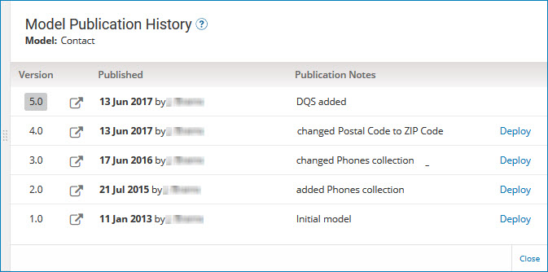
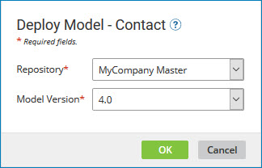

# Model Publication History view 

<head>
  <meta name="guidename" content="DataHub"/>
  <meta name="context" content="GUID-5862EE85-2B08-4CE6-B8F0-38486E504DEF"/>
</head>

The Model Publication History view is used to view the model publication history and historical versions of the model and to roll deployment back or forward to other published versions.

Any of the following actions opens the view:

-   In the **Summary** tab in the repository page for a repository to which a model is deployed, clicking the deployed version.

-   In the Models page, selecting **View Publication History** from the model’s gear icon  menu.

-   In the Models page, clicking the model’s most recently published version number.

In the view header:

**Name**  
**Description**

**Model**    
Model for which the publication history is shown.

Clicking and dragging the **** icon in the view border adjusts the width of the view.

## Versions summary list 

Shows the model publication history. For each version of the model, the publication date, publication note and the requesting user are shown.

Clicking ** View this version of the model** loads the model page for that version, read-only, in a separate browser tab or window.

If the view was opened from a repository page, the version currently deployed to that repository is shaded.

The **Deploy** link opens the Deploy Model dialog, which is used to request deployment of a different version of the model than the one currently deployed.

:::note

The **Deploy** link is visible only to administrators and users having roles that include the MDM - View Repositories and MDM - Model Deployment privileges. If the view was opened from a repository page, the Deploy link is not visible for the version currently deployed to that repository.

:::

The model name appears in the dialog header.
 
**Name**  
**Description**

**Repository**  
Selects the repository to which to deploy the selected **Model Version**. This control is present only if the view was opened from the Models page.

**Model Version**  
Selects the version of the model to deploy from the list of published versions. The selection for the currently deployed version is disabled and appears with the notation “Deployed”. The default selection is the version from which the **Deploy** link was clicked, except if the currently deployed version is the newest published version, in which case there is no default selection.

**OK**  
Initiates deployment.

A status dialog is displayed while deployment is in progress and momentarily upon completion of deployment.

**Cancel**  
Closes the dialog without deploying a different version.

## Close 
Closes the view.

:::note

You can also close the view by clicking elsewhere in the page.

:::