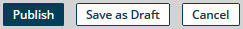
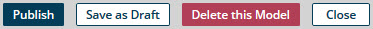
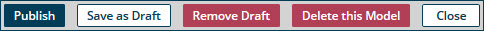
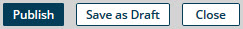
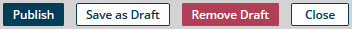
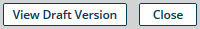
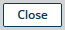
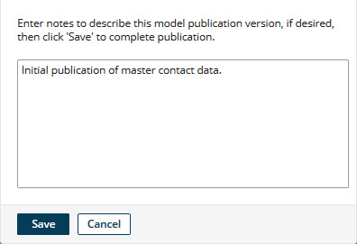
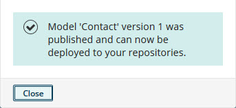
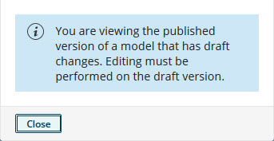

# Model page 

<head>
  <meta name="guidename" content="DataHub"/>
  <meta name="context" content="GUID-608E2C45-D480-4F59-BE1F-BE5353D68B2E"/>
</head>

The model page is used to view, create or modify a model.

The page’s title heading is the name of the model. Breadcrumbs indicate whether the model is a published or draft version and, for a published version, the version number. For a published model having a newer draft definition, this page can be used only to view the published version, read-only. This page can be opened in a separate browser tab or window to view a selected published version, read only, by clicking ** View this version of the model** for that version in the Model Publication History view, which is accessible from the Models page or the repository page’s **Summary** tab.

The page has the following tabs:

-   [**Name and Root Element**](/docs/Atomsphere/Master%20Data%20Hub/Menu/hub-Name_and_Root_Element_Name_tab_f4bf607c-58ce-4cfa-a8c1-ee8899842f3b.md)

-   [**Fields**](/docs/Atomsphere/Master%20Data%20Hub/Menu/r-mdm-Fields_tab_9e5fde15-a465-47ec-a587-06319c089ece.md)

-   [**Sources**](/docs/Atomsphere/Master%20Data%20Hub/Menu/hub-Sources_tab_model_3333e3f7-c402-4772-ab60-8c9b620788dc.md)

-   [**Data Quality Steps**](/docs/Atomsphere/Master%20Data%20Hub/Menu/r-mdm-Data_Quality_tab_0c91da81-d521-4a6f-8fd3-a3f9c49151b3.md)

-   [**Match Rules**](/docs/Atomsphere/Master%20Data%20Hub/Menu/r-mdm-Match_Rules_tab_0454873e-bfcd-4375-9170-df8312ff97d8.md)

-   [**Record Title Format**](/docs/Atomsphere/Master%20Data%20Hub/Menu/hub-Record_Title_Format_tab_1b46aab2-28fe-4f93-9333-8cb0d93a42bf.md)

-   [**Tags**](/docs/Atomsphere/Master%20Data%20Hub/Menu/r-mdm-Tags_tab_8ace0b7a-705e-42ce-a055-66e315504a91.md)

:::note

The controls in this page and on its tabs for creating and modifying models are enabled only for administrators and users having roles that include the MDM - View Models and MDM - Edit Models privileges.

:::

## Action buttons 

The buttons are used to apply actions to the model. The available actions are as follows:

-   Upon creation of a model before the model is saved:

    

-   During modification of a saved, never before published model:

    

-   During modification of a published but not yet deployed model for which a newer draft has not been saved:

    

-   During modification of a draft version of a published but not yet deployed model:

    

-   During modification of a deployed model for which a newer draft has not been saved:

    

-   During modification of a draft version of a deployed model:

    

-   While viewing the published version of a model for which a newer draft was previously saved:

    

-   While viewing a published version selected from the Model Publication History view or the repository page’s **Versions** tab:

    

**Publish**   
Saves the model as defined on this page \(as if **Save as Draft** had been clicked\) and initiates a request to publish the model.

A dialog appears containing a text box into which you can optionally type a note documenting the changes to the model, or, in the case of the initial publication, describing the model. If the note is longer than 4000 characters, the note is truncated.

In this dialog:

-   Clicking **Save** executes the publish operation. This dialog confirms a successful outcome:

    

    Once a model is published, it can be deployed to repositories.

-   Clicking **Close** cancels the request.

:::note

A model cannot be published if any of the following is true:

-   A field specified in a match rule is deleted from the model.

-   A field specified in a tag definition is deleted from the model.

 -   The id field is the model’s only field.

-   The name of a non-reference field in the model is longer than 64 characters.

-   The name of a reference field in the model is longer than 53 characters minus the number of characters in the model’s root element name. For example, a model with the root element name contact \(seven characters\) cannot be published if it has a reference field with a name longer than 46 characters.

-   The name of a collection in the model is longer than 58 characters minus the number of characters in the model’s root element name. For example, a model with the root element name contact \(seven characters\) cannot be published if it has a collection with a name longer than 51 characters.

-   The model does not have at least one match rule.

 -   A match rule in the model consists only of a fuzzy match expression or grouped fuzzy match expressions.

-   A match rule in the model contains a fuzzy match expression grouped using an OR or NOT operator.

The failure of a publishing operation is indicated by a dialog containing a description of the error\(s\).

:::

**Save as Draft**  
Saves the model as defined on this page as a draft.

:::note

A model cannot be saved as a draft if either of the following is true:

-   The name of a non-reference field in the model is longer than 64 characters.

-   The name of a reference field in the model is longer than 53 characters minus the number of characters in the model’s root element name. For example, a model with the root element name contact \(seven characters\) cannot be saved if it has a reference field with a name longer than 46 characters.

-   The name of a collection in the model is longer than 58 characters minus the number of characters in the model’s root element name. For example, a model with the root element name contact \(seven characters\) cannot be saved if it has a collection with a name longer than 51 characters.

:::

**Remove Draft**  
Initiates a request to abandon the current draft model definition and, if the model was previously published, to revert to the most recent version. In the confirmation dialog:

-   Clicking **OK** executes the operation.

-   Clicking **Cancel** cancels the request.

**Delete this Model**  
Initiates a request to delete the model. In the confirmation dialog:

 -   Clicking **OK** executes the operation.

-   Clicking **Cancel** cancels the request.

It is possible to delete a model only while it is not deployed to a repository.

:::caution

Once a model is deleted, it cannot be restored.

:::

**View Draft Version**  
Loads a previously saved draft version of a previously published model.

When, in the models summary list, you click a published version of a model for which a newer draft was previously saved, this dialog appears:

Action buttons are disabled until you click the dialog’s **Close** button.

**Cancel**  
Initiates a request to abandon the new draft model definition and return to the Models page. In the confirmation dialog:

 -   Clicking **OK** executes the operation.

 -   Clicking **Cancel** cancels the request.

**Close**  
Navigates to the Models page or, if there are unsaved changes to the model definition, initiates a request to navigate to the Models page. In the latter case a confirmation dialog opens:

-   Clicking **OK** navigates to the Models page without saving changes.

-   Clicking **Cancel** returns focus to the model page.