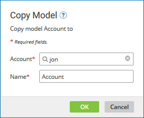
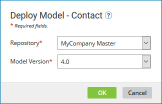
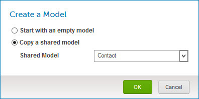

# Models page 

<head>
  <meta name="guidename" content="DataHub"/>
  <meta name="context" content="GUID-55ED08F0-F866-4429-B3BB-58A2D4E82F35"/>
</head>

The **Models** link in the Boomi DataHub menu opens the Models page, which lists existing models and lets you publish individual models and manage their deployment to repositories. This page also links to the model page, which is used to create, modify and publish individual models.

:::note

The Models page is visible only to administrators and users having a role with the MDM - View Models privilege.

:::

## Create a Model 

Creates a model and opens the model page. The **Fields** tab is automatically selected, and the Getting Started: Hub Model Fields box appears.

:::note

The **Create a Model** button is enabled only for administrators and users having roles that include the MDM - View Models and MDM - Edit Models privileges.

:::

## Copy a Shared Model 
Opens the Select a Shared Model dialog which is used to create a model by copying a shared model. The dialog contains a list from which to select the model to copy.

**Name**  
**Description**

**OK**  
Creates the model and opens the model page. The new model is a copy of the most recently published version of the selected model. The model’s fields appear in the **Fields** tab, and its sources, data quality steps, match rules and tags are accessible in their respective tabs. processes called in data quality steps are not copied. The entire model is modifiable and will not be affected when the source model is changed by its owning partner.

**Cancel**  
Closes the dialog without creating a model.

:::note

The **Copy a Shared Model** button is visible if the account is in an account group with which models are shared. The button is enabled only for administrators and users having roles that include the MDM - View Models and MDM - Edit Models privileges.

:::

## Filter Models 
Typing in this field filters the models summary list below to include only models having matching names. Clicking  clears the field and stops filtering.

## Models summary list 
Lists existing models in this user account.

A model is listed multiple times if it has been published but a newer draft exists.

For each model the following tools and properties are shown.

**Name**  
**Description**

****  
Opens a contextual menu containing the following tools:

-   **Copy** — Opens the Copy Model dialog, which is used to copy a model.

    

     **Account**  
        Sets the destination account for the copy. The default is the current account. Clicking the magnifying glass icon opens the Choose Account dialog, which lets you select another account to which you have access.

    **Name**  
        Sets the name of the copy. The default is the name of the source model with the suffix “ Copy”.

    **OK**  
        Starts the copy operation and closes the dialog.

     **Close**  
        Closes the dialog without starting a copy operation.

-   **Delete** — Initiates a request to delete the model. In the confirmation dialog:

     -   Clicking **OK** executes the operation.

            -   If the model is a draft version for which a published version exists, only the draft version is deleted.

            -   If the model is a published version for which a draft version exists, both versions are deleted.

    -   Clicking **Cancel** cancels the request.

        **Delete** is not visible if the model is deployed to a repository.

        :::caution

        Once a model is deleted, it cannot be restored.

        :::

 -   **View Publication History** — Opens the Model Publication History view, which is used to view the model publication history and historical versions of the model and to roll deployment back or forward to other published versions.

**publication status**  
 Draft or Published

**Name**  
Name of the model. This is a link to the model page used to create or modify a model, for the purpose of modifying the model.

**Version**  
The number of the newest published version of the model appears here, except where the model is a draft, in which case DRAFT status is indicated. \(A new version number is assigned only upon a draft’s publication.\)

The version number, if present, is a link to the Model Publication History view, which is used to view the model publication history and historical versions of the model and to roll deployment back or forward to other published versions.

**Last Modified**  
Date on which the model was last published and the publishing user.

**View/Hide/No Deployments**    

:::note

This column is populated only if the model is published and the user is an administrator or has a role that includes the MDM - View Repositories privilege.

:::

-   **View Deployments** — this link reveals a list of the repositories to which the model is deployed.

     For each repository, the following tools and properties are shown:

    **Name**  
        **Description**

    **Repository**  
        The name of the repository. This is a link to the repository page’s **Summary** tab for the domain associated with the model.

    **Version**  
        The version of the model deployed to the repository. This is a link to the Model Publication History view, which is used to view the model deployment history and roll the deployment back or forward to other published versions.

    **Sources**  
        The sources attached to the domain associated with the model. If sources are not attached that status is indicated here. The information shown here links to the repository page’s **Sources** tab for the domain, which is used to attach sources to the domain, remove sources, review and change the configuration of the domain's attached sources, configure source rankings, set a default source, manage staging areas, and analyze pending source record update requests on the sources’ channels.

    :::note
    
    Sources embedded in the model, if any, are listed in the model page’s **Sources** tab.

    :::

**Records**  
Counts of golden records and quarantine entries.
- The golden records count links to the Golden Records page, which is used to view golden records.

-  The quarantine entries count is highlighted in purple. The count is omitted for a domain for which there are not any quarantine entries. If present the count links to the Quarantine page, which is used to view and resolve quarantine entries.

    :::note
    
    When an end-dated golden record is purged from the Golden Records page, the quarantine entries count can take more than a minute to update.

    :::

 -   **Hide Deployments** — this link hides the repositories list.

-   No Deployments — the model is not deployed.

**Deploy/Publish**  
The button that appears here is dependent upon whether the model is a draft version.

-   **Deploy**  indicates the model (or a new version of it) is published and ready for deployment. Clicking this button opens the Deploy Model dialog.

    :::note
    
    The button is visible only to administrators and users having roles that include the MDM - View Repositories and MDM - Model Deployment privileges.

    :::

    

    The model name appears in the dialog header.

    **Name**  
    **Description**

    **Repository**  
    Selects the repository to which to deploy.

    **Model Version**  
        Selects the version of the model to deploy from the list of published versions. The selection for the currently deployed version is disabled and appears with the notation “Deployed”. The default selection is the newest published version, except if the currently deployed version is the newest published version, in which case there is no default selection.

    **OK**  
        Initiates deployment.

    A status dialog is displayed while deployment is in progress and momentarily upon completion of deployment.

    **Cancel**  
        Closes the dialog without deploying a different version.

-   **Publish** indicates the model is a draft. Clicking this button opens the model page, in which the model can be modified and, optionally, published.

## Getting Started: Hub Models 

Until the first model is created, a Getting Started box will be visible in the Models page.

**Name**  
**Description**

**Create Your First Model**
-   If you are using an account that is not in an account group with which models are shared, clicking this button creates the model and opens the model page. The **Fields** tab is automatically selected, and the Getting Started: Hub Model Fields box appears.

-   If you are using an account that is in an account group with which models are shared, clicking this button opens the Create a Model dialog:

    

    **Name**  
    **Description**

    **Start with an empty model**  
    Selects the option to create an empty model.

    **Copy a shared model**  
    Selects the option to create a model by copying a shared model.

    **Shared Model**  
    Selects the shared model to copy. This field is present only if **Copy a shared model** is selected.

    **OK**  
    Creates the model and opens the model page. The **Fields** tab is automatically selected.

     -   If **Start with an empty model** is selected, the Getting Started: Hub Model Fields box appears in the **Fields** tab.

     -   If **Copy a shared model** is selected, the new model is a copy of the most recently published version of the selected **Shared Model**. The model’s fields appear in the **Fields** tab, and its sources, data quality steps, match rules, and tags are accessible in their respective tabs. processes called in data quality steps are not copied. The entire model is modifiable and will not be affected when the source model is changed by its owning partner.

    **Cancel**  
    Closes the dialog without creating a model.