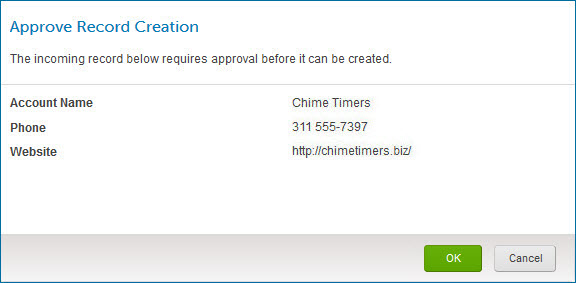
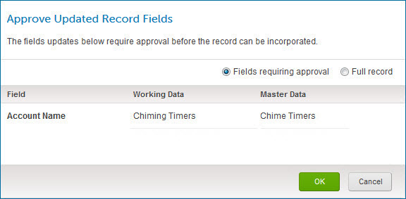
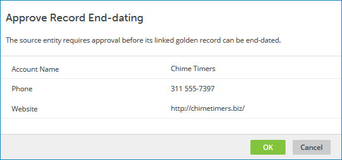

# Quarantine entry detail view 

<head>
  <meta name="guidename" content="DataHub"/>
  <meta name="context" content="GUID-05C51767-0AAD-4702-BE17-63CC3B513BDE"/>
</head>


In the Quarantine page, clicking the Quarantined Date column value in a quarantine entry list item opens the detail view for that entry:


Clicking and dragging the **** icon in the view border adjusts the width of the view.

:::note

Masked values are visible if you have one of the following user permissions:

- **MDM - Privileged Data Steward** role
- **MDM - Administrator** role
- **MDM - Reveal Masked Data** privilege
- **MDM - Data Steward** role (or **MDM - Stewardship** privilege) and the **Reveal Masked Data** Hub entitlement (available with the Advanced Security feature)

:::

In the view header the following quarantine entry metadata appears:

**View title**

-   If a golden record title format is defined in the domain model, the view title is derived from the values of the same fields in the entity as those specified in the title format.

-   Otherwise, the view title is the system transaction ID assigned upon the entity’s initial submission.


**Transaction ID**  
The system transaction ID, assigned upon the entity’s initial submission.

The URL for the view specifies the transaction ID as the value of the parameter `transactionIds` — for example:

 ```
    https://platform.boomi.com/MdmSphere.html#mdm_quarantine;accountId=account-123456;repository=01234567-89ab-cdef-0123-456789abcdef;universe=abcdef01-2345-6789-abcd-ef0123456789;**transactionIds=768bf2e4-9f24-11e3-8169-525400d21c77**
 ```

**Quarantined Date**  
Date and time of the quarantining of the entity.

**Resolved Date**  
\(Resolved entry only\) Date and time of the resolution of the entry.

**Source**  
Contributing source of the entity \(where this can be determined\).

##  Actions 

Clicking this button opens a menu of actions applicable to the entry:


:::note

The **Actions** button and drop-down menu are visible only for an active entry.

:::

-   **Delete** — Initiates a request to delete the entry. In the confirmation dialog:

    -   Clicking **OK** confirms the request.

    -   Clicking **Cancel** cancels the request.

    :::note
    
    This action is available only to administrators and users having a role with the Delete Quarantine entitlement.

    :::

-   **Resubmit** — Initiates a request to resubmit the quarantined entity for incorporation in the domain. In the confirmation dialog:

    -   Clicking **OK** confirms the request.

    -   Clicking **OK** confirms the request.

    -   Clicking **Cancel** cancels the request.


    :::note
    
    When an entity quarantined with the cause “Update Approval Required” is resubmitted, if a golden record with the ID specified for linking does not exist, the repository performs normal matching, which in a normal case will result in creation of a golden record.

    :::

    :::note
    
    This action is available only to administrators and users having a role with the Resubmit Quarantine entitlement.

    :::

-   **Edit and Resubmit** — Opens the Edit and Resubmit Entity wizard which lets you edit fields in the entity and resubmit it for incorporation in the domain.

    :::note
    
    This action is available only if the currently deployed version of the domain model is the same as the version deployed at the time the entity was quarantined and the user has a role with the Edit Quarantine entitlement.

    :::

-   **Retry Enrichment Step** — Initiates a request to resubmit the quarantined entity for incorporation in the domain, reapplying the failed data quality step and applying all subsequent steps.

    :::note
    
    This action is available only if the entity was quarantined because it failed a data quality step, the currently deployed version of the domain model is the same as the version deployed at the time the entity was quarantined, and the user has a role with the Resubmit Quarantine entitlement.

    :::

-   **Ignore Enrichment Failure** — Initiates a request to resubmit the quarantined entity for incorporation in the domain, applying all data quality steps subsequent to the failed step.

    :::note
    
    This action is available only if the entity was quarantined because it failed a data quality step, the currently deployed version of the domain model is the same as the version deployed at the time the entity was quarantined, and the user has a role with the Resubmit Quarantine entitlement.

    :::

-   **Match** — Opens the Resolve Matching Issues wizard which lets you resolve matching errors — either or both of the following — that caused the quarantining of the entity:

    -   The entity matches one or more golden records that have already been linked to an entity in the originating source system and is therefore a possible duplicate.

    -   The entity matches multiple golden records that are not yet linked to an entity in the originating source system.

    :::note
    
    This action is not available if one or more of the following conditions is true:

    -   The user does not have a role with the Match Quarantine entitlement.

    -   A matching error was not the reason for the quarantining of the entity.

    -   The entity was quarantined as a possible duplicate but there are no longer any matching golden records. \(In this case an informational message to this effect appears below between the additional quarantine entry metadata and the tabs.\)
    
    :::

-   **Approve** — Opens a dialog that lets you approve the entity for incorporation in the domain.

    -   If the entity is new, the Approve Record Creation dialog opens. The entity field values are shown. Collections are collapsed by default.

        

    -   If the entity would update a matching golden record, the Approve Updated Record Fields dialog opens.

        

        -   The Working Data column shows the entity field values that would be incorporated. These values reflect the results of the application of data quality steps, if any, in the domain model.

        -   The Master Data column shows the field values in the golden record.

        Collections are collapsed by default.

        By default only fields requiring approval are listed. To view all fields, select **Full record**; in this view fields requiring approval are highlighted. To restore the default view, select **Fields requiring approval**.

    -   If the entity would end-date a matching golden record, the Approve Record End-dating dialog opens. The values of the fields in the golden record are shown. Collections are collapsed by default.

        

    Long Text field values are represented by the ** View value** icon. Clicking that icon for a represented value opens a dialog in which the value is shown.

    Clicking **OK** approves the quarantined entity for incorporation and exits the dialog. If successfully incorporates the entity, the quarantine entry is deleted. However, if matching errors have arisen due to recent activity, or if approval is no longer required, an error message is displayed — you can resubmit the entity for incorporation.

    :::note
    
    If the entity did not require approval when it was quarantined or the user does not have a role with the applicable entitlement \(Approve Creates, Approve Updates, or Approve End-dating\), **Approve** is not available.

    :::

-   **Approve Update Without Base Values** — Initiates a request to approve the entity for incorporation in the domain without base values for the contributing source.

:::note

A field’s base value for a source is the value of the field in the matching golden record’s base version for the source. While there is a pending link from a golden record to a source, the base version of the golden record for that source is the golden record version when the pending link was created.

:::

In the confirmation dialog:

- Clicking **OK** confirms the request.

    If Boomi DataHub successfully incorporates the entity, the quarantine entry is deleted. However, if matching errors have arisen due to recent activity, or if approval is no longer required, an error message is displayed — you can resubmit the entity for incorporation.

-   Clicking **Cancel** cancels the request.

:::note
    
If the entity did not require approval when it was quarantined or the user does not have a role with the Approve Updates Specifying Base Values entitlement, **Approve Update Without Base Values** is not available.

:::

-   **Approve Update With Base Values** — Opens the Approve Update With Base Values dialog, which lets you approve the entity for incorporation in the domain with base values for the contributing source.

    

    -   The Working Data column shows the entity field values that would be incorporated. These values reflect the results of the application of data quality steps, if any, in the domain model.

    -   The Master Data column shows the field values in the golden record.

    -   The Base Data column shows base field values in the entity — values that match the values of the corresponding fields in the base version of the golden record for the source.

    Collections are collapsed by default.

    By default only fields requiring approval are listed. To view all fields, select **Full record**; in this view fields requiring approval are highlighted. To restore the default view, select **Fields requiring approval**.

    Long Text field values are represented by the ** View value** icon. Clicking that icon for a represented value opens a dialog in which the value is shown.

    Clicking **OK** approves the quarantined entity for incorporation and exits the dialog. If successfully incorporates the entity, the quarantine entry is deleted. However, if matching errors have arisen due to recent activity, or if approval is no longer required, an error message is displayed — you can resubmit the entity for incorporation.

    :::note
    
    If the entity did not require approval when it was quarantined or the user does not have a role with the Approve Updates Specifying Base Values entitlement, **Approve Update With Base Values** is not available.

    :::

-   **Reject** — Initiates a request to reject the entity. This action is applicable if the entity was quarantined for either of the following reasons:

    -   The entity matches one or more active golden records linked to the entity in the originating source system \(potential duplicate error\).

    -   The entity is linked from an end-dated golden record \(record already end-dated error\).

    In the confirmation dialog:

    -   Clicking **OK** confirms the request.

        -   In the case of a potential duplicate error, an update request specifying a Reject Contributed Entity operation is propagated on the channel of the contributing source.

        -   In the case of a record already end-dated error, an update request specifying a Delete operation is propagated on the channel of the contributing source.

    -   Clicking **Cancel** cancels the request.

    :::note
    
    If the entity was not quarantined for a potential duplicate or record already end-dated error, or the user does not have a role with the Reject Quarantine entitlement, this action is not available.

    :::

-   **Restore** — Initiates a request, in the case of the entity having been quarantined for a record already end-dated error, to restore the end-dated golden record linked to the entity in the originating source system. The request is also to apply updates, if possible, from the entity to the restored golden record.

    In the confirmation dialog:

    -   Clicking **OK** confirms the request. If an incorporation error occurs when updates from the quarantined entity are applied to the restored golden record, the entity is once again quarantined.

    -   Clicking **Cancel** cancels the request.

    :::note
    
    If the entity was not quarantined for a record already end-dated error or the user does not have a role with the Restore Records entitlement, this action is not available.

    :::


## Additional metadata 

The following additional quarantine entry metadata appears below the ** Actions** button:

**Entity ID**
<br />Source entity ID \(where this can be determined\). Clicking the source entity ID, if it is shown as a link, will open the record in the source system in another browser tab or window, provided the source entity URL format is correctly specified in the **Entity ID URL** field for the source attachment in the **Sources** tab, or if not there, for the source definition in the Sources page.

**Cause**
<br />Cause for quarantining — for example, Potential Duplicate.

**Reason**
<br />Detailed reason for quarantining.

**Resolution**
<br />\(Resolved entry only\) Resolution — for example, Matching Issue Resolved.

## Tabs 

Below the additional quarantine entry metadata are the following tabs:

-   The **Fields** tab, which is selected by default, shows the entity data — fields and their respective values. Collections are collapsed by default. If the reason for quarantining is specific to particular fields, those fields are highlighted.

    Long Text field values are represented by the ** View value** icon. Clicking that icon for a represented value opens a dialog in which the value is shown.

    If a golden record title format is defined in the referenced domain's model, the values of those fields in referenced golden records are shown as reference field values instead of golden record IDs.

-   The **Original XML** tab shows the entity data in the native XML format of the incoming batch.

    

-   The **Activity** tab lists events logged for the entity in reverse chronological order, beginning with its contribution in a batch. These events include quarantining of the entity and actions previously taken to resolve associated quarantine entries. The date and time of occurrence of each event is shown.

    

-   The **Tags** tab lists the entity’s tags.

    

-   The **Match Detail** tab is present only if the entity was quarantined due to a matching error and the quarantine entry is active. In addition, in the case of an entity quarantined as a potential duplicate of a golden record\(s\), the potential duplicate condition must still exist for the tab to be present. 

The tab shows the most current match rule causing the quarantine. It does not show any previous match rules after you change the entity or the match rules in the model. To return historical data on all match rules that caused quarantines, you can use the [Query Quarantine Entries](/docs/Atomsphere/Master%20Data%20Hub/REST%20APIs/r-mdm-Query_Quarantine_Entries_1ba99cc5-8cd1-4d9c-ac3c-ae95db3aa4cd.md) endpoint.

    Below the heading “Match Rule” is the plain text representation of the definition of the match rule whose application to the entity resulted in the matching error.

    

    -   If the entity is potentially a duplicate of a golden record\(s\) already linked to an entity in the source system, the golden record\(s\) are listed below the heading “Potential Duplicates”. For each listed golden record:

        -   The Golden Record column shows the golden record ID and, if a golden record title format is defined in the domain model, the golden record’s title. This information is a link to the golden record detail view.

        -   The Source Entity ID column shows the ID of the entity in the source system to which the golden record is linked.

        -   If the entity was quarantined due to a fuzzy match, clicking **** in the Fuzzy Match Details column opens the Fuzzy Match Details dialog,

            

            The dialog shows the golden record ID and, if a golden record title format is defined in the domain model, the golden record’s title. The dialog also shows the following information about the fuzzy match:

            -   The Field column shows the field containing the data used for matching.

            -   The Method column shows the similarity algorithm specified by the match rule. The algorithm is either [Jaro-Winkler](http://en.wikipedia.org/wiki/Jaro%E2%80%93Winkler_distance), [Levenshtein](http://en.wikipedia.org/wiki/Levenshtein_distance), [Bigram](http://en.wikipedia.org/wiki/N-gram), [Trigram](http://en.wikipedia.org/wiki/N-gram) or [Soundex](http://en.wikipedia.org/wiki/Soundex).

            -   The First column shows the value of the field referenced first in the match rule. This value is either from the incoming entity or the golden record.

            -   The Second column shows the value of the field referenced second in the match rule. This value is either from the incoming entity or the golden record.

            -   The Match Strength column shows the strength of the fuzzy match. 1.0 indicates perfect similarity.

            -   The Threshold column shows the tolerance level for application of the similarity algorithm specified by the match rule.

            Clicking **Close** closes the dialog, restoring the focus to the detail view.

    -   If the entity matches 2–10 golden records not yet linked to an entity in the source system, the golden records are listed below the heading “Multiple Matched Unlinked Records”. For each listed golden record, the Golden Record column shows the golden record ID and, if a golden record title format is defined in the domain model, the golden record’s title. This information is a link to the golden record detail view. If the entity was quarantined due to a fuzzy match, clicking **** in the Fuzzy Match Details column opens the Fuzzy Match Details dialog, which shows information about the fuzzy match, as described above.

    -   If the entity matches more than 10 golden records, regardless of their links to source entities, there are too many matching golden records to list here. A note is shown to this effect.

    -   If the entity no longer matches any golden records, a note is shown to this effect.


## Navigation bar 

The following navigation controls are in the bar at the bottom of the view:

** Previous**  
Navigates to details for the previous entry in the list. Keyboard shortcut: **Up arrow**.

**Next **  
Navigates to details for the next entry in the list. Keyboard shortcut: **Down arrow**.

**Close**  
Closes the view and updates the quarantine entry list. Keyboard shortcut: **Esc**.

:::note

You can also close the view by clicking elsewhere in the Quarantine page.

:::