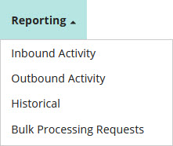

# Reporting menu 

<head>
  <meta name="guidename" content="DataHub"/>
  <meta name="context" content="GUID-2487896e-1595-4c20-8c15-cbb8e06e01a9"/>
</head>

The **Reporting** menu is the entry point for the reporting capabilities of Boomi DataHub.

The menu has the following selections:

**Name**  
**Description**

**Inbound Activity**  
View reports on previously processed incoming batches and drill down to details on individual batches and their entities.

**Outbound Activity**  
View reports on pending source record update requests and previously acknowledged deliveries of update requests and drill down to details on both.

:::note

Delivery of update requests is not a guarantee of the successful application of the requested updates to the target source system. The same to Source integration process that acknowledges a delivery typically routes the update requests to the source system. Only then are the updates applied.

:::

**Historical**  
Build and view reports on historical data.

**Bulk Processing Requests**  
View the status of requests for bulk operations on golden records, and apply actions to those requests. Bulk operations include sending source record update requests for golden records, end-dating golden records, and purging golden records.

:::note

The menu is visible only to administrators and users having a role with the MDM - Activity Reporting privilege, the MDM - Historical Reporting privilege, or the MDM - Source Management privilege. The menu items are each visible only to administrators and users having a role with the corresponding privilege. The MDM - Activity Reporting privilege encompasses both inbound batch and outbound activity reporting. The MDM - Source Management privilege corresponds to bulk processing request status reporting.

:::