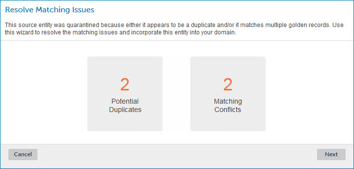
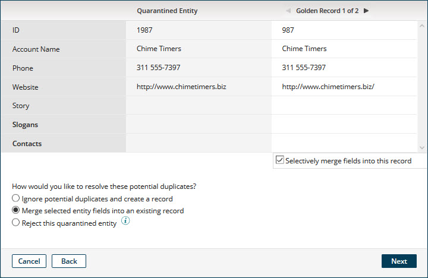
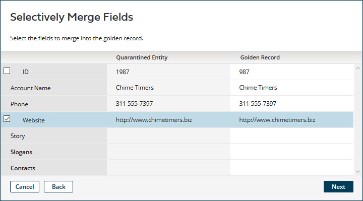
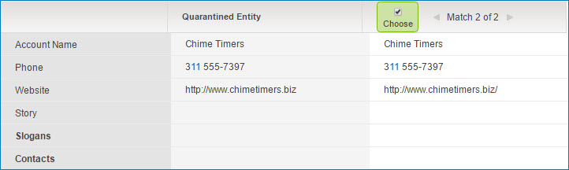

# Resolve Matching Issues wizard 

<head>
  <meta name="guidename" content="DataHub"/>
  <meta name="context" content="GUID-2AB9344E-4B5B-4ECC-BC28-D0A07B1DC207"/>
</head>

Selecting **Match** in the ** Actions** menu in the detail view for a quarantine entry opens the Resolve Matching Issues wizard, which is used to submit a request to resolve matching errors that resulted in the quarantining of the entity.

:::note

In this wizard:

-   Collections are collapsed by default.

-   Reference field values in matching golden records are represented by the golden record IDs of referenced golden records — in other words, the actual reference field values — except if a golden record title format is specified in the referenced domain’s model. In those cases, the reference field value is represented by the referenced golden record’s title format field value; hovering on that title format field value shows the ID of the referenced golden record.

    Reference field values in entities are represented in a similar manner. If a golden record title format is specified in a referenced domain’s model and there is an established link from a referenced golden record to the referenced entity, the reference field value is represented by the referenced golden record’s title format field value instead of the linked entity’s ID; hovering on that title format field value shows that entity ID.

-   Long Text field values in entities and golden records are represented by the ** View value** icon. Clicking that icon for a represented value opens a dialog in which the value is shown.

:::

:::note

Masked values are visible if you have one of the following user permissions:

- **MDM - Privileged Data Steward** role
- **MDM - Administrator** role
- **MDM - Reveal Masked Data** privilege
- **MDM - Data Steward** role (or **MDM - Stewardship** privilege) and the **Reveal Masked Data** Hub entitlement (available with the Advanced Security feature)

:::

## Navigation  

The following navigation buttons appear at the bottom of the wizard:

**Cancel**  
Exit the wizard without submitting a resolution request.

**Back**  
Go back to the previous screen. This button is present in all but the **Resolve Matching Issues** screen.

**Next**  
Go to the next screen. This button is present in all but the **Matching Issues Resolved** screen.

**Submit**  
Submits a resolution request and exits the wizard. This button is present only in the **Matching Issues Resolved** screen.

## Resolve Matching Issues 

Shows the following counts:

-   **Potential Duplicates** — count of golden records for which the quarantined entity is a potential duplicate. If zero, this count is omitted.

-   **Matching Conflicts** — count of golden records eligible for matching with the quarantined entity. If zero, this count is omitted.

## Potential Duplicates 

Presents golden records — one at a time — for which the quarantined entity is a potential duplicate. Clicking the arrow icons navigates between golden records. The entity field values appear to the left for comparison purposes.

**Name**  
**Description**

**Ignore potential duplicates and create a record**  
Marks the entity as eligible for incorporation into the domain as a new golden record despite the entity being a potential duplicate.

Clicking **Next** advances the wizard to the Choose a Match or Matching Conflicts Resolved screen.

**Merge selected entity fields into an existing record**  
Selecting this option and clicking **Selectively merge fields into this record** for a presented golden record selects the record as the target for merging.

The **Next** button is not enabled until a golden record is selected. Clicking **Next** advances the wizard to the Selectively Merge Fields screen.

**Reject this quarantined entity**  
Marks the quarantined entity for rejection. Clicking **Next** advances the wizard to the Matching Conflicts Resolved screen.

## Selectively Merge Fields

Entity field values and the corresponding field values in the selected matching golden record are listed for comparison. Clicking the check box for an entity field selects that field for merging into the golden record. Each selected field is highlighted.

-   Entire collections can be selected for merging.

-   Individual collection items cannot be selected for merging.

-   Fields whose values are the same as in the golden record cannot be selected for merging.

-   Selecting the ID field for merging results in the unlinking of the selected matching golden record from the source entity to which is currently linked and linking of that golden record to the quarantined entity.

The **Next** button is not enabled until at least one field is selected. Clicking **Next** advances the wizard to the Matching Conflicts Resolved screen.

## Choose a Match 

Presents golden records — one at a time — eligible for matching with the quarantined entity. Only a single eligible golden record can be chosen as the match. Clicking the arrow icons navigates between eligible matches. The entity field values appear to the left for comparison purposes.

Clicking **Choose** for a presented golden record marks it as the chosen match.

The **Next** button is not enabled until a golden record is marked. Clicking **Next** advances the wizard to the Matching Conflicts Resolved screen.

## Matching Conflicts Resolved 

Shows a summary of the pending resolution of the quarantine entry.

Clicking **Submit** submits the resolution request and exits the wizard.

-   If the quarantined entity was marked as eligible for incorporation into the domain as a new golden record, the repository attempts to incorporate the entity.

-   If fields from the quarantined entity were selected for merging into a selected matching golden record, the repository attempts to update the golden record and propagates an update request specifying a Reject Contributed Entity operation on the channel of the contributing source.

-   If the quarantined entity is a potential duplicate of an existing golden record\(s\) and the option to reject the entity was selected, the repository propagates an update request specifying a Reject Contributed Entity operation on the channel of the contributing source.

-   If a golden record was chosen as a match for the quarantined entity, the repository attempts to link the chosen golden record to the source entity.

If the operation\(s\) are successful, the quarantine entry is deleted.