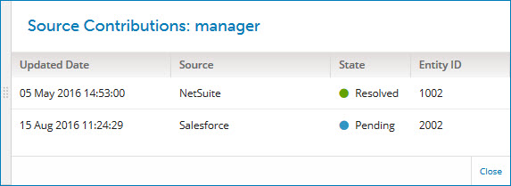

# Source Contributions view 

<head>
  <meta name="guidename" content="DataHub"/>
  <meta name="context" content="GUID-3FCC9D1B-99C0-42A9-A785-624B0C055CDC"/>
</head>

In the Golden Records page’s golden record details view’s **Fields** tab, clicking ** View contributed values by source** for a reference field opens the Source Contributions view for that field.

The field name is included in the view header.

## Contributions list 

For each source from which entities have been contributed that matched the golden record, the list shows:

-   Updated Date — the date and time of the source’s most recent update of the golden record.

-   Source — name of the source.

-   State — state of the reference specified by the field value:

    -    Pending — the reference has not been resolved.

    -    Resolved — the reference is resolved.

-   Entity ID — the field value in the most recent update from the source.

## Close 

Closes the view.

:::note

You can also close the view by clicking elsewhere in the Golden Records page.

:::