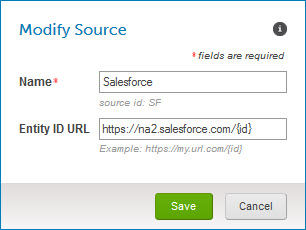

# Sources page 

<head>
  <meta name="guidename" content="DataHub"/>
  <meta name="context" content="GUID-5DCBF4B9-A950-4801-8038-C5B916CF529D"/>
</head>

The **Sources** link in the Boomi DataHub menu opens the Sources page, which is used to create, modify and delete sources.

:::note

The Sources page is visible only to administrators and users having a role with the MDM - Source Management privilege.

:::

## Create a Source 
Clicking the **Create a Source** button opens the Create a Source dialog.

**Name**  
 **Description**

**Name**  
Sets the name of the new source — maximum 255 characters.

**Source ID**  
Sets the ID for the new source, which will be used to refer to the source in integrations. The maximum length is 50 characters, and the allowable characters are uppercase and lowercase letters, numbers, underscore \(“\_”\) and hyphen \(“-”\). Once a source is created its ID cannot be changed.

**Entity ID URL**  
Sets the URL template will use to construct target URLs for links, rendered in a deployed model’s Golden Records page, to entities in this source system . In the template the string `{id}` serves as placeholder for the source entity ID.

For example, suppose the entity page URLs in this source system have the format https://na2.salesforce.com/*entity\_id*, where *entity\_id* is the source entity ID: In this case you would set **Entity ID URL** to `https://na2.salesforce.com/{id}`. This feature is useful only with source systems that support “deep linking” to individual entity pages.

:::note

URL templates specified in the **Sources** tab for individual deployed models override any template specified here. This is useful in the cases of source systems supporting “deep linking” using a different URL format for each object.

:::

**Save**  
Creates the source and closes the dialog.

**Cancel**  
Closes the dialog without creating a source.

:::note

The **Create a Source** button is visible only to administrators and users having roles that include the MDM - View Repositories and MDM - Source Management privileges.

:::

## Sources summary list 

Lists the sources in the account and provides tools for managing them.

For each source the following tools and properties are shown:

**Name**  
**Description**

****  
Opens the Modify Source dialog, which is used to modify the properties of a source. This dialog is much like the Create a Source dialog described above.

However, if the source is neither embedded in any models nor attached to any domains, clicking this icon opens a contextual menu:

-   **Configure** — Opens the Modify Source dialog.

    

 -   **Delete** — Initiates a request to delete the source.

        In the confirmation dialog:

        -   Clicking **OK** executes the request.

        -   Clicking **Cancel** cancels the request.

        Sources attached to domains cannot be deleted.

:::note

This icon and its contextual menu are visible only to administrators and users having roles that include the MDM - View Repositories and MDM - Source Management privileges.

:::

**Name**  
Name of the source.

**Source ID**  
Permanent ID of the source. This ID is used to refer to the field in integrations — specifically in calls to Repository API endpoints.

**Last Modified**  
Date on which the source was created or most recently renamed and the requesting user.

**Show Attachments**/**Hide Attachments**  
Toggles the display on following lines of the list of the source’s attachments to domains. For each attachment the following information is shown:

-   repository — The name of the repository hosting the domain to which the source is attached. This is a link to the repository page.

-   source status — The status of the source with regard to the domain to which it is attached:

     -    \(gray\) — neither loaded nor enabled for loading.

     -    \(blue\) — Initial Load mode is enabled.

    -    \(green\) — loaded and in a normal, operating state.

    -    \(red\) — loaded but an error occurred in the processing of a source record update or the propagation of a request on the channel.

        This status indicator is a link to the repository page and the Sources tab for the domain.

 -   domain — The name of the domain to which the source is attached. This is a link to the repository page and the Sources tab for the domain.

## Getting Started: Hub Sources 

Until the first source is created in the account, this Getting Started box will be visible in the Sources page:

**Name**  
**Description**

**Create Your First Source**  
Clicking this button has the same effect as clicking **Create a Source**.