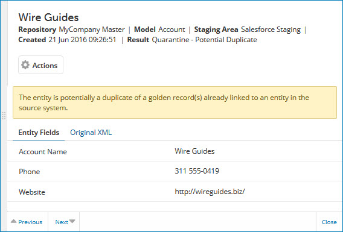
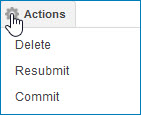
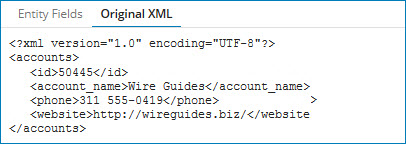

# Staged Entity detail view 

<head>
  <meta name="guidename" content="DataHub"/>
  <meta name="context" content="GUID-E609144F-F1A4-417A-BD8F-D77CE25C0C94"/>
</head>

Clicking the Created Date link for a staged entity in the Staged Entities page opens the detail view for that entity.

:::note

Masked values are visible if you have one of the following user permissions:

- **MDM - Privileged Data Steward** role
- **MDM - Administrator** role
- **MDM - Reveal Masked Data** privilege
- **MDM - Data Steward** role (or **MDM - Stewardship** privilege) and the **Reveal Masked Data** Hub entitlement (available with the Advanced Security feature)

:::

The view header shows the following details:

**Name**  
**Description**  
**View title**

-   If a golden record title format is specified in the domain model, the view title is derived from the values of the same fields in the entity as those specified in the title format.

-   Otherwise, the view title is “Staged Entity”.

**Repository**  
Repository on which the target domain for the staged batch that included the entity is hosted.

**Model**  
Target domain for the staged batch that included the entity.

**Staging Area**  
Name of the staging area in which the batch that included the entity was staged.

**Created**  
Date and time at which the entity was staged.

**Result**  
The result of staging the entity — in other words, the entity processing result that would have occurred had the entity actually been contributed when it was staged:

-   Create Record — creation of a golden record.

-   Update Record — updating of a golden record.

 -   End-date Record — end-dating of a golden record.

-   Link Record — linking of a golden record to the source entity.

-   Link and Update Record — linking of a golden record to the source entity and updating of that golden record.

 -   No Change to Record — no impact on a golden record.

 -   Quarantine — quarantining of the entity. The reason for quarantining is also shown.

**message**  
If the entity would have been quarantined, the reason for quarantining is shown on a yellow background.

Clicking and dragging the **** icon in the view border adjusts the width of the view.

##  Actions 

Clicking this button opens a menu of actions applicable to the entity:

-   **Delete** — Initiates a request to delete the staged entity. In the confirmation dialog:

    -   Clicking **OK** executes the operation and closes the view.

    -   Clicking **Cancel** cancels the request.

    :::note
    
    This action is available only to administrators and users having a role with the Delete Staged Data entitlement.

    :::

-   **Resubmit** — Initiates a request to resubmit the staged entity to the staging area. In the confirmation dialog:

    -   Clicking **OK** executes the operation and closes the view.

    -   Clicking **Cancel** cancels the request.

    :::note
    
    This action is available only to administrators and users having a role with the Resubmit Staged Data entitlement.

    :::

-   **Commit** — Initiates a request to commit the staged entity for transaction processing. In the confirmation dialog:

    -   Clicking **OK** executes the operation and closes the view.

    -   Clicking **Cancel** cancels the request.

    :::note
    
    This action is available only to administrators and users having a role with the Commit Staged Data entitlement.

    :::

## Tabs 

Below the header are two or three tabs:

-   The **Entity Fields** tab lists the entity’s fields and their corresponding values. Collections are collapsed by default. The view opens with this tab selected.

    -   Long Text field values are represented by the ** View value** icon. Clicking that icon for a represented value opens a dialog in which the value is shown.

    -   If a golden record title format is specified in a referenced domain’s model, the values of title format fields in referenced golden records are shown as reference field values instead of golden record IDs.

-   The **Full Record** tab, which is present for all types of staging results except End-date Record and Quarantine, shows the resulting full golden record had the entity actually been contributed when it was staged.

-   The **Original XML** tab shows the entity data in the native XML format of the staged batch.

    

## Navigation bar 

The following navigation controls are in the bar at the bottom of the view:

**Name**  
**Description**

** Previous**  
Navigates to detail for the next entity \(previous entry in the staged entities list\). Keyboard shortcut: **Up arrow**.

**Next **  
Navigates to detail for the previous entity \(next entry in the staged entities list\). Keyboard shortcut: **Down arrow**.

**Close**  
Closes the view. Keyboard shortcut: **Esc**.

:::note

You can also close the view by clicking elsewhere in the Staged Entities page.

:::