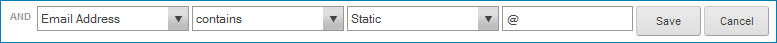

# Tags tab 

<head>
  <meta name="guidename" content="DataHub"/>
  <meta name="context" content="GUID-D9DB05EC-9B3A-4A6C-A473-60E12550083C"/>
</head>

The **Tags** tab in the model page is used to define the model’s tags. Tags are rules for categorizing golden records based on their data.

:::note

The controls on this tab for adding and modifying tags are enabled only for administrators and users having roles that include the MDM - View Models and MDM - Edit Models privileges.

:::

## Add a Tag 

Clicking this button opens the Configure Tag dialog, which is used to add or modify a tag, for the purpose of adding a tag.

**Name**  
**Description**

**Name**  
Name of the tag.

**Inputs**  
This section is used to define the tag’s inputs and their corresponding outputs.

**Name**  
**Description**

**Add**  
Selects the type of input to add to the tag.

-   **Field** — Opens the Add a Field dialog, which is used to add a single field as both an input and output.

    

    **Name**  
    **Description**

    **Field**  
     Sets the field to use as the input and output.

    Deleted fields are shown as “Unknown” in red.

    Clicking  clears both **Field** and **Alias**.

    **Alias**  
    Sets an output alias for the selected **Field**. Outputs are referenced by alias in the Conditions section. **Alias** is automatically populated with the field name upon selection of a **Field** and cleared upon the clearing of **Field**.

-   **Function** — Opens the Add a Function dialog, the first of a series of two or more dialogs, which are used to add a function input and the corresponding output\(s\).

  

**Category**  
Selects the function category of which the function to be applied is a member. Follow the links to Integration topics for information about the functions in each category:

- [String](/docs/Atomsphere/Integration/Process%20building/r-atm-String_functions_efef3d8f-b053-4cfd-aa5f-aa4e30ead17d.md)
- [Numeric](/docs/Atomsphere/Integration/Process%20building/r-atm-Numeric_functions_9b70e31b-a97d-444e-b638-5a004a66b9ee.md)
- [Date](/docs/Atomsphere/Integration/Process%20building/r-atm-Date_functions_e35e34c4-45f2-49ac-b1d7-4792114e52dc.md)

  **Functions**  
Selects the function to be applied. The available selections are dependent upon the selected **Category**.

  **OK**  
Opens a second dialog in which you define the function’s input parameters and/or output(s). The controls in the dialog are dependent upon the selected function in the **Functions** list. For some functions, a third dialog opens when you click **OK** in the second.

  **Cancel**  
Closes the dialog without adding an input and output(s).

**Inputs list**    
    Lists the inputs defined for the tag and provides controls for deleting them. In the list:

-   Clicking the name of an input opens the Add A Field dialog or the Add a Function dialog for the purpose of modifying the output\(s\).

 -   Clicking  for an input initiates a request to delete it. In the confirmation dialog:

        -   Clicking **OK** executes the request.

     -   Clicking **Cancel** cancels the request.

**Conditions**  
This section is used to define the conditions for the tag.

**Name**  
**Description**

**Conditions list**  
Lists the conditions defined for the tag and provides controls for adding, modifying, deleting and reordering conditions and condition groups. Indentation delineates levels in the hierarchy.

At each level of the hierarchy the following links are available:

-   **Add a Condition** — Add a list entry for a new condition at the current level in the hierarchy.

-   **Add a Group** — Add a list entry for a new condition group at the current level in the hierarchy.

You must save changes to individual conditions and condition groups to add them before you click the **Save** button at the bottom of the dialog to save the tag itself.

For each condition and condition group the following links and controls are available:

 -    reorder icon — Used to change the position of the condition or condition group by dragging and dropping.

 -   **Edit** — Reveals controls used to edit the condition or condition group.

 -   **Remove** — Removes the condition or condition group. Removing a condition group removes all of its member conditions.

The following links and controls are revealed when **Edit** is clicked for either a condition or a condition group:

-   **Save** — Saves changes to the condition or condition group \(but not the tag itself\) and hides the editing controls.

 -   **Cancel** — Discards unsaved changes to the condition or condition group and hides the editing controls.

The following links and controls are additionally revealed when **Edit** is clicked for a condition:

  

-   Output selection lists — Select Static or one of the outputs. Outputs are referenced by alias. Multiple outputs for a given input are indented in the list below the input alias. Selecting Static reveals a field to the right for specifying the static value.

-   Static value fields

-   Operator selection list — Sets the manner in which two specified outputs are compared or a single specified output is evaluated:

| |  |
| --- | --- |
| `=` | Output #1 to the left equals output #2 to the right. |
| `!=` | Output #1 is not equal to output #2. |
| `<` | Output #1 is less than output #2. |
| `>` | Output #1 is greater than output #2. |
| `<=` | Output #1 is less than or equal to output #2. |
| `>=` | Output #1 is greater than or equal to output #2. |
| contains | Output #1 contains output #2. |
| does not contain | Output #1 does not contain output #2. |
| starts with | Output #1 starts with output #2. |
| is empty | Output #1 is null. |
| is not empty | Output #1 is not null. |

-   The following control is additionally revealed when **Edit** is clicked for a condition group:

   -   **Group Level Operator** — Selects AND or OR as the Boolean operator defining the relationship between the condition group’s member conditions and condition groups.

**Save**  
Adds the defined tag and closes the dialog.

**Cancel**  
Closes the dialog without adding a tag.

## Tags summary list 

Lists the tags in the and provides tools for managing them. For each tag the following tools and properties are shown:

**name**  
Name of the tag. This is a link to the Configure Tag dialog, which is used to add or modify a tag, for purpose of modifying the tag.

** Delete this tag**  
Clicking this icon deletes the tag.

There is no undo. To effectively undo the deletion of a tag, you must either re-add it or click **Cancel** or **Close** and discard all unsaved changes to the model.

## Getting Started: Hub Model Tags 

Until the first tag is added to a definition, this Getting Started box will be visible in the **Tags** tab:

**Name**  
**Description**

**Add Your First Tag**  
Clicking this button has the same effect as clicking **Add a Tag**.