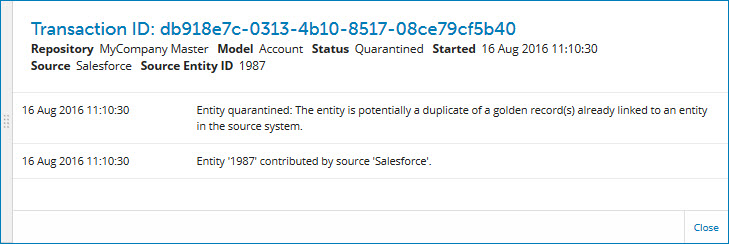

# Transaction detail view 

<head>
  <meta name="guidename" content="DataHub"/>
  <meta name="context" content="GUID-4C3AAD9D-3DCC-4202-AA79-2EC0C0420BC0"/>
</head>

Selecting **View Transaction Details** in the **Actions ** menu for an entity listed in batch detail view opens the detail view for the entity’s transaction, which contains details about the transaction status and history.

In addition to the entity’s **Repository**, **Model**, **Source** and \(if applicable\) **Source Entity ID** also shown in batch detail view, the view header also shows:

**Name**  
**Description**

**Transaction ID**  
transaction ID assigned upon the entity’s initial submission.

**Started**  
Date and time of the entity’s initial submission.

**Ended**  
\(Completed, Errored, or Deleted **Status** only\) Ending date and time of the transaction.

**Status**  
Status of the transaction:

-   Processing — The entity is currently being processed by the system.

-   Quarantined — The entity is quarantined and awaits manual resolution.

 -   Completed — Processing completed, resulting in the creation, updating, or end-dating of a golden record or no operation on a golden record.

 -   Errored — Processing ended due to an unexpected error.

 -   Deleted — After the entity was quarantined, its quarantine entry was manually deleted, thus ending the transaction.

Clicking and dragging the **** icon in the view border adjusts the width of the view.

## Transaction details list 

Lists the event resulting in the initializing of the transaction and events occurring during the processing of the transaction, such as

-   contribution of the source entity in a batch.

-   quarantining of the entity and actions taken to resolve associated quarantine entries.

-   outcome of the incorporation of the entity in the domain — creation, updating or end-dating of the corresponding golden record.

The date and time of occurrence of each event is shown. The events are listed in reverse chronological order.

## Close

Closes the view.

:::note

You can also close the view by clicking in the Batch Report detail view or elsewhere in Batch Reporting.

:::