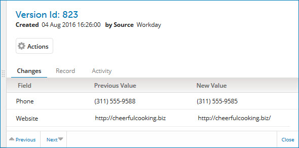

# Version detail view 

<head>
  <meta name="guidename" content="DataHub"/>
  <meta name="context" content="GUID-2DD7B823-0ED1-4E7E-9228-A405B454265B"/>
</head>

In the Golden Records page’s golden record detail view’s version **History** list, clicking a version’s Updated Date opens its detail view.

Version detail view for a golden record

In the view header:

**Name**  
**Description**

**Version Id**  
Internal system version ID.

**Created**  
Date and time at which the version was created. This coincides with the Updated Date column value for this version in the **History** list.

**Superseded**  
\(Non-current versions created as a result of a create or update operation only\) Date and time at which the version was superseded.

**by Source**  
\(Versions created as a result of a create or update operation only\) The source from which the version was contributed or superseded.

**Record end-dated**  
\(Current versions of end-dated golden records only\) Data and time at which the golden record was end-dated.

**End-dated by**  
\(Current versions of end-dated golden records only\) The source from which end-dating was requested.

Clicking and dragging the **** icon in the view border adjusts the width of the view.

##  Actions 

\(Versions created as a result of a create or update operation only\) Clicking this button opens a menu of actions applicable to the version:

-   **View Batch Entity** — Opens the Batch Entity dialog which lets you view the entity data corresponding to the version:

    **Name**  
    **Description**

    **ID**  
    The Boomi DataHub system entity ID.

    **Fields**  
    The entity data — fields and their respective values. The values reflect the results of successfully applied data quality steps, if any. Collections are collapsed by default. This tab is selected by default.

    **Submitted XML**  
    The originally submitted entity data in the native XML format of the incoming batch.

    If this version was an Update resulting from an **Edit this record** operation in golden record detail view in , this tab is not available.

    **Close**  
    Closes the dialog.

## Tabs 

Below the header is at least one tab — **Record**. If the version was created as a result of a create or update operation, there is also an **Activity** tab. If the version was created as a result of an update operation, there is also a **Changes** tab, and it is selected by default.

-   The **Changes** tab lists the previous and new values of created and updated fields for the version. Collections are collapsed by default.

-   The **Record** tab lists the values of all fields for the version. Collections are collapsed by default. Reference field values are links to the detail view for the referenced golden record. Long Text field values are represented by the ** View value** icon. Clicking that icon for a represented value opens a dialog in which the value is shown.

    

-   The **Activity** tab lists events that occurred leading to the creation of the version, such as

    -   contribution of the source entity in a batch.

    -   quarantining of the entity and actions taken to resolve associated quarantine entries.

    -   outcome of the incorporation of the entity in the domain — creation, updating or end-dating of the corresponding golden record.

    The date and time of occurrence of each event is shown. The events are listed in reverse chronological order.

    

## Navigation bar 

The following navigation controls are in the bar at the bottom of the view:

**Name**  
**Description**

** Previous**  
Navigates to detail for the next version \(previous entry in the **History** list\). Keyboard shortcut: **Up arrow**.

**Next **  
Navigates to detail previous version \(next entry in the **History** list\). Keyboard shortcut: **Down arrow**.

**Close**  
Closes the view. Keyboard shortcut: **Esc**.

:::note

You can also close the view by clicking in the golden record detail view or elsewhere in the Golden Records page.

:::