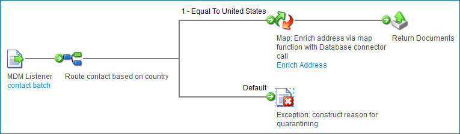

# Integration Hub listener process building

<head>
  <meta name="guidename" content="DataHub"/>
  <meta name="context" content="GUID-38908403-ec76-4bb7-8352-553d9f0eac19"/>
</head>

Integration Hub listener processes perform data validation and/or enrichment on incoming batches of source entities.

A Integration process call data quality step in a model specifies a Hub listener process that is or will be deployed to the Boomi Hub Cloud that hosts the repository to which the model is deployed. When, during processing of a batch, the data quality step is applied, the specified process executes.

Hub listener processes are so named because they utilize the Boomi Master Data Hub Listener connector.

All steps and components are available for use in building listener processes. If you are new to building processes, refer to the Integration documentation. For the remainder of this topic, it is assumed you have rudimentary knowledge of process development.

:::note

To use a listener process that sends validation or enrichment requests to another Internet-based service or an application behind your firewall, you must configure the destination to [accept requests from the Hub Cloud on which the repository is hosted](/docs/Atomsphere/Platform/atm-Accepting_requests_from_the_boomi_atom_clouds_and-hub_clouds_c50ae6a0-3849-4d36-a74e-ed9e7e87b3ee.md). maintains regional Hub Clouds worldwide.

:::

## Start step 

A Hub listener process [Start step](/docs/Atomsphere/Integration/Process%20building/r-atm-Start_shape_7561792f-f0b8-41f5-b06d-06e2bde5b0e5.md) must be configured as a [Boomi Master Data Hub Listener connector](/docs/Atomsphere/Integration/Connectors/r-atm-MDM_Listener_connector_3a30d199-8905-492a-9229-919352404655.md) operation. There is not a connection component as the Boomi Master Data Hub Listener connector is listen-only. The operation does not have any configuration options. The operation’s purpose is simply to receive the batch of source entities.

## Input documents 

XML is the native format of batches of source entities. In a Hub listener process, each source entity in the incoming batch is an input document whose format is specified in an  [XML profile](https://help.boomi.com/csh?context=GUID-065AD34C-0229-40CB-8E59-BFB311A9713C). Typically you will reuse the profile automatically created for Boomi DataHub connector operations.

## Output documents 

In a Hub listener process, each source entity is an output document whose format is specified in an XML profile. Here again you typically will reuse the profile automatically created for Boomi DataHub connector operations.

Terminate the process with a [Return Documents step](/docs/Atomsphere/Integration/Process%20building/r-atm-Return_Documents_shape_61192114-0f9d-49d8-bcd0-1c8d6a843db2.md) to enable return of the batch to Boomi DataHub for continuation of processing. Any entities that were enriched during the process execution are returned in their enriched state. If a field is not present in a returned entity — that is, there are no XML tags for the field — the original value of that field from the contributed entity is used as the field value for the continuation of processing of the entity. If a field in a returned entity is represented by an empty element, null is used as the field value for the continuation of processing of the entity.

## Validation 

Validation processing in a Hub listener process occurs in two phases:

1.  Batch-level validation \(optional\)

    The process determines whether the batch contains entities requiring validation and routes processing accordingly. You can use a [Route step](/docs/Atomsphere/Integration/Process%20building/r-atm-Route_shape_a2a2784e-244e-4d62-9b30-84be7b232802.md) to perform validation based on batch metadata. Batch metadata is received as dynamic process properties by the [Boomi Master Data Hub Listener connector](/docs/Atomsphere/Integration/Connectors/r-atm-MDM_Listener_connector_3a30d199-8905-492a-9229-919352404655.md) operation in the [Start step](/docs/Atomsphere/Integration/Process%20building/r-atm-Start_shape_7561792f-f0b8-41f5-b06d-06e2bde5b0e5.md) as follows:

    - *mdm_source_id* — ID of the batch’s contributing source.

    - *mdm_account_id* — ID of the account that contributed the batch.

    - *mdm_repository_id* — system ID of the repository that hosts the target domain.

    - *mdm_universe_id* — system ID of the domain.

2.  Entity validation

    The process distinguishes between valid and invalid entities and routes processing accordingly. For each entity, the source entity ID is received as the dynamic document property mdm\_source\_entity\_id by the [ Boomi Master Data Hub Listener connector](/docs/Atomsphere/Integration/Connectors/r-atm-MDM_Listener_connector_3a30d199-8905-492a-9229-919352404655.md) operation in the [Start step](/docs/Atomsphere/Integration/Process%20building/r-atm-Start_shape_7561792f-f0b8-41f5-b06d-06e2bde5b0e5.md). Each root entity element’s id attribute is populated with the **Batch Entity ID**, which is accessible from the batch detail view in the Inbound Activity page \(**Reporting** \> **Inbound Activity**\).

    If an entity is an update to an existing golden record, the golden record’s ID is received as the dynamic document property mdm\_record\_id by the [ Boomi Master Data Hub Listener connector](/docs/Atomsphere/Integration/Connectors/r-atm-MDM_Listener_connector_3a30d199-8905-492a-9229-919352404655.md) operation in the [Start step](/docs/Atomsphere/Integration/Process%20building/r-atm-Start_shape_7561792f-f0b8-41f5-b06d-06e2bde5b0e5.md). In addition, the root entity element’s grid attribute is populated with the golden record’s ID.

    -   You can use a [Route step](/docs/Atomsphere/Integration/Process%20building/r-atm-Route_shape_a2a2784e-244e-4d62-9b30-84be7b232802.md) to perform validation based on entity metadata or field value.

    -   If you need to perform validation by means of a look-up in an external data source, such as a database, you can use connector operations in conjunction with a [Decision step](/docs/Atomsphere/Integration/Process%20building/r-atm-Decision_shape_5f328651-9d49-4362-b8bf-8d46937c9ac0.md).

    Terminate the execution path for invalid entities with an [Exception step](/docs/Atomsphere/Integration/Process%20building/r-atm-Exception_shape_db794c33-dd6f-490d-8b5c-237409c86ef4.md) to enable the entities to be quarantined upon continuation of batch processing in Boomi DataHub. You can specify the reason for quarantining that will be returned to Boomi DataHub by populating the Message field in the Exception Properties dialog. In that dialog, select **Stop Single Document**; otherwise, all entities will be quarantined.

## Enrichment 

Enrichment processing in a Hub listener process augments and/or replaces entity data.

-   You can satisfy most requirements for enriching entity data using a [Map step](/docs/Atomsphere/Integration/Process%20building/r-atm-Map_shape_a481eb4d-739a-46fb-b062-866d9d13f21a.md) referencing a [map component](/docs/Atomsphere/Integration/Process%20building/c-atm-Map_components_87f669d6-4999-445f-9f29-ed24e79c92dd.md) whose input and output XML profiles are the same. In the map you can use [map functions](/docs/Atomsphere/Integration/Process%20building/r-atm-Map_Function_components_d209f3e8-3094-42de-a504-2f2dc33ab15c.md) to transform each entity in its contributed state to an enriched state. To use an external data source as the source of enriched data, you can use a map function with a connector call to connect to that data source. You can enrich unpopulated entity fields with static values by setting default field values in the output profile.

-   You can satisfy more complex requirements using [custom scripting](/docs/Atomsphere/Integration/Process%20building/r-atm-Custom_scripting_functions_a81bc95c-2ac5-4bff-8d76-17a925ba965e.md) in map functions or [Data Process steps](/docs/Atomsphere/Integration/Process%20building/r-atm-Data_Process_shape_8d7ca2b4-b8a7-4820-a8fe-c85dedb12b5c.md).

:::note

Splitting and combining entities using **Data Process** steps may yield unpredictable results and is not recommended.

:::

## Example process

Here is an example of a Integration Hub listener process that performs both validation and enrichment on an incoming batch of source contact entities:

As is always the case for a Hub listener process, the **Start** step’s Boomi Master Data Hub Listener connector operation and the **Return** Documents step serve as the process’ bookends. Neither requires configuration.

The **Route** step in this example performs validation on an entity based on the value of the entity’s country field, as noted in the step label. An entity whose country is “United States” is considered valid.

-   A valid entity is routed to the **Map** step for enrichment. As noted in the step label, the referenced map performs enrichment on specified fields in the entity by means of a map function that connects with a database, which serves as the source of enriched data.

-   An invalid entity is routed on the default execution path to the **Exception** step. The entity will be quarantined upon continuation of batch processing in Boomi DataHub. The reason for quarantining is constructed in the Exception Properties dialog, as noted in the step label.

:::note

This process does not perform batch-level validation.

:::