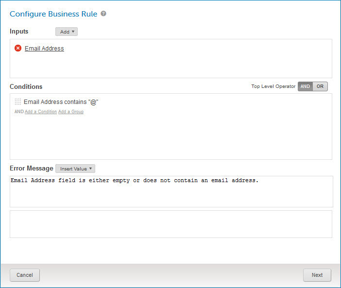

# Data quality steps overview 

<head>
  <meta name="guidename" content="DataHub"/>
  <meta name="context" content="GUID-aaa003de-4378-44b1-ba5c-a355087c71d7"/>
</head>

Data quality steps in a model specify data validation and/or enrichment actions to be applied by the repository to incoming source entities.

In the context of master data synchronization:

-   Data validation is the matching of incoming source data with data maintained by the external data quality service with the objective of cleaning the incoming data to ensure its accuracy before it is stored as master data.

-   Data enrichment is the matching of incoming source data with data maintained by the external data quality service with the objective of augmenting the incoming data before it is stored as master data.

There are three types of data quality steps — ordinary, Integration process call, and business rule:

-   When a business rule data quality step is applied, the repository performs data validation by evaluating entity data against a custom business rule.

-   When a Integration process call data quality step is applied, a process, which is deployed to the repository to which the model is deployed, executes to validate and/or enrich the entity data. The process may use any of a wide variety of methods — for example, comparing the entity data to a database record or sending the entity data to a third-party data quality service for which a connector exists.

-   When an ordinary data quality step is applied, the repository sends entity data to one of the following third-party data quality services for validation and/or enrichment:

    -   [Dun & Bradstreet \(D&B\)](http://dnbdirect.dnb.com/)

        -   Validate Company — This service returns a company’s [D-U-N-S number](https://www.dnb.com/duns/get-a-duns.html), its unique, nine-digit identification number issued by D&B, in addition to ordinary company data.

    -   [Loqate](https://loqate.com/address-verification/)

        -   Verify Address

        -   Verify and Geocode Address

Once entity data is validated and, if applicable, enriched, the entities are eligible for incorporation into the destination domain and propagation to contributing sources on their configured channels.

In the model page for a given model, select the **Data Quality Steps** tab to do the following:

-   View the list of supported data quality services.

-   Enable data quality services for usage in data quality steps.

-   Add data quality steps to the model.

-   View, modify or delete the model’s existing data quality steps.

-   Reorder data quality steps.

Data quality step changes will not persist in the model definition until you publish the model or save it as a draft.

Data quality steps are additive: The output of one data quality step is the input to the next data quality step.

## Data quality step properties 

Ordinary data quality steps have the following properties:

-   data quality service name/type

-   service connection settings

    -   D&B — user name and password

    -   Loqate — API key

-   step name

-   mapping between fields in the model and inputs to the service

-   mapping between outputs from the service and fields in the model

-   optional condition for applying or bypassing the step based on the contributing source

-   optional condition for applying the step to source entities updating matching golden records based on field values

-   optional condition for applying the step only to source entities satisfying a specified business rule

The first optional condition, if selected, has this effect: The step would be applied only where the values of mapped input or output fields would be populated or changed, or where, in a collection whose fields are mapped to service inputs or outputs, those fields in an incoming collection item fail to match any existing item.

Fields from different collections cannot be inputs to a service in the same ordinary data quality step. If any inputs in an ordinary data quality step are mapped to collection fields, all outputs from the service must be mapped to fields in that same collection.

Integration process call data quality steps have the following properties:

-   process name

-   step name

-   optional condition for applying the step to source entities updating matching golden records based on field values

-   optional condition for applying the step only to source entities satisfying a specified business rule

The first optional condition, if selected, has this effect: The step would be applied only where the values of fields — any fields or selected fields — would be populated or changed, or where any or selected fields in an incoming collection item fail to match any existing item.

A called Integration process must

-   have a Boomi Master Data Hub Listener connector operation as its Start step,

-   return results as documents, and

-   be deployed to a repository to which the model is deployed.

See the linked topics about building and deploying Integration Hub listener processes for more information.

Business rule data quality steps have the following properties:

-   step name

-   business rule configuration — inputs/outputs based on entity field values, conditions evaluating outputs, and an error message template for logging exceptions.

Business rule data quality steps are always applied to source entities regardless of the presence of rule inputs in the entities. Omitted and empty fields are evaluated as empty strings.

## Data quality step examples 

Suppose you are building a master data model for United States-based contacts, including their names, addresses, telephone numbers, etc. You might define data quality steps in this model to validate and/or enrich incoming contact entities prior their being incorporated as master data. Assume you will use a third party contact validation and enrichment service for which Boomi Data Hub supports ordinary data quality steps. Also assume that service that requires a correctly formatted email address in the input for each contact.

-   The first data quality step might apply a business rule to test the Email Address field in entities for the presence of the “@” character, which is required in a correctly formatted email address.

    To add this step you would configure the business rule as follows: The Email Address field would be specified as an input and output. A “contains” condition would be specified to evaluate the output.

    

-   The next step might apply a business rule to test the Email Address field in entities for the presence of a top-level domain — for example, “.com”.

    To add this step you would configure the business rule as follows: The Email Address field would again be specified as an input. The String Split function would be used to split the input at “@” into multiple outputs — User and Domain. A “contains” condition would be specified to evaluate Domain. The input would also be specified in its entirety as an output for use in error messages.

    

-   The last step would send entity data to the data quality service to validate contacts’ first names, last names and email addresses and enrich the data with cities, states, telephone numbers and ZIP+4 codes.

    To add this step you would define the correspondence between fields in the model and contact object properties supported by the service. You would do this separately for data sent to the service for validation — these are the inputs — and data retrieved from the service for enrichment — these are the outputs.

    