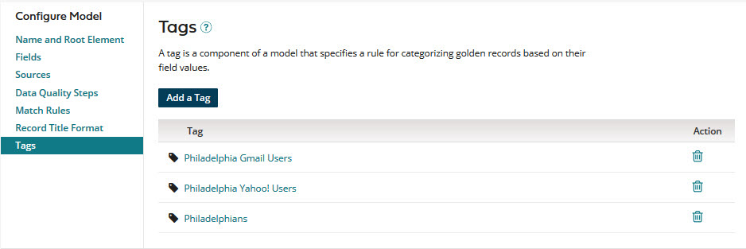

# Tags overview 

<head>
  <meta name="guidename" content="DataHub"/>
  <meta name="context" content="GUID-a9eede4a-8b09-4092-a976-934035257dc2"/>
</head>

A tag is a component of a model that specifies a rule for categorizing golden records and quarantined entities based on their data.

For example, if you are designing a model for your company’s accounts, you may find it useful for governance purposes to provide a means to distinguish the golden records of customers from those of prospects and partners. To do this you could add a tag to the model. If all golden records in your accounts domain will have a Type field value of “Cust”, your tag definition would need to specify this field and value. You would specify a descriptive name for the tag, such as “Customer”. Golden records satisfying the tag will be said to be “tagged” Customer — that is, to “have the tag” Customer. A golden record or quarantined entity can have multiple tags.

Tags are first applied to a domain’s golden records upon the completion of the initial deployment of a version of the domain model containing tag definitions. Tags are reapplied upon completion of each subsequent deployment of the model in which tag definitions are added, modified, or deleted.

:::note

If, during tagging of golden records, you deploy a different version of the model, tagging stops and then restarts upon completion of the new deployment.

:::

Tags can be used to conditionally limit the delivery of source record update requests to individual sources. Continuing with the Customer tag example, suppose you want to store only customer accounts in NetSuite. You would configure the NetSuite source so that requests specifying create operations will be delivered on its channel only for golden records tagged Customer. This means for a given golden record originating from another source, a request specifying a create operation will be delivered on the NetSuite channel either when that golden record is created, if its initial Type field value is “Cust”, or when that golden record’s Type field is updated to “Cust”. In the former case, the golden record is tagged Customer upon its creation. In the latter case, the golden record is tagged Customer upon update.

Tag-based entitlements can be used to control user access to golden record data and quarantine entries in a given domain.

In the model page for a given model, select the **Tags** tab to do the following:

- Add tags to the model.
  
- View, modify or delete the model’s existing tags.

A tag definition consists of

- its name. The name of each added tag appears in the Tags tab.

- inputs/outputs based on field values.

- conditions evaluating outputs.

Tag definitions can be complex:

- You can specify that a function be applied to an input to derive one or multiple outputs.

- You can specify a hierarchy of conditions and condition groups whose relationships are specified by Boolean operators AND and OR. You can group conditions across multiple levels.

Referring back to the Customer tag example, that tag has a relatively simple definition:

- The Type field value is both an input and an output. There are not any other inputs or outputs.

- A single condition is specified for evaluating whether the output Type is equal to “Cust”.