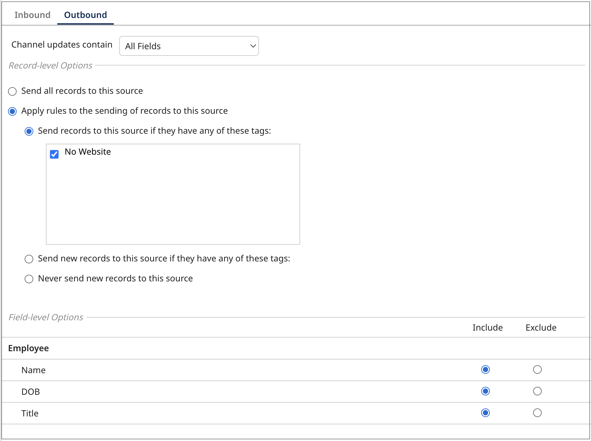

# Adding a source to a model 

<head>
  <meta name="guidename" content="DataHub"/>
  <meta name="context" content="GUID-e77a2437-3758-413a-bdbe-7911fb57e492"/>
</head>

You can add source settings to a model so that every deployed model in a repository contains the same source configuration. This is useful when you want to deploy the same model in development, test, and production repositories. 

## Before you begin 

You must have the following privileges to add a source to a model:

    - **MDM - Edit Models**
    - **MDM - View Models**

## Adding a source to a model

1. Navigate to the Models page and select the model. 

2. Click **Sources**. 

3. Click **Add a Source** or **Add Your First Source**.

4.  Select the source. Source options appear based on the sources you created in the [Sources page](/docs/Atomsphere/Master%20Data%20Hub/Getting%20started/t-mdm-Creating_a_source_9a4b322e-623a-4ba5-9375-1eea62547959.md). 

5. Select one of the following in the **This source can** drop-down menu to specify the source’s behavior: 
    - **Both** - The source can send data to golden records and can accept requests to update data from golden records. This is the default setting.

    - **Contribute data** - The source can only send data to golden records. It cannot accept requests to update data from golden records. 

    - **Accept channel updates** - The source can accept requests to update data from golden records. It cannot contribute data.

    :::note
    
    When you select Contribute data or Accept channel updates, Boomi DataHub hides settings that are not applicable.
    
    :::

6. **Optional:** If the source system supports direct links to data entities, enter the source’s URL format used to create source links.  In the URL add the `{id}` placeholder so Boomi DataHub can insert the specific record id. For example, `https://na2.salesforce.com/{id}`. After you deploy a model and golden records created, you can view a link to the source’s record from the Sources tab of a golden record (Stewardship > Golden Records). 

    Boomi DataHub will use the specified URL format as a template for constructing target URLs for links, rendered in the Golden Records page, to entities in the source system. The URL template will override any template specified on the Sources page for all domains.

    

    

7. **Optional:** Turn on **Allow Multiple Links**. There may be scenarios where a source has two similar individual records with different entity ids. If you turn on this setting, sources can contribute two similar records and the second record is not quarantined as a potential duplicate because the entity id is different. Instead these records are linked together. By default, this setting is turned off so that Boomi DataHub quarantines similar records from the source as potential duplicates.  

    :::note

    If a source is configured to allow multiple links and then reconfigured to disallow multiple links, any existing multiple links from individual golden records to that source’s entities will still remain.

    :::

8. Select **Inbound** settings.

9. Set **Record-level Options** for contributing sources, if applicable: 

    - Select **Require approval for new records** if you want to quarantine all new records contributed by the source. The setting requires you to manually approve quarantined records before they can become new golden records. You can [configure a rule](../Deployment/hub-Configuring_a_business_rule.md) if you want Boomi DataHub to quarantine only new records that satisfy the rule. You create rules using operators and static values. For example, require approval if MailingPostalCode is equal to 00000. If you create a rule with a reference field, you must enter an actual value. You cannot enter the ID of the referenced golden record in place of a value. 
    - Select **Require approval for updates to any field** if you want to quarantine any field updates to existing records contributed by the source. This setting requires you to approve updates to existing records. You can [configure a rule](../Deployment/hub-Configuring_a_business_rule.md) if you want Boomi DataHub to quarantine only record updates that satisfy the rule. You create rules using operators and static values. For example, if MailingPostalCode is equal to 00000. If you create a rule with a reference field, you must enter an actual value. You cannot enter the ID of the referenced golden record in place of a value.
    - Select **Require approval for updates in which a field has a base value** if you want to quarantine base value contributions. When a source contributes the first values for a golden record, these values are considered base values. In scenarios where the base value is no longer the current value, this setting quarantines records for approval when the source attempts to contribute the base value. If this option is not selected, Boomi DataHub ignores base values in entity contributions.
    - Select **Require approval to end-date records** to send a record to quarantine when the source sends a Delete request to end-date a golden record.
    - Select **Enable Early delta detection**. Early delta detection reduces the time it takes to process golden record updates from a contributing source. It allows Master Data Hub to detect when a submitted entity does not change a golden record. Hub compares the previous entity with the inbound entity. If the inbound entity matches the previous entity submitted, the next time the same entity is submitted again without a change, Hub skips processing the entity. Master Data Hub will only include the source's entity submissions when it detects a change to the record or if a new model version is deployed or a source configuration is changed. Model deployment or a change to the entity or to a source configuration starts the evaluation process again from the beginning, and Hub will skip the third time the same entity is submitted.

    :::info

    Early delta detection does not detect a change to a record when you are [using third-party data quality services](/docs/Atomsphere/Master%20Data%20Hub/Modeling/t-mdm-Enabling_a_quality_service_to_use_in_data_quality_f74aa25d-86a6-4390-b5f0-e90b75ebbd4a.md) for data enrichment, such as [Loqate](https://www.loqate.com/en-gb/address-verification/). A change cannot be detected because data enrichment from the third party happens after the entity is compared to the previous entity.

    :::

    :::info

    Early delta detection may not detect a change to a record if you submit an entity and then submit the same entity again with changed and unchanged data within 1 second.

    :::

10. Set **Field-level Options** for contributing sources, if applicable: 

    - Select **Include** if you want the source to contribute data to the field. This is the default setting.
    - Select **Require approval for updates** to quarantine the record if the source requests to update the field.
    - Select **Exclude** to prevent the source from contributing data to the field. If a required field is excluded, the golden record is quarantined. 
    - Select **Custom** if you need the source to contribute data to the field based on a custom rule. You can [configure a rule](../Deployment/hub-Configuring_a_business_rule.md) if you want Boomi DataHub to only quarantine fields that satisfy the rule.

11. Select **Outbound** settings.

12. In the **Channel updates contain** list, select one of the following, if applicable:

    - Select **All Fields** to request all fields in the golden record. This is the default setting.
    - Select **Changed Fields Only** to request only the fields whose values were changed. 

13. Set the **Record-level Options** for accepting sources, if applicable:

    - Select **Send all records to this source** to send record updates to the source without restriction.
    - Select **Apply rules to the sending of records to this source** send record updates to the source according to the rules you specify:
        - Select **Send records to this source if they have any of these tags** if you have created tags in your model, you can use them to create this rule. The source receives updates if the record has the tag or tags specified. Read [Managing Tags](/docs/Atomsphere/Master%20Data%20Hub/Modeling/c-mdm-Tags_overview_a9eede4a-8b09-4092-a976-934035257dc2.md) to learn more.
        - Select **Send new records to this source if they have any of these tags** if you have created tags in your model, you can use them to create this rule. The source only receives new records if they include the tag or tags specified.
        - Select **Never send new records to this source** to reject the requests to send new records to the source.

14. Set the **Field-level Options** for accepting sources, if applicable:

    - Select **Include** to allow the source to recieve data for the field or collection.
    - Select **Exclude** to prevent the source to receive data for the field or collection. You cannot exclude collection key fields in repeatable field groups.

15. Click **Add**.

## Modifying source configurations

After you deploy a model, you can always make modifications to the source configurations in a model or in a specific deployed model in a repository (domain). If you make modifications, keep in mind:
    - Modifications you make in the model are automatically applied to the domain when you deploy the new, updated version of the model. 
    - If you remove source settings in the model and then deploy that model version, Boomi DataHub deletes source configurations in the domain automatically. You cannot undo deleted source configurations. To revert, you must add source configurations again to the model or add them to the domain.

## Next steps
- [Configuring a Rule](../Deployment/hub-Configuring_a_business_rule.md)
- [Configuring source rankings](/docs/Atomsphere/Master%20Data%20Hub/Deployment/t-mdm-Configuring_source_rankings_for_a_domain_0e38f4b3-321a-44c7-b811-018f5ad13954.md)
