# Data masking examples 

<head>
  <meta name="guidename" content="DataHub"/>
  <meta name="context" content="GUID-d4a4cfd3-6548-4e1c-ac35-dcd3e2434b43"/>
</head>

Before you configure data masking in models, consider the model field's datatype and know the typical character length of field values to make the best masking decision. For example, you may decide to mask all characters in an email address instead of a partial mask since the number of characters in an email address varies greatly.

You can configure the following data masking options when you create or edit model fields:

- **All** - hides entire data. Displays all field values as five asteriks. Available for all data types except Reference. 
- **Partial Mask** - hides a portion of the data. Not available for Boolean and Reference type fields. 
- **Partial Show** - reveals a portion of the data. Not available for Boolean and Reference type fields.
- **None** - reveals entire data

Masked values are visible if you have one of the following user permissions: 
  - **MDM - Privileged Data Steward** role
  - **MDM - Administrator** role
  - **MDM - Reveal Masked Data** privilege
  - **MDM - Data Steward** role (or **MDM - Stewardship** privilege) and the **Reveal Masked Data** Hub entitlement (available with the Advanced Security feature)

Review the following examples to help you visualize data masking options and make field masking decisions.

## Masking the last characters

1. In the Model > **Fields** page, select **Partial Mask** in the **Mask** drop-down.
2. Select **Last** to mask the last portion of a field value. 
3. Enter a number to indicate how many characters to mask starting from the last character in the field value. For example, you can mask the last 4 numbers in the account number field.

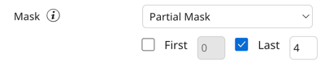

In the golden record, the last 4 characters are masked.

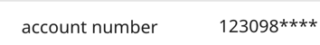

For the date datatype, the format includes dashes. 

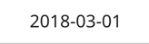

In this example, the last 4 characters are masked. Therefore, the last three numbers and a dash are masked.

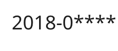

## Masking the first characters

1. In the Model > **Fields** page, select **Partial Mask** in the **Mask** drop-down.
2. Select **First** to mask the first portion of a field value. 
3. Enter a number to indicate how many characters to mask starting from the first character (or number) in the field value. For example, you can mask the first 3 characters in the account number field.

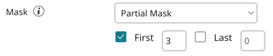

In the golden record, the first 3 characters are masked.

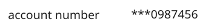

For the date datatype, the format includes dashes.

In this example, the first 3 characters are masked.

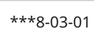

## Masking a combination of first and last characters

1. In the Model > **Fields** page, select **Partial Mask** in the **Mask** drop-down.
2. Select **First** to mask the first portion of the field value. 
3. Enter a number to indicate how many characters to mask starting from the first character.
4. Select **Last** to also mask the last portion of the field value. 
5. Enter a number to indicate how many characters to mask starting from the last character.

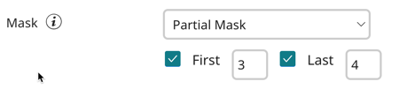

In the golden record, the first 3 characters and last 4 characters are masked in the account number. 

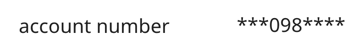

For the date datatype, the format includes dashes. 

In this example, the first three characters and last 4 characters are masked. Therefore, the last three numbers and a dash are masked.

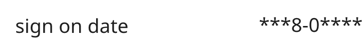

## Showing the first characters

1. In the Model > **Fields** page, select **Partial Show** in the **Mask** drop-down.
2. Select **First** to show the first portion of a field value. 
3. Enter a number to indicate how many characters to show starting from the first character (or number) in the field value. For example, you can show the first 3 characters in the time field.

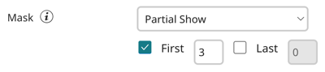

For the time datatype, the format includes a colon.

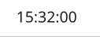

In this example, the first three characters, including the colon are shown.

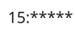

## Showing the last characters

1. In the Model > **Fields** page, select **Partial Show** in the **Mask** drop-down.
2. Select **Last** to show the last portion of a field value. 
3. Enter a number to indicate how many characters to show starting from the last character (or number) in the field value. For example, you can show the last 4 characters in the account field.

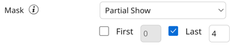

In the golden record, the last 4 characters in the account number are shown.

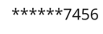

## Showing a combination of first and last characters

1. In the Model > **Fields** page, select **Partial Show** in the **Mask** drop-down.
2. Select **First** to show the first portion of the field value. 
3. Enter a number to indicate how many characters to show starting from the first character.
4. Select **Last** to also show the last portion of the field value. 
5. Enter a number to indicate how many characters to show starting from the last character.

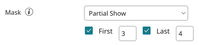

In the golden record, the first 3 characters and last 4 characters are shown in the account number. 

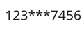

## Masking all characters

In the model Field's page, select **All** in the **Mask** drop-down to mask the entire field value as five asteriks. The consistent masked length hides the field values actual character length.

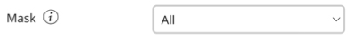

In the golden record, the email address is masked. 

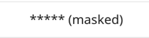