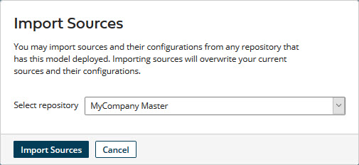

# Importing a domain source configuration into the domain model 

<head>
  <meta name="guidename" content="DataHub"/>
  <meta name="context" content="GUID-f8f7cd85-ddcd-4f32-84a7-adecba23dfe1"/>
</head>

Prior to the November 2020 release, sources had to be manually attached to domains. Starting with that release, it became possible to add sources to models. When a model that contains sources is deployed to a repository, the sources are automatically attached to the domain. To take advantage of this capability with existing domains and models, you can import a domain source configuration into the domain model.

## About this task

:::note

Importing a domain source configuration into a model replaces the model’s existing source configuration. Conversely, deploying a version of a model with embedded sources replaces the domain source configuration.

It is not possible to import a source configuration into a model that is not deployed or into a deployed model to which sources are not attached.

:::

:::note

When a domain to which a model with embedded sources was deployed has a source configuration that is specific to the repository in which the domain is hosted, a notification to that effect appears in the domain **Soures** tab in the repository page. The notification contains a link to the model’s **Sources** tab to make it easy for you to import the domain source configuration into the model, should you so desire.

:::

## Procedure

1.  In the Models page, click the model to which you want to import sources and select the **Sources** tab.

2.  Do one of the following:

    -   If the model does not currently contain sources, click **Import sources from repository**.

    -   If the model currently contains sources, click **Import Sources**.

    The Import Sources dialog appears.

    

3.  Select the repository that hosts the domain from which you want to import the source configuration.

4.  Click **Import Sources**.

5.  In the confirmation dialog, click **OK**.

    The dialog closes. The source configuration is imported. When the operation is complete, the imported sources are listed in the Sources tab.