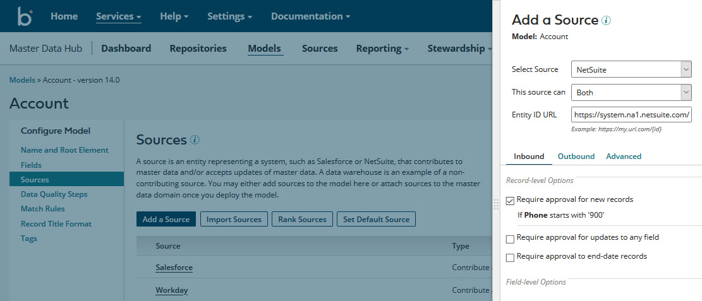

# Early Access \(EA\): Models with embedded sources 

<head>
  <meta name="guidename" content="DataHub"/>
  <meta name="context" content="GUID-996f3018-f866-4302-8a0f-e6cce011374d"/>
</head>

You can optionally embed sources in models. Embedding sources in models is advantageous because it enables you to easily maintain consistent domain source configurations across repositories.

In the Models page, when you create a model or select an existing model, the model page contains a new tab, **Sources**. Use this tab to add sources to the model, modify the configuration of previously added sources, configure the model’s source rankings, designate the model’s default source, and remove sources from the model.

## Getting started 

Existing users can most easily add sources to their models by importing source configurations from existing domains. To initially import a domain source configuration into a model, click **Import sources from repository** in the Getting Started box in the model’s **Sources** tab.

## Model deployment 
When you deploy a version of a model with embedded sources to a repository, those sources are automatically attached to the master data domain. If the domain had existing source attachments, they are overwritten by the model’s sources. Similarly, if the domain had existing source rankings or a default source, they are overwritten by the model’s source rankings or default source. Once you deploy a model with embedded sources, this deployment behavior applies to future versions of that model.

:::note

Once you deploy a version of a model with embedded sources, if you deploy a subsequent version without embedded sources, all sources attached to the domain are removed, as are any source rankings or default source designation. If you then want to restore the domain source configuration, you either need to manually do so from the domain **Sources** tab or deploy a new or previous model version with the desired source configuration.

:::

## Synchronization of model and domain source configurations 

A discrepancy between a domain source configuration and the source configuration in the deployed version of a model occurs if, after you deploy a model with embedded sources, you then modify the domain source configuration. This action makes the domain source configuration specific to the repository in which the domain is hosted.

A notification about the discrepancy appears in the domain **Sources** tab in the repository page. You can then synchronize the domain and model source configurations either by importing the domain source configuration into the model or reverting the domain source configuration to the source configuration in the most recently deployed model version.

-   To import the domain source configuration into the model, click the link in the notification to go to the model’s **Sources** tab. Then click **Import Sources**. Importing overwrites the model’s source configuration.

-   To revert the domain source configuration to the source configuration in the most recently deployed model version, click **Revert Source Configuration** in the domain **Sources** tab.

## Differences between source configuration at the model and repository levels 

The functionality and appearance of the model **Sources** tab are almost identical to the domain **Sources** tab. These are the differences:

-   There is no actions menu for a source in the summary list at the model level because the actions of viewing pending updates and adding a staging area are not applicable. Unlike at the repository level, the configuration dialog for a source can be opened only by clicking the source name in the summary list, and a source can be removed only by clicking ** Remove Source** in the source’s summary list entry.

-   At the model level, there is no attachment status icon for a source in the summary list because attachment takes place at the repository level.

-   At the model level, there is no URL column in the summary list because a channel corresponds to an attachment.

-   Once a source is added to a model, you can still change its type \(Contribute and Accept, Contribute Only, or Accept Only\), whereas at the repository level, you cannot modify a source’s type once the source is attached to a domain.

## Related Platform API enhancements 

The new Platform API operation [Import Domain Source Configuration to Model](<../REST APIs/hub-Import_Domain_Source_Configuration_to_Model_85965d04-e0fd-481c-9f72-0e820834c825.md>) can be used to programmatically import a domain source configuration into the domain model.

The following previously existing API operations are updated to support models with embedded sources:

-   [Deploy Universe](/docs/Atomsphere/Master%20Data%20Hub/REST%20APIs/hub-Deploy_Universe_4329ae89-04b9-4375-92ca-3c53b88967f8.md)

-   [Get Universe Deployment Status](/docs/Atomsphere/Master%20Data%20Hub/REST%20APIs/hub-Get_Universe_Deployment_Status_7f21090b-c214-40cf-bbdf-27e4bbbcf6be.md)

-   [Undeploy Universe](/docs/Atomsphere/Master%20Data%20Hub/REST%20APIs/hub-Undeploy_Universe_2f33215c-5d89-46ec-bceb-999e643007e3.md)