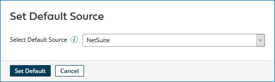

# Setting the default source 

<head>
  <meta name="guidename" content="DataHub"/>
  <meta name="context" content="GUID-792dcd2c-083f-4d3e-afbe-503ca3a8ac0b"/>
</head>

You set a default source when: 

- You have a model that has a reference field.

- The reference field value needs to be pulled from a source that is not attached to the model. Setting the default source tells Hub which source to look at for the value.

Setting a default source ensures that golden records consistently use the same source for reference field values. You can set the default source in the model or in the deployed model (**Repository > Deployed Model > Sources tab**).

## Procedure

1.  Do one of the following:

    -   To configure the default source for a model, in the Models page, click the model for which you want to set the default source and select the **Sources** tab.

    -   To configure the default source for a domain, in the repository page, click the domain for which you want to set the default source and select the **Sources** tab.

2.  Click **Set Default Source**.

    The Set Default Source dialog appears.

    

3.  Do either of the following:

    -   To change or set the default source, in the **Select Default Source** list, select that source.

:::note

When you change the default source, two changes occur:

 - All resolved references to golden records in the referenced domain linked to the previous default source are changed to Pending.

- Hub attempts to match the entity ID in each pending reference to the entity ID linking a golden record in the referenced domain to the new default source. For each such successful attempt, the reference is resolved.

:::

    -   To deselect the current default source without selecting a replacement, in the **Select Default Source** list, select None.

4.  Click **Set Default**.

    The dialog closes, and if you changed or set the default source, “ - Default” immediately follows that source’s name in the sources summary list.

:::note

Once you specify a default source, the Hub will try to link contributed references to the specified default source in the future. Any pending references that existed before you set the default source will remain in a pending state.

:::