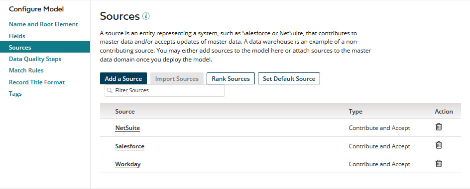

# Sources overview 

<head>
  <meta name="guidename" content="DataHub"/>
  <meta name="context" content="GUID-44bc8108-64e3-48a4-a5ee-375fe9a6849b"/>
</head>

You can optionally add sources to a model. Sources represent systems that can contribute data to and/or accept updates of data from master data domains hosted in repositories. Including sources in your models is advantageous because it enables you to easily maintain consistent domain source configurations across repositories.

Most sources are configured to both contribute data and accept updates of data. Common exceptions are data warehouses, spreadsheets and web forms. Data warehouses are commonly designated as non-contributing sources. Spreadsheets and web forms are commonly designated as contribute-only sources.

If you deploy a version of a model with embedded sources to a repository:

-   The sources are automatically attached to the domain.

-   If you deploy a subsequent version, the domain’s source attachments are updated to reflect that version’s source configuration.

    :::note
    
    If you deploy a subsequent version without embedded sources, all sources attached to the domain are removed. If you then want to reattach sources, you either need to manually reattach the sources from the domain’s **Sources** tab or deploy a new or previous version with embedded sources.

    :::

If you want to add sources to a previously deployed model, you will likely want the model’s source configuration to reflect the domain source configuration, at least initially. To accomplish that objective, you can import the domain source configuration into the model.

Select the **Sources** tab in a model page to add and import sources to the model, modify the model’s sources, remove sources from the model, and, optionally, rank the model’s sources and set the the model’s default source.

## Source rankings 

By default a repository to which a model with embedded sources is deployed incorporates contributed entity data into the master data domain on a first-come, first-served basis, without regard for the relative trustworthiness of the contributing sources. This approach has two fundamental risks, both of which increase as additional contributing sources are attached to the domain.

-   One risk is that master data will be updated with data from less trusted sources.

-   The second risk flows from the first — the risk that less trusted data will be propagated in source record update requests to source systems.

Although you can to some extent design a domain’s master synchronization process to mitigate these risks, you can effectively eliminate them by ranking sources.

Consider a domain containing master data contributed from three source systems — financial, operational, and marketing. Typically an entity is first added to the marketing system, later added to the operational system, and added last to the financial system. The system hierarchy is such that the source of record for a given golden record is the system to which a record for the subject entity was most recently added.

To automate governance of golden record updates and propagation of update requests to support this hierarchy, you would rank the domain model’s sources as follows:

1.  financial

2.  operational

3.  marketing

These rankings in the model would, upon its deployment, ensure the following with respect to contributed entity data:

-   Less trusted data from the marketing system would not update golden record data sourced from the operational or financial system.

-   Less trusted data from the operational system would not update golden record data sourced from the financial system.

In both cases instead of less trusted data being incorporated in the domain, more trusted golden record data would be propagated, if available, in source record update requests to the domain’s attached contributing sources on their channels.

Source rankings are supported at the *field* and *field group* levels to similarly satisfy more complex use cases in which a domain’s source of record varies from field to field. An example is a domain for which the financial system is the source of record with two exceptions: The operational system is the source of record for the Address field, and the marketing system is the source of record for the Account Executive field. The detail view for a given golden record in the Golden Records page provides visibility into value agreement across sources for fields for which source rankings are configured.

You can enable, change, or disable a field’s source rankings or a field group’s source rankings at any time.

-   If you enable rankings in a model or designate a different source as highest ranked for a field\(s\) or field group\(s\), upon deploying the model, you should ensure the highest ranked sources immediately contribute their current values for the fields and field groups for which they are highest ranked. These entity contributions should omit fields and field groups for which a source is not highest ranked.

-   When you add a source, it is automatically ranked lowest for all fields and field groups for which rankings are configured. If that lowest ranking is not your intent for certain fields or field groups, change the rankings for those fields and field groups as soon as possible.

:::note

You should not rank sources for fields subject to validation or enrichment by data quality steps — the purpose of using data quality steps is to source the most trusted data.

:::

If you deploy a version of a model with embedded sources and source rankings to a repository:

-   The source rankings are applied to the domain.

-   If you deploy a subsequent version, the domain source rankings are updated to coincide with that version’s source rankings.

    :::note
    
    If you deploy a subsequent version without embedded sources or source rankings, the domain source rankings are removed.

    :::

## Source configuration for inbound contributions 

Several configuration options are available for a source embedded in a model that, upon deployment of the model to a repository, affect entity contributions into the master data domain from the source system.

-   The option to allow multiple links to source entities from individual golden records can be useful when you need to synchronize master data with data in a source system that does not provide the capability to identify or remove duplicate records. This option affects both inbound contributions and outbound deliveries. With regard to inbound contributions, if a source is configured with the option to allow multiple links, entities contributed from that source that would otherwise be quarantined during incoming batch processing as potential duplicates remain eligible for incorporation.

-   There are options to unconditionally or conditionally exclude particular fields or collections in entity contributions from create and update operations on golden records. Consider these options for sources that are not the domain’s source of record at the field level. If the model has match rules specifying excluded fields, you should designate those fields in the model as Required to facilitate data stewardship.

    You should not select these options for *all* sources for fields for which source rankings are configured — doing so would prevent the application of data survivorship rules derived from the rankings to those fields in entity contributions.

-   There are options to require manual approval in order for a source’s entity contributions to be incorporated:

    -   New entity contributions from the source — approval can be required conditionally or unconditionally. Consider this option for sources that are not the domain’s source of record at the record or field level.

    -   Entity contributions that would update any or selected fields in matching golden records linked to the source — approval can be required conditionally or unconditionally at the record level or the field level. The alternative of configuring source rankings, if that capability is enabled in your account, offers greater control of updates and does not impose a data stewardship burden.

    -   Entity contributions for which there is a pending link from the matching golden record and in which a field has a base value. If manual approval is not required, a link is established in these cases, but the update ignores the fields with base values.

        :::note
    
        A field’s base value for a source is the value of the field in the matching golden record’s base version for the source. While there is a pending link from a golden record to a source, the base version of the golden record for that source is the golden record version when the pending link was created.

        :::

    -   Entity contributions that would end-date matching golden records linked to the source — approval can be required unconditionally.

    Entities for which manual approval is required for incorporation are quarantined.

You can change a source’s configuration for inbound contributions at any time, but changes do not take effect until model deployment.

## Source configuration for outbound deliveries 

Several configuration options are available for a source embedded in a model that, upon deployment of the model to a repository, affect the propagation of source record update requests on the source’s channel from the master data domain to the source system.

You can configure a source so that update requests propagated on its channel either contain all fields in the golden record (full updates) or only the fields whose values were changed (differential updates). Differential updates are preferable where the source can reconcile through a record ID and apply that type of update, but some sources apply updates by overlaying all existing fields. Differential updates obviously use less bandwidth than full updates.

The option to allow multiple links to source entities from individual golden records can be useful when you need to synchronize master data with data in a source system that does not provide the capability to identify or remove duplicate records. This option affects both outbound deliveries and inbound contributions. With regard to outbound deliveries, if a source is configured with the option to allow multiple links, an update request necessitated by a golden record update is propagated on the source’s channel for each entity to which the golden record is linked.

To facilitate the maintenance of data compliance:

-   There are source configuration options to allow, conditionally allow, or conditionally disallow the propagation of update requests. Conditions are based on the type of operation specified in a request and/or tags applied to created, updated or deleted golden records. \(A tag is a component of a model that specifies a rule for tagging golden records based on their data — for example, the tag Customer for golden records with the Type field value of “Cust”.\)

    -   You can conditionally allow the propagation of all requests resulting from create, update and delete operations on golden records having any of a set of selected tags.

    -   You can conditionally allow only requests specifying create operations having any of a set of selected tags.

    -   You can disallow the propagation of all requests specifying create operations.

-   Furthermore, there are source configuration options to exclude particular fields or collections in propagated update requests.

You can change a source’s configuration for outbound deliveries at any time, but changes do not take effect until model deployment.

## Default source designation 

A common master data management practice is to master reference data — for example, geographical locations — in domains separate from the domains in which “nouns” of the business are mastered. This architecture helps to ensure references from master data to reference data remain consistent across master data domains and across the source systems that contribute to individual master data domains.

To identify a reference data model, designate one of its sources as the model’s default source. Upon deployment of the model to a repository as reference data domain, the default source designation results in this behavior: When an entity is contributed to a referencing master data domain from a source not attached to the reference data domain, an attempt is made to match the entity ID in the referencing field to an entity ID linking a golden record in the reference data domain to the default source. If the attempt is successful, the reference is resolved for the contributing source.

If you deploy a version of a model with embedded sources and a default source designation to a repository:

-   The default source designation is applied to the domain.

-   If you deploy a subsequent version, the domain’s default source is updated to coincide with that version’s default source.

    :::note
    
    If you deploy a subsequent version without embedded sources or a default source designation, the domain’s default source designation is removed.

    :::