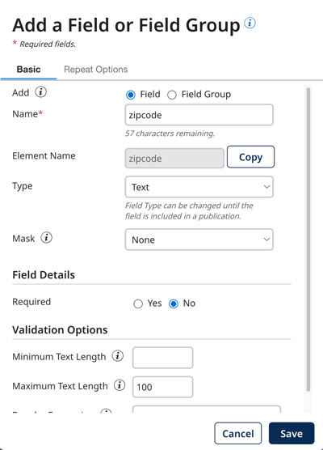
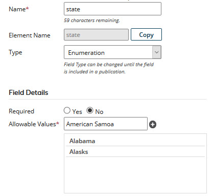
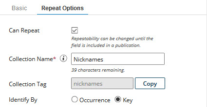

# Adding a field 

<head>
  <meta name="guidename" content="DataHub"/>
  <meta name="context" content="GUID-b0e3b851-2b02-4624-b74f-f8625dfc9c41"/>
</head>

Add a field to a model by specifying the field’s name, type, and other properties.

## Procedure

1.  Do one of the following:

    -   In the **Fields** tab, click **Add a Field or Field Group**.

    -   In the dialog used to select a method for adding fields, click **No thanks, I’ll add fields manually**.

    The Add a Field or Field Group dialog appears and takes focus with its **Basic** tab selected.

    

2.  In the **Name** field, type the field name.

3.  In the **Type** list, select the field type. Text is the default. For ordinary fields, the alternatives are Integer, Float, Date/Time, Date, Time, Boolean, Enumeration and Long Text.

    Once the field is in a published version of the model, its type cannot be changed.

4.  If you selected **Type** Enumeration, enter the allowable field values as follows \(otherwise, skip to step 5\):

    1.  In the **Allowable Values** field, type a unique value.

    2.  Click ** Add allowable value**.

        Case-sensitivity is enforced. For example, once you add “red” to the list, you cannot add “Red” or “RED”.

        The value appears in the list below.

        

    3.  For each additional value, repeat substeps a–b.

    :::note
    
    To delete a previously typed value, click ** Delete this value** adjacent to the value in the list.

    :::

5. **Optional**: If the field will contain sensitive data, you can select a masking option to mask data from users that that cannot view masked data. Read [Setting up user accounts and access](/docs/Atomsphere/Master%20Data%20Hub/Getting%20started/r-mdm-User_Management_5f47b2da-d5cc-4c88-bdfd-0a255d69323a.md) to learn more. Select one of the following options from the **Mask** drop-down:

- **All** - hides entire data. Not available for Reference data types. 
- **Partial Mask** - hides a portion of the data. Not available for Boolean and Reference data types. 
- **Partial Show** - reveals a portion of the data. Not available for Boolean and Reference data types. 
- **None** - reveals entire data.

6.  To require the field to have a value in records, select Required — **Yes**.

7. **Optional**: If you selected **Type** Text, to set validation options for the field, do any or all of the following. Incoming entities having one or more fields that fail validation will be quarantined.

    1.  To require validation of a minimum number of characters, in the **Minimum Text Length** field, type that number.

    2.  To require validation of a maximum number of characters, in the **Maximum Text Length** field, type that number. This field can be set to a maximum of 255 characters.

    3.  To require validation using pattern matching, in the **Regular Expression** field, type the regular expression specifying the pattern against which to match. See the [regular expression syntax](http://docs.oracle.com/javase/6/docs/api/java/util/regex/Pattern.html) for help on how to build regular expressions.

8.  **Optional**: To make the field repeatable, which enables the representation of a collection:

    1.  Select the **Repeat Options** tab.

        

    2.  Select **Can Repeat**.

    3.  In the **Collection Name** field, type the collection name.

    4.  Select one of the following **Identify By** options, which controls the method by which collection items in incoming entities are matched with collection items in golden records:

        -   To enable matching based on order of occurrence, select **Occurrence**.

        -   To enable matching by key field values, select **Key**.

9.  Click **Save**.

    The dialog closes.

    -   If the specified **Name** is not the same as that of a deleted field, the field is added as the last field in the record structure. You can then change the relative position of the field if you like.

    -   Otherwise, a dialog appears enabling you to add a new field with that name or restore the deleted field — see the Related task for viewing and restoring deleted fields.