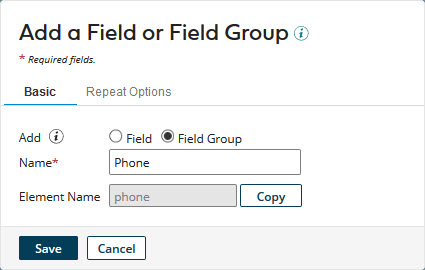
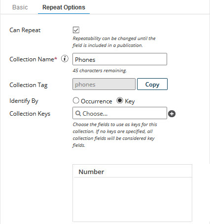

# Adding a field group 

<head>
  <meta name="guidename" content="DataHub"/>
  <meta name="context" content="GUID-88a4a3bc-76e3-4aea-84dd-10a4623e0aaa"/>
</head>

You can add field groups to models as a means of defining relationships between fields.

## Procedure

1.  Do one of the following:

    -   In the **Fields** tab, click **Add a Field or Field Group**.

    -   In the dialog used to select a method for adding fields, click **No thanks, I’ll add fields manually**.

    The Add a Field or Field Group dialog appears and takes focus.

2.  Select **Add**: **Field Group**.

    

3.  In the **Name** field, type the name of the field group.

4.  **Optional**: To make the field group repeatable, which enables the representation of a collection:

    1.  Select the **Repeat Options** tab.

    2.  Select **Can Repeat**.

        

    3.  In the **Collection Name** field, type the collection name.

    4.  Select one of the following **Identify By** options, which controls the method by which collection items in incoming entities are matched with collection items in golden records:

        -   To enable matching based on order of occurrence, select **Occurrence**.

        -   To enable matching by key field values, select **Key**.

5.  Click **Save**.

    The dialog closes. The list entry for the newly added field group appears.

:::note

A newly added field group does not contain any fields. You cannot save or publish a model containing a field group that does not contain fields. See the Related task for adding a field to a field group.

If the field group is repeatable and in step 4d you set **Identify By** to **Key**, once you add fields to the field group, you will have the option to select key fields for the collection. See the Related task for modifying the properties of a field group. If you do not explicitly select key fields, all fields are designated as keys.

:::