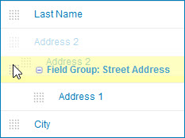
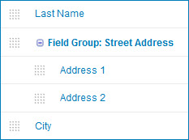

# Adding a field to a field group 

<head>
  <meta name="guidename" content="DataHub"/>
  <meta name="context" content="GUID-06e64430-dd46-492e-9603-c259b4cef834"/>
</head>

Field groups typically have multiple member fields. Adding a field to a field group is a drag-and-drop operation.

## Before you begin

Before you can add a field to a field group you must first add the field group.

## Procedure

1.  In the **Fields** tab, drag the field’s reorder icon  and drop it on the field group.

    

    If the field group is expanded, the newly added field is immediately visible.

    

:::note

It is not possible to move a field into a field group that represents a collection.

:::