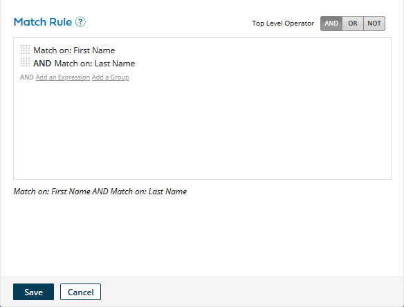

# Adding a match rule 

<head>
  <meta name="guidename" content="DataHub"/>
  <meta name="context" content="GUID-3bd6884b-c6a5-49ff-b3dc-2ac536aba1b4"/>
</head>

You must add at least one match rule to a model in order to publish it. You can add match rules to a model in the **Match Rules** tab

## Before you begin

You must have the following privileges to add a match rule:

- MDM - View Models
- MDM - Edit Models

## Procedure

1.  In the **Match Rules** tab, click **Add a Match Rule** or **Add Your First Match Rule**.

    The Match Rule dialog appears and takes focus.

    

2.  Either add an expression \([simple](../Modeling/t-mdm-Adding_a_simple_expression_to_a_match_rule_4274e002-3998-4947-b9e3-38087f34dfaa.md) or [advanced](../Modeling/t-mdm-Adding_an_advanced_expression_to_a_match_rule_2b6f454a-4577-4dfd-97d0-1451a17aad28.md)\) or an [expression group](../Modeling/t-mdm-Adding_an_expression_group_to_a_match_rule_03cca47e-2b1e-49e6-80dd-c487f60e2576.md).

3.  Repeat step 2 until you are finished building the match rule.

    To change the Boolean operator relating grouped expressions at the top level of the match rule definition, click the desired **Top Level Operator** — **AND**, **OR** or **NOT**.

4.  Click **Save**.

    The Match Rule dialog closes, and the newly added match rule is shown in the Match Rules tab. You can drag and drop the reorder icon  to change the relative priority of the match rule.

    :::note

    If you delete a field from the match rules on the **Fields** tab, the corresponding match rules will become invalid. You will see their definitions highlighted in red, and the deleted fields will be labeled as **Unknown**.

    :::

    :::note
    
    The key to building a match rule is to start at the beginning and proceed in a linear fashion. For example, consider the match rule \(Match on: first\_name AND Match on: last\_name\) OR \(Match on: last\_name AND Match on: email\). This match rule would be built as follows:

    -   Add the first expression group with AND as the group-level operator.

    -   Add the two expressions in that group.

    -   Add the second expression group with AND as the group-level operator.

    -   Add the two expressions in that group.

    -   Change the **Top Level Operator** to OR.

    :::