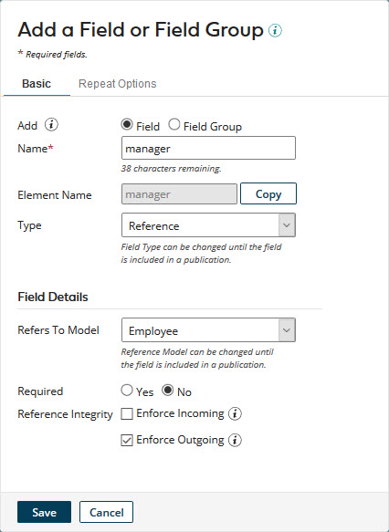

# Adding a reference field 

<head>
  <meta name="guidename" content="DataHub"/>
  <meta name="context" content="GUID-b746561c-da49-4b09-b226-27812969f947"/>
</head>

You can add reference fields to models. Reference fields represent relationships between objects of the same type, such as employees and their managers, and objects of different types, such as contacts and accounts.

## Procedure

1.  Do one of the following:

    -   In the **Fields** tab, click **Add a Field or Field Group**.

    -   In the dialog used to select a method for adding fields, click **No thanks, I’ll add fields manually**.

    The Add a Field or Field Group dialog appears and takes focus.

2.  In the **Name** field, type the field name.

3.  In the **Type** list, select Reference.

4.  In the **Refers to Model** list, select the model to be referenced by this field. Your selection cannot be changed once the field is in a published version of the model.

    

5. **Optional**: To require the field to have a value in golden records, select Required — **Yes**.

    Reference Integrity — **Enforce Outgoing** automatically turns on If in step 4 you selected another model \(inter-domain reference\).

6.  **Optional**: To ensure the enforcement of referential integrity with respect to the field for entity contributions, select Reference Integrity — **Enforce Incoming**.

    Enforcement of referential integrity for entity contributions means any contributed entity in which the value of the field references an entity for which a golden record does not exist will be quarantined.

    :::note
    
    If you select this option and in step 4 you selected another model \(inter-domain reference\):

    -   It will not be possible to deploy the model without first deploying the referenced model.

    -   It will not be possible to attach a source shared by the model and the referenced model without first attaching that source to the referenced model.

    -   It will not be possible to remove a source shared by the model and the reference model without first removing that source from the referenced model.

    :::

7.  **Optional**: To ensure the enforcement of referential integrity with respect to the field for channel update requests, select Reference Integrity — **Enforce Outgoing**.

    Enforcement of referential integrity for channel update requests means propagation of source record update requests on channels, as a result of golden record updates, will occur only to sources already linked to referenced golden records.

8.  Click **Save**.

    The dialog closes.

    -   If the specified **Name** is not the same as the name of a deleted field, the field is added as the last field in the golden record structure. You can then change the relative position of the field if you like.

    -   Otherwise, a dialog appears enabling you to add a field with that name or restore the deleted field — see the Related task for viewing and restoring deleted fields.