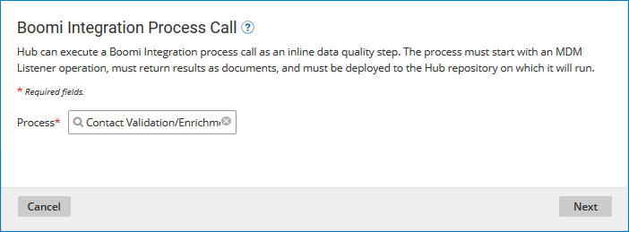
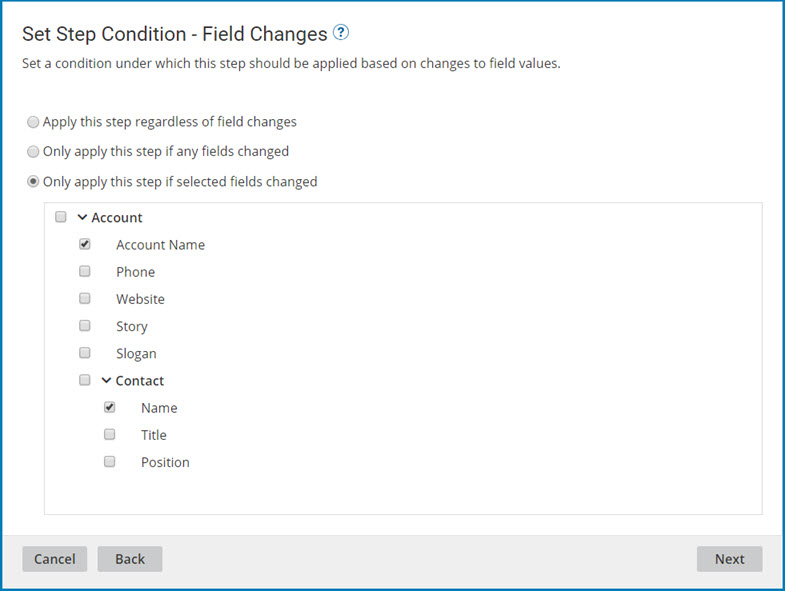

# Adding a Integration process call data quality step

<head>
  <meta name="guidename" content="DataHub"/>
  <meta name="context" content="GUID-08a641f0-d201-4b85-b819-d68cb631944b"/>
</head>

When a Integration process call data quality step in a model is applied, it requests execution of a Integration Hub listener process to validate and/or enrich incoming entity data. The process may use any of a wide variety of methods — for example, comparing the entity data to a database record or sending the entity data to a third-party data quality service for which a Integration connector exists.

## Procedure

1.  In the Integration Build page, build the process. See the linked topic.

2.  In the Integration Deploy page, deploy the process to the repository to which the model is or will be deployed. See the linked topic.

   You can defer this step until after you actually add the data quality step to the model \(steps 3–12\).

3.  In the Boomi DataHub **Data Quality Steps** tab, click **Add a Data Quality Step** or **Add Your First Data Quality Step**.

    The Available Data Quality Services dialog appears and takes focus.

    

4.  Click **Process Call**.

    The Data Quality Step wizard opens to the Integration Process Call screen.

    

5.  In the **Process** list, select the process.

6.  Click **Next**.

    The wizard advances to the Set Step Condition — Contributing Source screen.

    

7.  To configure the data quality step to be applied for source record updates contributed by particular sources, select**Only apply this step if the record is contributed by selected sources** and select the sources by turning on their check boxes below.

    The default, **Apply this step for all contributing sources**, applies this step to source record updates regardless of their contributing source.

8.  Click **Next**.

    The wizard advances to the Set Step Condition - Field Changes screen.

    

9.  To configure the data quality step for updating source records, you can select one of the options mentioned below: 

     -  If the source entity does not populate or change the values of golden record fields, select **Apply this step regardless of field changes**. This option is useful for domains with relatively dynamic source data.

     -  If the source entity does populate or change specific golden record fields, select **Only apply this step if selected fields changed** and activate the checkboxes for the required fields below. 
   
     -  By default, the system selects **Only apply this step if any fields changed**, indicating that the source entity does not populate or change any golden record field values.

10. Click **Next**.

    The wizard advances to the Set Step Condition - Custom Business Rule \(optional\) screen.

    

11. To configure the data quality step to be applied only to entities that satisfy a business rule, configure the business rule using the Inputs and Conditions controls.

    The steps are analogous to those for configuring inputs and conditions in a business rule data quality step — see the linked topic.

12. Click **Next**.

    The wizard advances to the Name the Step screen.

    

13. In the **Data Quality Step Name** field, type the name of the data quality step.

    The default is Integration Process Call.

14. Click **Finish**.

    The wizard closes, and the data quality step is added.