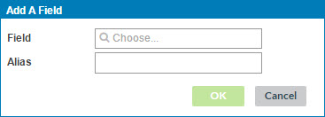

# Adding an input field to a business rule 

<head>
  <meta name="guidename" content="DataHub"/>
  <meta name="context" content="GUID-ef201876-b6a6-4700-b999-e95d443e97f5"/>
</head>

Adding an input field\(s\) to a business rule is part of the process of configuring a business rule, which is a required step in adding a business rule data quality step to a model and an optional step in adding another type of data quality step.

## Procedure

1.  In the Inputs section of the Configure Business Rule screen, click **Add** and select **Field**.

    The Add A Field dialog opens.

    

2.  In the **Field** list, select the desired field.

    The **Alias** field automatically populates with the name of the selected field. This is the output alias for use in the business rule’s conditions and error message template.

3.  To specify a different output alias, type it in the **Alias** field.

4.  Click **OK**.