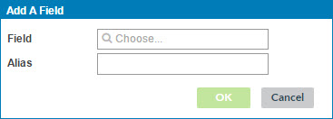

# Adding an input field to a tag 

<head>
  <meta name="guidename" content="DataHub"/>
  <meta name="context" content="GUID-3db59dde-b614-41d2-839c-37d532a99c2a"/>
</head>

Adding an input field(s) is part of the process of adding a tag.

## Procedure

1.  In the Inputs section of the dialog used to add a tag, click **Add** and select **Field**.

    The Add A Field dialog opens.

    

2.  In the **Field** list, select the desired field.

    The **Alias** field automatically populates with the name of the selected field. This is the output alias for use in adding conditions.

3.  **Optional**: To specify a different output alias, type it in the **Alias** field.

4.  Click **OK**.