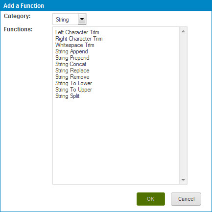

# Adding an input function to a business rule

<head>
  <meta name="guidename" content="DataHub"/>
  <meta name="context" content="GUID-49aeaa7f-eedc-45ab-b51f-a85c57afe92a"/>
</head>

Adding an input function(s) to a business rule is part of the process of configuring a business rule, which is a required step in adding a business rule data quality step to a model and an optional step in adding another type of data quality step.

## Procedure

1. In the Inputs section of the Configure Business Rule screen, click **Add** and select **Function**.

    The Add a Function dialog opens.

    

2. In the **Category** list, select the category of the desired function.

3. In the **Functions** list, select the desired function.

4. Click **OK**.

    A different dialog opens, depending on the function that you selected.

5. Specify your function’s input parameters and output\(s\). In some dialogs you can enter optional aliases and select default values.

    For information about function categories, see these topics:

    - [String](/docs/Atomsphere/Integration/Process%20building/r-atm-String_functions_efef3d8f-b053-4cfd-aa5f-aa4e30ead17d.md)

    - [Numeric](/docs/Atomsphere/Integration/Process%20building/r-atm-Numeric_functions_9b70e31b-a97d-444e-b638-5a004a66b9ee.md)

    - [Date](/docs/Atomsphere/Integration/Process%20building/r-atm-Date_functions_e35e34c4-45f2-49ac-b1d7-4792114e52dc.md)

6. Click **OK**.