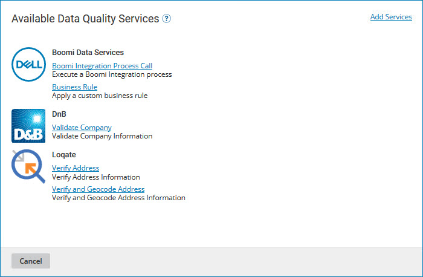
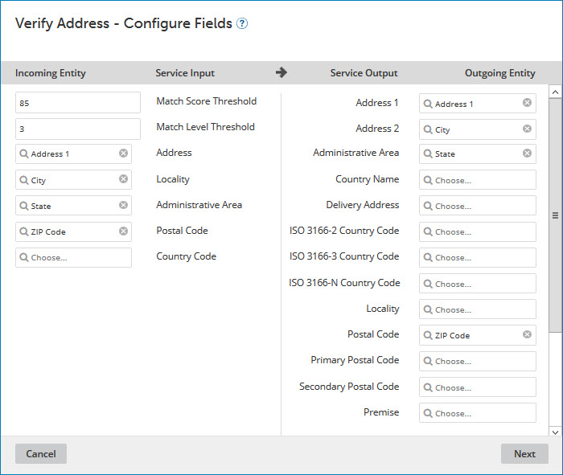
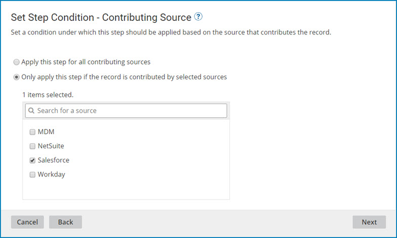
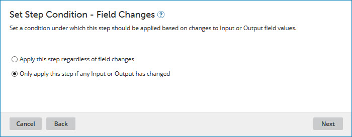
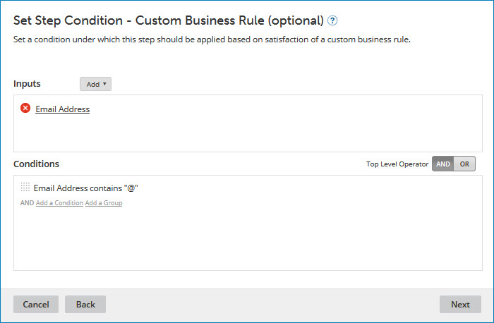
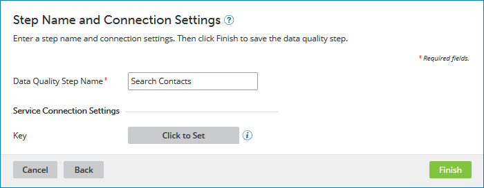

# Adding an ordinary data quality step 

<head>
  <meta name="guidename" content="DataHub"/>
  <meta name="context" content="GUID-2005333d-c08d-4ad8-ad04-ca9309d66d9e"/>
</head>

When an ordinary data quality step in a model is applied, the repository sends incoming entity data for validation and/or enrichment, to a third-party data quality service for which Boomi DataHub provides built-in support.

## Procedure

1.  In the **Data Quality Steps** tab, click **Add a Data Quality Step** or **Add Your First Data Quality Step**.

    The Available Data Quality Services dialog appears and takes focus.

    

    If the desired service is already enabled for usage in data quality steps, it is listed in the dialog.

2.  If the desired service is not enabled, enable it — see the linked topic. Otherwise, skip to step 3.

3.  In the Available Data Quality Services dialog, click the link for the desired service. All linked services except Business Rule are usable in ordinary data quality steps.

    The Data Quality Step wizard opens to the Configure Fields screen.

    

4.  Under **Incoming Entity**, for each object property for which you want to send data to the service for validation, select the field in the model that corresponds to that object property.

    :::note
    
    For Loqate data quality steps, optionally set the following:

    -   **Match Score Threshold** — the required similarity between input data and the closest reference data match as a percentage. A value of 100 specifies complete similarity. The default is 85.

    -   **Match Level Threshold** — the level, expressed as an integer, to which the input data matches reference data after validation and enrichment. The minimum value, 0, specifies no match level. The maximum value, 5, specifies matching at the delivery point \(building or structure\) level. The default is 3.

    :::

5.  Under **Outgoing Entity**, for each object property for which data will be retrieved from the service, select the field whose value in a source entity will be updated to reflect retrieved data.

6.  Click **Next**.

    The wizard advances to the Set Step Condition - Contributing Source screen.

    

7.  **Optional**: To configure the data quality step to be applied for source record updates contributed by particular sources, select **Only apply this step if the record is contributed by selected souces** and select the sources by turning on their check boxes below.

    The default, **Apply this step for all contributing sources**, applies this step to source record updates regardless of their contributing source.

8.  Click **Next**.

    The wizard advances to the Set Step Condition - Field Changes screen.

    

9. **Optional**: To configure the data quality step to be applied for source record updates even if a source entity does not populate or change the values of golden record fields selected as inputs \(step 4\) or outputs \(step 5\), select **Apply this step regardless of field changes**. Selecting this option may be advantageous for domains with relatively dynamic source data.

    The default, **Only apply this step if any Input or Output has changed**, causes the data quality step to be applied for source record updates only if a source entity populates or changes the values of golden record fields selected as inputs \(step 4\) or outputs \(step 5\).

10. Click **Next**.

    The wizard advances to the Set Step Condition - Custom Business Rule \(optional\) screen.

    

11. **Optional**: To configure the data quality step so that it is applied only to entities that satisfy a business rule, configure the business rule using the Inputs and Conditions controls.

    The steps are analogous to those for configuring inputs and conditions in a business rule data quality step — see the linked topic.

12. Click **Next**.

    The wizard advances to the Step Name and Connection Settings screen.

    

13. In the **Data Quality Step Name** field, type the name of the data quality step.

    The default is the name of the operation — for example, Search Contacts.

14. If this is a D&B data quality step, in the **User Name** field, type the user name for accessing D&B. Otherwise, skip to step 15.

15. Click **Click to Set**.

16. Do one of the following:

    -   If this is a D&B data quality step, in the **Password** field, type the password for accessing D&B.

    -   If this is a Loqate data quality step, in the **Password** field, type the API key for accessing Loqate.

17. Click **Apply**.

18. Click **Finish**.

    The wizard closes, and the data quality step is added.