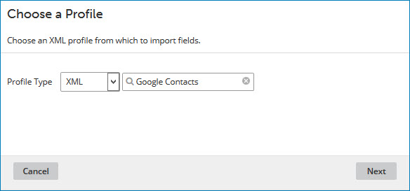
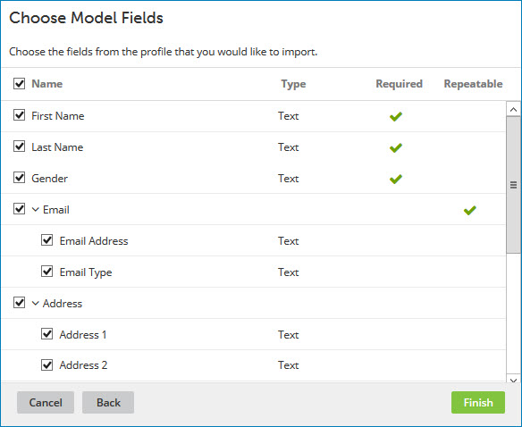

# Adding fields from a Integration profile 

<head>
  <meta name="guidename" content="DataHub"/>
  <meta name="context" content="GUID-14a50899-73bd-4bd0-91a1-670198584391"/>
</head>

If you have already built Integration processes that connect to what will be a domain's source systems, you can use the Import Fields wizard to easily add selected fields to the domain model from Integration profiles used in those processes.

## About this task

You can import fields from your existing integrations, such as XML, JSON, and database profiles, into the model.

:::note

You cannot import EDI and flat file profiles.

:::

The table below displays the data types in source profiles along with their corresponding field type while importing the fields in the model:

|Element Data Type|Field Type|Profile type|
|--|--|---|
|Character|Text|XML, JSON, Database|
|Number|Float|XML, JSON, Database|
|Date/Time|Date/Time|XML, JSON, Database|
|Boolean|Boolean|JSON|
|Clob|Long Text|Database|

## Important considerations while importing profiles

When you are importing fields from your JSON and database profiles into the model, the following should be considered:

### JSON Profiles

- When you add fields by selecting a simple element of data type Character, Number, Boolean, or Date/Time:

    - If the field value has a specific name, it will be used as the field name; otherwise, it will be named **JSONValue** by default.

    - A simple element of any other data type will not be imported, and those excluded elements will be listed in an alert box at the end of the import operation.

- When you add a field group by selecting an object element:

    - If the object has a specific name, it will be used as the field group name; otherwise, it will be named **JSONObject** by default.
    
    - If the root element of the profile is an object, the contents of the object will be added instead of the object itself.

- When you select repeating array elements as a field or field group:
    
    - If the array consists of simple elements, it will be added as a repeating field; if it contains more complex entities, it will be added as a repeating field group.
    
    - If the repeating array has a specific name, it will be used as the field or field group name; otherwise, it will be named **JSONArray** by default.
    
    - The name of the enclosing array will serve as the collection name.

- When you select an absolute array element as a field group:

    - If the absolute array has a specific name, it will be used as the field group name; otherwise, it will be named **JSONArray** by default.

### Database Profiles

- Both Read and Write database profiles can be imported.

- Empty statements are ignored.

- Fields, parameters, and conditions in all types of statements are evaluated as potential sources for adding more fields to the model.

- Blob fields will not be included in the import.

- A field group will be created if a statement includes parameters or conditions.

- If there are multiple statements at the root level of the profile, they will be added as a nested field group.

- When a statement is nested within another, it will be added to a field group containing all associated fields.

- Individual fields, parameters, or conditions do not require specified names in the model:

    - If a field has no name, it will be named as **DatabaseElement**.
    
    - If a parameter has no name, it will be named as **DBParameter**.
    
    - If a condition has no name, it will be named as **DBCondition**.

## Procedure

1.  In the **Fields** tab, click **Import Fields** or **Import from Profile**.

    

2.  In the **Profile Type** list, select **Database**, **JSON**, or **XML**.

3.  In the profile list, select the profile.

4.  Click **Next**.

    The wizard advances to the Choose Model Fields screen, which lists all of the selected profile’s elements for selection.

    

5.  Select the check box for each element you want to add as a field to the model. \(All elements are selected by default.\)

     To clear all the selected fields, uncheck the checkbox next to the column heading labeled **Name**.

     When you select an element with the **Required** column checked, it will be added as a required field since the element’s definition in the profile specifies that it must be included in the return payload. Similarly, if you select an element with the **Repeatable** column checked, the field will be added as a repeatable field, allowing for multiple occurrences as specified in the element’s definition. 

     Additionally, if you select an element that has child elements, and at least one of those child elements is selected, a field group will be created for the parent element, which will include a field for each selected child. If a child element is selected without its parent, the selected field will be added to the root level of the model, regardless of its nested level.

     Fields will have minimum and maximum length properties if these values are defined in the corresponding selected elements.

6.  Click **Finish**.

    -   If none of the selected elements have the same name as that of a deleted field, a field for each selected element is added to the list in the **Fields** tab.

    -   Otherwise, for each selected element having the same name as that of a deleted field, a dialog appears enabling you to add a new field with that name or restore the deleted field. Read [Viewing and restoring deleted fields](../Modeling/t-mdm-Viewing_and_restoring_deleted_fields_e644c019-edce-4c4d-b2d4-b3001d71b93d.md) to learn more.
