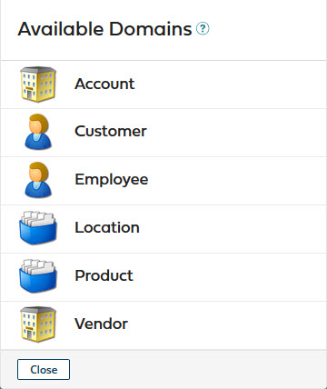
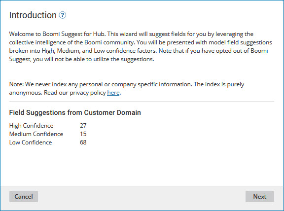
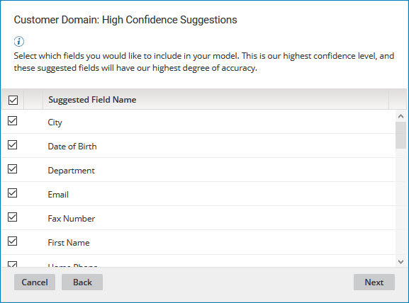
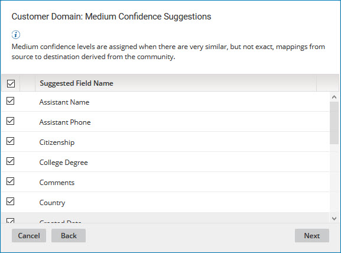
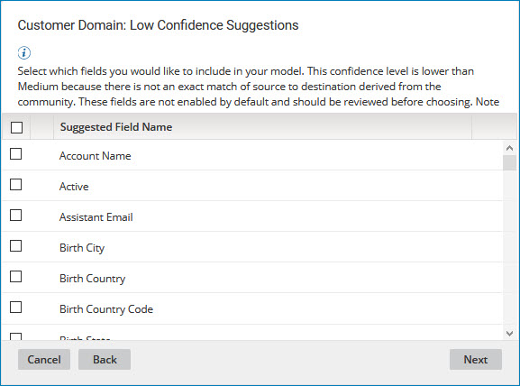
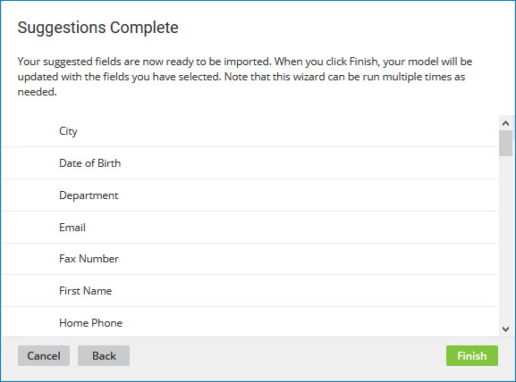

# Adding fields using Boomi Suggest 

<head>
  <meta name="guidename" content="DataHub"/>
  <meta name="context" content="GUID-a3f2bfb5-805a-48c1-9d8c-0ec5bad84c26"/>
</head>

To add fields to a model by leveraging the collective intelligence of the community, use the Boomi Suggest wizard.

## Procedure

1.  In the **Fields** tab, click **Suggest Fields** or **Start Hub Suggest**.

2.  Click the domain that most closely aligns with the object type you are modeling — **Account**, **Customer**, **Employee**, **Location**, **Product** or **Vendor**.

    

    The wizard’s **Introduction** screen shows counts of high-, medium- and low-confidence field suggestions.

    

:::note

The wizard will suggest fields for high, medium, and low confidence levels based on your selected domain, only if suggestions are available.

:::

3.  Click **Next**.

    The wizard shows high-confidence suggestions.

    

4.  Select the check box for each suggested field you want to add to the model. All suggestions are accepted by default, except those marked with an  icon, which indicates that a field with the same name already exists in your model, either in an active or deleted state.

    Clear the checkbox next to the column heading labeled **Suggested Field Name** to remove all selections.

5.  Repeat steps 3–4 for medium-confidence suggestions, if any.

    

6.  Repeat steps 3–4 for low-confidence suggestions, if any.

    

7.  When you are done selecting fields to add, click **Next**.

    The wizard advances to the **Suggestions Complete** screen. The field suggestions you accepted are listed.

    

8.  Click **Finish**.

    -   If none of the selected fields have the same name as that of a deleted field, the fields are added to the list in the **Fields** tab.

    -   Otherwise, for each selected field having the same name as that of a deleted field, a dialog appears enabling you to add a new field with that name or restore the deleted field. Read [Viewing and restoring deleted fields](../Modeling/t-mdm-Viewing_and_restoring_deleted_fields_e644c019-edce-4c4d-b2d4-b3001d71b93d.md) to learn more.
