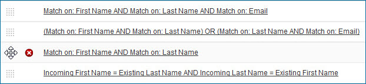
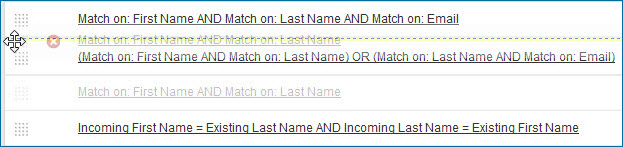

# Changing the order in which match rules are applied

<head>
  <meta name="guidename" content="DataHub"/>
  <meta name="context" content="GUID-0cb580e8-c02d-4c4c-9cb3-b0688246b763"/>
</head>

You can change the order in which match rules in a model are applied, in reaction to changes in requirements.

## Procedure

1. In the **Match Rules** tab, drag and drop reorder icons  for match rules until they are in the desired order.

    

    As you drag a reorder icon, a dashed horizontal line dynamically shows the position into which the match rule would be moved if you were to drop the icon at the pointer location.

  