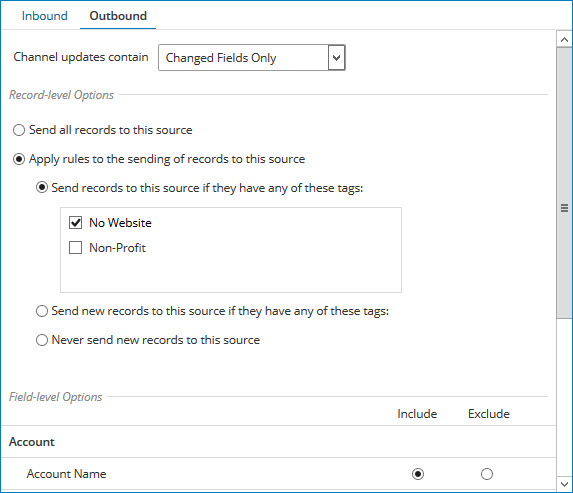

# Modifying the configuration of a source 

<head>
  <meta name="guidename" content="DataHub"/>
  <meta name="context" content="GUID-2f17f57e-2797-44e9-ab6d-c176553fabbb"/>
</head>

Once you add a source to a model or attach a source to a master data domain, you can modify the source configuration when needed to reflect changes in project requirements.

## About this task

-   Modifications to a source in a model take effect when the model is saved. When a version of the model that includes an updated source configuration is deployed to a domain, the model’s source configuration is applied to the domain.

-   Modifications to a source attached to a domain take effect immediately.

-   Golden records need at least one contributing source linked. If a source is the only contributing source linked to a golden record, you need to add another contributing source before you can delete it or switch its setting to accept channel updates.

## Procedure

1.  Do one of the following:

    -   To modify a source in a model, in the Models page, click the model and select the **Sources** tab.

    -   To modify a source attached to a domain, in the repository page, click the domain and select the **Sources** tab.

2.  In the sources summary list, click the name of the source.

    If you are modifying the configuration of a source attached to a domain, you can instead select **Configure** in the source’s gear icon **** menu,

    The source configuration dialog opens.

    

3. **Optional**:  If you are modifying a source in a model and you want to change the source type, make a **This source can** selection — do one of the following:

    -   To prevent the source from accepting channel updates, select **Contribute data**.

    -   To prevent the source from contributing to master data, select **Accept channel updates**.

    -   Otherwise, leave the default selection **Both** as is.

4. **Optional**:  To change the URL format Boomi DataHub uses to construct target URLs for links, rendered in the Golden Records page, to entities in the source system, in the **Entity ID URL** field, type the new format. Specify `{id}` as the placeholder for the source entity ID.

5. **Optional**:  If **Allow Multiple Links**, which is the setting that controls whether multiple links from individual golden records to entities in the source system are allowed, is not set as you would like, do one of the following:

    -   To allow multiple links, switch **Allow Multiple Links** to Yes. The effect is that entities contributed from the source cannot be quarantined as potential duplicates.

    -   To disallow multiple links, switch **Allow Multiple Links** to No. The effect is that potential duplicate entities contributed from the source are quarantined.

6. **Optional**:  Where applicable, to conditionally or unconditionally require new entity contributions from the source to be manually approved in order to be incorporated in a domain to which the source is attached, select **Require approval for new records**.

    If the requirement is unconditional, skip to step 9. 

7. **Optional**:  Where applicable, to conditionally require new entity contributions from the source to be manually approved in order to be incorporated, using simple rule configuration:

    1.  Do one of the following:

        -   If you are configuring a new rule, click **Add a rule**

        -   If you are modifying a previously configured rule. click **Edit**.

        The controls for configuring a rule are revealed.

    2.  In the chooser, select the field whose value would be evaluated against a static value.

    3.  In the adjacent list, select the comparison operator.

    4.  In the field, type the static value.

    5.  Click **OK**.

8. **Optional**:  Where applicable, to conditionally require new entity contributions from the source to be manually approved in order to be incorporated, using advanced rule configuration:

    1.  Do one of the following:

        -   If you are configuring a new rule, click **Add a rule**

        -   If you are modifying a previously configured rule. click **Edit**.

    2.  Click **Advanced Configuration**.

        The Configure Business Rule dialog opens.

        

    3.  In the Input section, add either an input field or an input function and the corresponding output\(s\).

        Repeat this substep as many times as needed.

    4.  In the Conditions section, add either a condition or a condition group. Conditions refer to the outputs defined in the previous step.

        Repeat this substep as many times as needed.

        To change the Boolean operator relating top-level grouped conditions, click the desired Top Level Operator — **AND** \(the default\) or **OR**.

    5.  Click **Save**.

        The focus returns to the source configuration dialog.

    6.  Click **OK**.

9. **Optional**:  Where applicable, to conditionally or unconditionally require entity contributions that would update any fields or collections in golden records to be manually approved in order to be incorporated in a domain to which the source is attached, select **Require approval for updates to any fields**.

    If the requirement is unconditional, skip to step 12. 

10. **Optional**: Where applicable, to conditionally require entity contributions that would update any fields or collections in golden records to be manually approved in order to be incorporated, using simple rule configuration, follow steps 7a–7e.

11. **Optional**: Where applicable, to conditionally require entity contributions that would update any fields or collections in golden records to be manually approved in order to be incorporated, using advanced rule configuration, follow steps 8a–8e.

12. **Optional**: Where applicable, to require approval for entity contributions for which there is a pending link from the matching golden record and in which a field has a base value \(the value of the field in the golden record’s base version for the source when the pending link was created\), select **Require approval of updates in which a field has a base value**.

    :::note
    
    If this option is not selected, a link is established in these cases, but the update ignores the fields with base values.

    :::

13. **Optional**: Where applicable, to require manual approval for entity contributions specifying golden record Delete requests, select **Require approval to end-date records**.

    The expected outcome of incorporating an entity specifying a Delete request is the end-dating of the golden record linked to the source entity specified in the request.

14. **Optional**: Select **Enable Early delta detection**. Early delta detection reduces the time it takes to process golden record updates from a contributing source. It allows Master Data Hub to detect when a submitted entity does not change a golden record. Hub compares the previous entity with the inbound entity. If the inbound entity matches the previous entity submitted, the next time the same entity is submitted again without a change, Hub skips processing the entity. Master Data Hub will only include the source's entity submissions when it detects a change to the record or if a new model version is deployed or a source configuration is changed. Model deployment or a change to the entity or to a source configuration starts the evaluation process again from the beginning, and Hub will skip the third time the same entity is submitted.

    :::info

    Early delta detection does not detect a change to a record when you are [using third-party data quality services](/docs/Atomsphere/Master%20Data%20Hub/Modeling/t-mdm-Enabling_a_quality_service_to_use_in_data_quality_f74aa25d-86a6-4390-b5f0-e90b75ebbd4a.md) for data enrichment, such as [Loqate](https://www.loqate.com/en-gb/address-verification/). A change cannot be detected because data enrichment from the third party happens after the entity is compared to the previous entity.

    :::

    :::info

    Early delta detection may not detect a change to a record if you submit an entity and then submit the same entity again with changed and unchanged data within 1 second.

    :::

15. **Optional**: Where applicable, to configure unconditional handling for certain fields in entity contributions, in the Field-level Options section of the **Inbound** tab, do one of the following for each such field:

    -   To include the field in create and update operations on golden records resulting from entity contributions, select **Include** \(the default\).

    -   To exclude the field from create and update operations on golden records resulting from entity contributions, select **Exclude**.

    -   To require manual approval for new entity contributions that would update the field, select **Require approval for updates**.

16. **Optional**: Where applicable, to conditionally exclude certain fields in create and update operations resulting from entity contributions, using simple rule configuration, in the Field-level Options section of the **Inbound** tab, do the following for each such field \(not applicable to collection fields within repeatable field groups\).

    1.  Do one of the following:

        -   Select **Custom**.

        -   If **Custom** is already selected, click **Show Rules**.

    2.  If in substep a you clicked **Show Rules**, do one of the following. Otherwise, the controls for configuring a rule are already visible — skip to substep c.

        -   If you are configuring a new rule of this type, click **Add a rule**

        -   If you are modifying a previously configured rule of this type. click **Edit**.

        The controls for configuring a rule are revealed.

    3.  In the topmost list, select Exclude if.

    4.  In the chooser, select the field whose value would be evaluated against a static value.

    5.  In the adjacent list, select the comparison operator.

    6.  In the field, type the static value.

    7.  Click **OK**.

17. **Optional**: Where applicable, to conditionally exclude certain fields in create and update operations resulting from entity contributions, using advanced rule configuration, in the Field-level Options section of the **Inbound** tab, do the following for each such field \(not applicable to collection fields within repeatable field groups\):

    1.  Do one of the following:

        -   Select **Custom**.

        -   If **Custom** is already selected, click **Show Rules**.

    2.  If in substep a you clicked **Show Rules**, do one of the following. Otherwise, the controls for configuring a rule are already visible — skip to substep c.

        -   If you are configuring a new rule of this type, click **Add a rule**

        -   If you are modifying a previously configured rule of this type. click **Edit**.

        The controls for configuring a rule are revealed.

    3.  In the topmost list, select Exclude if.

    4.  Click **Advanced Configuration**.

        The Configure Business Rule dialog opens.

    5.  In the Input section, add either an input field or an input function and the corresponding output\(s\).

        Repeat this substep as many times as needed.

    6.  In the Conditions section, add either a condition or a condition group. Conditions refer to the outputs defined in the previous step.

        Repeat this substep as many times as needed.

        To change the Boolean operator relating top-level grouped conditions, click the desired Top Level Operator — **AND** \(the default\) or **OR**.

    7.  Click **Save**.

        The focus returns to the source configuration dialog.

    8.  Click **OK**.

18. **Optional**: Where applicable, to conditionally require manual approval for new entity contributions that would update certain fields, using simple rule configuration, in the Field-level Options section of the **Inbound** tab, do the following for each such field or collection \(not applicable to collection fields within repeatable field groups\):

    1.  Do one of the following:

        -   Select **Custom**.

        -   If **Custom** is already selected, click **Show Rules**.

    2.  If in substep a you clicked **Show Rules**, do one of the following. Otherwise, the controls for configuring a rule are already visible — skip to substep c.

        -   If you are configuring a new rule of this type, click **Add a rule**

        -   If you are modifying a previously configured rule of this type. click **Edit**.

        The controls for configuring a rule are revealed.

    3.  In the topmost list, select Require approval if.

    4.  In the chooser, select the field whose value would be evaluated against a static value.

    5.  In the adjacent list, select the comparison operator.

    6.  In the field, type the static value.

    7.  Click **OK**.

19. **Optional**: Where applicable, to conditionally require manual approval for new entity contributions that would update certain fields, using advanced rule configuration, in the Field-level Options section of the **Inbound** tab, do the following for each such field or collection \(not applicable to collection fields within repeatable field groups\):

    1.  Do one of the following:

        -   Select **Custom**.

        -   If **Custom** is already selected, click **Show Rules**.

    2.  If in substep a you clicked **Show Rules**, do one of the following. Otherwise, the controls for configuring a rule are already visible — skip to substep c.

        -   If you are configuring a new rule of this type, click **Add a rule**

        -   If you are modifying a previously configured rule of this type. click **Edit**.

        The controls for configuring a rule are revealed.

    3.  In the topmost list, select Require approval if.

    4.  Click **Advanced Configuration**.

        The Configure Business Rule dialog opens.

    5.  In the Input section, add either an input field or an input function and the corresponding output\(s\).

        Repeat this substep as many times as needed.

    6.  In the Conditions section, add either a condition or a condition group. Conditions refer to the outputs defined in the previous step.

        Repeat this substep as many times as needed.

        To change the Boolean operator relating top-level grouped conditions, click the desired Top Level Operator — **AND** \(the default\) or **OR**.

    7.  Click **Save**.

        The focus returns to the source configuration dialog.

    8.  Click **OK**.

20.  **Optional**: Where applicable, to change the manner in which update requests are propagated to the source on its channel, select **Outbound** and make a different selection in the **Channel updates contain** list:

-   All Fields — Requests contain all fields in the golden record.

-   Changed Fields Only — Requests include only the fields whose values were changed.

    :::caution

    Changing this setting discards any pending requests on the channel and deletes the channel.

    :::

21.  **Optional**: Where applicable, to enable propagation of update requests without restriction on the source’s channel:
     1.   Select **Outbound**.
     2.   Select **Send all records to this source**.
     3.   1.  Skip to step 24.

22. **Optional**: Where applicable, to prevent propagation of update requests specifying create operations on the source’s channel:

    1.  Select **Outbound**.

    2.  Select **Apply rules to the sending of records to this source**.

    3.  Select **Never send new records to this source**.

    4.  Skip to step 24.

23. **Optional**: Where applicable, to restrict propagation of update requests on the source’s channel to requests resulting from the creation, updating, or deletion of golden records having any of a set of particular tags:

    1.  Select **Outbound**.

    2.  Select **Apply rules to the sending of records to this source**.

    3.  Select **Send records to this source if they have any of these tags:**.

    4.  Select the check boxes for those tags.

        

    5.  Skip to step 24.

24. **Optional**: Where applicable, to restrict propagation of update requests specifying create operations on the source’s channel to requests resulting from the creation or updating of golden records having any of a set of particular tags:

    1.  Select **Outbound**.

    2.  Select **Apply rules to the sending of records to this source**.

    3.  Select **Send new records to this source if they have any of these tags:**.

    4.  Select the check boxes for those tags.

25. **Optional**: Where applicable, to configure unconditional handling for certain fields in propagated update requests, in the Field-level Options section of the **Outbound** tab, do one of the following for each such field:

    -   To include the field in update requests, select **Include** \(the default\).

    -   To exclude the field from update requests, select **Exclude**.

26. Click **Save**.

    The dialog closes, and the changes are applied. When the operation is complete, the gear icon **** reappears.