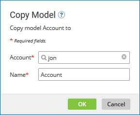

# Copying a model 

<head>
  <meta name="guidename" content="DataHub"/>
  <meta name="context" content="GUID-89021193-0897-4ba7-ae7a-b43a90fd38d1"/>
</head>

You can copy a model to use it in another account, back it up, or use it as the basis for a new, similar model.

## Procedure

1.  In the **Models** page, in the gear icon  menu for the model you want to copy, select **Copy**.

    The Copy Model dialog appears and takes focus.

    

2.  **Optional:** To select a different account as the destination of the copy operation, click the magnifying glass icon and in the Choose Account dialog do the following:

    1.  In the drop-down menu, select either **contains:** or **starts with:**.

    2.  In the search field, type all or part of the account name or account ID of the desired destination account.

    3.  Click **Search**.

        Accounts matching your search criteria appear in the list. You will not see accounts to which you do not have access.

    4.  Do one of the following:

        -   Select the desired account and click **OK**.

        -   Double-click the account.

        Focus returns to the Copy Model dialog.

3.  In the **Name** field, type a name for the copy.

    The field is pre-populated with the name of the source model and the suffix “ Copy”.

4.  Click **OK**.

    The copy is created. The new model is in Draft status and is unpublished, regardless of the publication status of the source model.