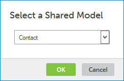
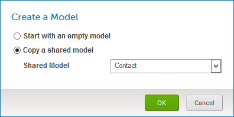

# Creating a model by copying a shared model 

<head>
  <meta name="guidename" content="DataHub"/>
  <meta name="context" content="GUID-979a8ad7-f278-4441-a6cb-17473e0aadda"/>
</head>

There are two ways to create a model by copying a shared model.

## Before you begin

You can create a model by copying a shared model only if you are using an account that is in an account group with which models are shared.

## Procedure

1.  In the **Models** page, click **Copy a Shared Model** or **Create Your First Model**.

    -   If you clicked **Copy a Shared Model**, the Select Shared Model dialog opens.

    -   If you clicked **Create Your First Model**, the Create a Model dialog opens.

2.  Do one of the following:

    -   In the Select a Shared Model dialog, select the shared model.

        

    -   In the Create a Model dialog, select **Copy a shared model** and select the **Shared Model**.

        

3.  Click **OK**.

    The newly created model is saved as a draft and loads in the model page. The model name serves as the domain name once the model is deployed. At this point you can assign a different name to the model or otherwise modify the model, as described in the linked topic.

    If the source model contains Integration process call data quality steps, the referenced Integration processes are not copied — you need to modify those data quality steps to reference processes in your account, as described in the linked topic.

    :::note
    
    The newly created model will not be affected when the source model is changed by its owning partner.

    :::