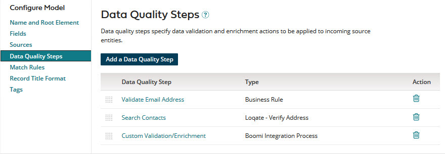

# Creating a model starting with an empty field layout

<head>
  <meta name="guidename" content="DataHub"/>
  <meta name="context" content="GUID-66bdcc79-a77b-4c99-8511-4bf7a789516d"/>
</head>

If you do not have a shared model to copy, create a master data domain model starting with an empty field layout.

## About this task

Following is the general procedure for creating a model starting with an empty field layout. For details about individual steps refer to the linked topics.

## Procedure

1.  On the **Models** page, click **Create a Model** or **Create Your First Model**.

    -   If you clicked **Create Your First Model** and you are using an account that is in an account group with which models are shared, the Create a Model dialog opens — continue with step 2.

    -   Otherwise, the model page loads. The **Name and Root Element** tab is initially selected — skip to step 3.

2.  In the Create a Model dialog, select **Start with an empty model** and click **OK**.

3.  In the **Model Name** field, type the model name.

    

    The model name also serves as the domain name once the model is deployed. It must contain at least one letter and allows a maximum length of 255 characters. If the model name exceeds 40 characters, you must save the model before making further changes.

    The **Root Element Name** is derived from the specified model name and is the name of the required root XML element in batches of source entities contributed to the domain after deployment of the model. 

    When creating the model, any changes you make to the **Model Name** before saving will automatically update the **Root Element Name**, with a few exceptions: leading numbers will be disregarded, uppercase letters will be converted to lowercase, and all spaces and special characters will be removed. However, once you save the model, any changes you make to the **Model Name** will not affect the **Root Element Name**.
    
    You will not be able to deploy the model to a repository if its root element name is the same as that for a model previously deployed to that repository.
    
    :::note
    
    The length of the root element name impacts the maximum length of characters allowed in reference field and collection name in the model. You cannot save or publish your model if either of the following character limits is exceeded:

    - The maximum length of the reference field, including the root element name, cannot exceed 53 characters. For example, if your Root Element Name is contact, which has 7 characters, then your reference field can only contain a maximum of 46 characters.
    
    - The maximum length of the collection name, including the root element name, cannot exceed 58 characters. For example, if your Root Element Name is contact, which has 7 characters, then your collection name can only contain a maximum of 51 characters. 
    
    :::

4.  Select the **Fields** tab.

5.  In the Getting Started box, click **Add Your First Field**.

    

    A dialog appears in which you can select between three methods of initially adding fields to the model.

    

6.  Add fields.

    There are two wizards for adding fields:

    -   The Import Fields wizard lets you select fields to add from an existing profile — click **Import from Profile**.

    -   The Boomi Suggest wizard suggests fields to add — click **Start Hub Suggest**.

    Instead of using one of the wizards you can add fields manually.

    If the field will contain sensitive data, you can select a masking option to mask data from users that cannot view masked data. Read [Setting up user accounts and access](/docs/Atomsphere/Master%20Data%20Hub/Getting%20started/r-mdm-User_Management_5f47b2da-d5cc-4c88-bdfd-0a255d69323a.md) to learn more. Select one of the following options from the **Mask** drop-down:

    - **All** - hides entire data. Not available for Reference data types. 
    - **Partial Mask** - hides a portion of the data. Not available for Boolean and Reference data types. 
    - **Partial Show** - reveals a portion of the data. Not available for Boolean and Reference data types. 
    - **None** - reveals entire data.

    You can select Yes to require a value for a specific field. Ensure that a source contributes data to required fields. Boomi DataHub quarantines records until a source contributes data for a required field.

    

7. **Optional**:   Continue to define the field structure for golden records by adding, modifying and deleting fields and field groups.

8. **Optional**:   In the **Data Quality Steps** tab, add data quality steps.

    

9.  In the **Match Rules** tab, add at least one match rule.

    

10. **Optional**: In the **Record Title Format** tab, set the golden record title format. You cannot add masked fields to the title format.

    

11. **Optional**: In the **Tags** tab, add tags.

    

12. Do one of the following:

    -   Save the model as a draft.

    -   Publish the model.

        Once a model is published it can be deployed to repositories.

    :::note

    A model cannot be saved as a draft if either of the following is true:

    The name of a non-reference field in the model is longer than 64 characters.

    The name of a reference field in the model is longer than 53 characters minus the number of characters in the model’s root element name. For example, a model with the root element name contact (seven characters) cannot be saved if it has a reference field with a name longer than 46 characters.

    The name of a collection in the model is longer than 58 characters minus the number of characters in the model’s root element name. For example, a model with the root element name contact (seven characters) cannot be saved if it has a collection with a name longer than 51 characters.

    :::