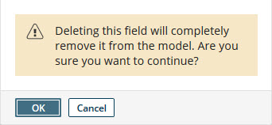
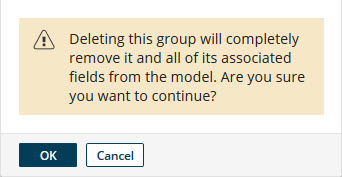

# Deleting a field or field group 

<head>
  <meta name="guidename" content="DataHub"/>
  <meta name="context" content="GUID-4ed59584-9a8b-4b6c-844c-69019a023565"/>
</head>

If you no longer need a field or field group in a model, you can delete the field or field group.

## Before you begin

To delete a field group without deleting all of its fields, first individually remove from the field group each field you want to keep.

## About this task

Following are steps for deleting a field or field group.

:::note

Deleting a field specified in a match rule or data quality step invalidates that match rule or data quality step. In the **Match Rules** tab, invalid match rules and deleted fields are shown in red and deleted fields are shown as “Unknown”. In the Data Quality Step Wizard, in field selection lists, deleted fields are shown as “Unknown” in red.

:::

## Procedure

1.  In the **Fields** tab’s list entry for the field or field group, click ** Delete this field**.

     

2.  In the confirmation dialog, click **OK**.

    -   In the case of a field, the field is deleted.

    -   In the case of a field group, the field group and its member fields are deleted.