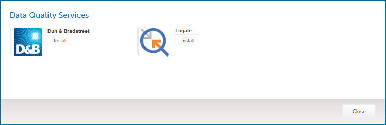

# Enabling a data quality service for usage in data quality steps 

<head>
  <meta name="guidename" content="DataHub"/>
  <meta name="context" content="GUID-f74aa25d-86a6-4390-b5f0-e90b75ebbd4a"/>
</head>

To use a third-party data quality service in ordinary data quality steps in models, you need to enable that service for usage.

## Procedure

1.  In the Available Data Quality Services dialog, click **Add Services**.

    The Data Quality Services dialog appears and takes focus.

    

2.  In the list entry for the desired data quality service, click **Install**.

    The dialog closes and focus is taken by the Available Data Quality Services dialog. The newly enabled service is listed.