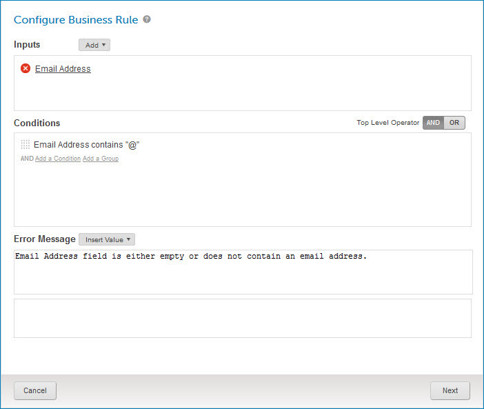
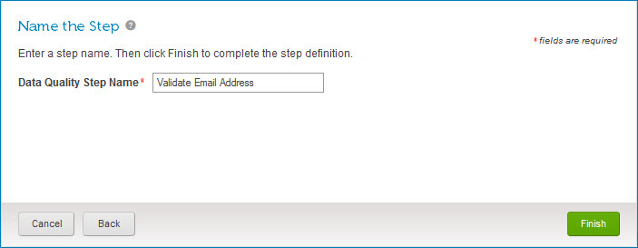

# Modifying a business rule data quality step

<head>
  <meta name="guidename" content="DataHub"/>
  <meta name="context" content="GUID-fc2f305f-0c5c-4d52-9a95-8d5fc02f2b90"/>
</head>

You can modify a business rule data quality step in a model in reaction to changes in requirements.

## About this task

Following are the steps for modifying a business rule data quality step. Separate Related topics cover the steps for modifying other types of data quality steps.

## Procedure

1.  In the **Data Quality Steps** tab, click the data quality step name.

    The Data Quality Step wizard opens to the Configure Business Rule screen.

    

2. **Optional**: Do any of the following:

    1.  To delete an input field or function, click  next to it, then click **OK**.

    2.  To modify an input field, click the input in the Inputs section, edit it in the dialog and click **OK**.

    3.  To modify an input function, click the input in the Inputs section and edit the function’s input parameters and output\(s\) in the dialog\(s\). When you are done, click **OK** in the last dialog.

    4.  To add an input field or function, follow the steps in the corresponding Related task.

    5.  To remove a condition, pause the pointer on it in the Conditions section and click **Remove**.

    6.  To remove a condition group, pause the pointer on its top delimiter in the Conditions section and click **Remove**.

        When you remove a condition group, its member conditions are also removed.

    7.  To edit a condition, pause the pointer on it in the Conditions section and click **Edit**. Then make changes and click **Save**.

    8.  To edit a condition group, pause the pointer on its top delimiter in the Conditions section and click **Edit**. Then make changes and click **Save**.

    9.  To change the Boolean operator relating root-level grouped conditions, click the desired **Top Level Operator** — **AND** or **OR**.

    10. To add a condition or condition group, follow the steps in the corresponding Related task.

    11. To reorder conditions and condition groups, drag and drop their reorder icons .

        As you drag a reorder icon, a dashed horizontal line dynamically shows the position into which the condition or condition group would be moved if you were to drop the icon at the current pointer location.

        When you change the position of a condition group, its member conditions move along with it.

    12. To edit the error message template, use the controls in the Error Message section.

        :::note
        
        To remove all references in the template to a particular output value, click  on the value’s button below the template editor.

        :::

3.  Click **Next**.

    The wizard advances to the Name the Step screen.

    

4.  **Optional**: In the **Data Quality Step Name** field, type a new name for the step.

5.  Click **Finish**.

    The wizard closes, and the data quality step is modified.